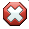
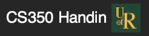

#+title: Functional Languages, Interpreters and Types: CS 350 Course Notes
#+author: Dr. Joseph Eremondi, with material adapted from Dr. Shriram Krishnamurthi

#+SETUPFILE: readtheorg_inline.theme

* Introduction
:PROPERTIES:
:header-args:racket: :results code :lang plait
:END:

** For Students

*** What This Course Is About

If you take into a linguistics class, you will not take French one week, German the next, Mandarin after that, etc.
Instead, you learn about the things that all languages are made of: sounds, words, syntax, semantics, etc.
You might learn about the history of certain languages, and how some languages influenced each other,
or how some languages have certain features while others don't.

In the same way, this course is not about teaching you multiple different languages.
It's about teaching you /what languages are made of/.
The idea is that you will then have the tools to understand the features of any language you encounter
in your career.
In particular, you will learn about /semantics/: what does a program mean, separate from a particular computer
and input and environment that it's run on.
Some languages which are syntactically very different are semantically very similar, and some languages that look the same
have very different features.

*** Why Functional Programming?

In this course, we will learn about /functional programming,/ where a variable's value never changes once it is set.
Programming is focused around what a program /is/, not what a program /does/.
There is no denying that functional programming is less popular in industry than imperative or object-oriented programming,
so why are we going to learn it? We have a few reasons:

1. Functional languages have simple reasoning principles.
   In this course, code is not just a means to an end, but an object worthy of study.
   Just as one might study a bacterium or a mouse before studying human biology, we will
   examine simple languages before complex ones.
   While it is certainly possible to formally reason about code in languages like C++, Python, or Java,
   doing so is much more complicated, and is beyond the scope of an introductory class.
2. Functional languages are close to the "atoms" of programming languages.
   As we will see in the course, many concepts like mutable variables, loops, and objects
   are expressible using functions, datatypes, and recursion.
   Many of the concepts we language features we will learn about are obvious in functional languages,
   but implicit or hidden in other languages.
   So we can learn about those features more directly.
3. The functional paradigm is growing in popularity.
   Languages like F#, Clojure, Elixir, and Scala have introduced functional languages
   into existing ecosystems, yielding a bump in usage.
   More significantly, functional /ideas/ are being added to more and more languages.
   Nearly every language has some kind of closure, with C being the main exception.
   JavaScript async is based around passing functions as arguments, and
   Rust's design draws heavily from research on algebraic datatypes, pattern matching, and polymorphism.

You will not likely ever use Racket in industry
(although the Naughty Dog video game company does use Racket to develop games like The Last of Us).
But more importantly, I do not know what languages you will use in your career, and neither do you.
So I hope this course can change the way you think about programming and understand what languages are made of,
so that you are able to adapt and learn whatever language you need in your job ten or twenty years from now.

*** Why Interpreters?

In addition to learning how to use language features, this course will teach you
how to implement several of them.
Interpreters are the simplest way to implement a programming language.
To write a full-fledged compiler, one needs to understand machine code, memory layout,
jumps, basic blocks, register allocation, etc.
To write an interpreter, all we need is a few tree traversals.

More importantly, when we write an interpreter for a language in a purely functional source language,
we get equations about programs.
So we get a two-for-one: writing an interpreter for a language also serves to /define/ the semantics of the language,
and give us some rules and principles we can use to reason about programs in that language.
So our interpreters will give us a way to think logically about programs in an abstract way,
independent of machine-specific details, memory architectures, or execution contexts.

An interpreter is a program that is powerful enough to simulate every other program that has ever or will ever
be written. Nevertheless, it is essentially just a recursive tree traversal, and can serve to show the simplicity
and beauty that lies at the heart of computation.

** For Educators: Why FLIT? :noexport:

During my PhD at UBC, I was a TA for a programming course based on the first edition of Shriram Krishnamurthy's /Programming Languages, Applications and Interpretation/ text.
This worked quite well, but the student there had mainly studied /How To Design Programs/ in their first year, so they were familiar with functional programming
and the Racket ecosystem.

This course is for professors who do not have that luxury. It assumes that this is the first and only programming languages course
in your students' studies. So the entire first half of the course is devoted

While I appreciate the HtDP approach greatly, my background is in Haskell, so algebraic datatypes and pattern matching
are central to how I think about problem solving.
There is nothing wrong with the "union of structs" approach that HtDP and Typed Racket take to datatypes,
but it is not how I prefer to teach.

I also come from the Agda school of thought, where programming is an /interactive/ experience: you write the type of the thing
you're building, then put a hole as its definition. You can look at a hole to find out what's in scope, and what the types of variables are.
The HtDP approach uses this same process, but without the support of the editor or type system.
Given the rapid pace of a course teaching both functional programming and interpreters, having this tool support
is necessary, even if it means students get less practice reasoning about scope mentally.

These notes is accompanied by ~#lang flit~, a Racket dialect for typed functional programming and interpreter writing.
It is a modified version of the ~plait~ language used in PLAI 3rd edition to support typed holes and listing in-scope variables,
as well as some other niceties for programming, such as inferring types for pattern matches.
Syntactically it is essentially like Racket, but with plait-style datatype and pattern-matching definitions.
While students tend to get tripped up on the parentheses, using them has made it massively easier to write tooling for the language,
as well as to explain exactly what an expression is and when it's in scope.
I have expanded the standard library to include more classic higher-order functions, and
indulged my personal preference by changing some names
to be more Haskelly, such as ~Maybe~ instead of ~Option~ and ~List~ instead of ~Listof~.

* Part I: Functional Programming

** Setup: Editor and Tooling
:PROPERTIES:
:custom_id: setup
:header-args:racket: :results code :lang plait
:END:
*** Dr. Racket and ~#lang flit~

All of the programming in this course takes place in Racket.
Racket is a programming languages, but it is also a toolkit for making languages.
At the beginning of every Racket file, there is a line ~#lang nameOfLanguage~ which says
which language the following file is written in.
The default is ~#lang racket~, but for this course, we're going to be using the Flit language,
i.e., ~#lang flit~.

**** TODO Installing Dr. Racket
Dr. Racket is the IDE for Racket, and language made using Racket, including Flit.
To install it:

- Go to [[https://download.racket-lang.org/]], select the appropriate installer for your system,
  download it and run it.

  On MacOS with Homebrew, you may also run ~brew install --cask racket~.

  On Linux, you can install from Snap using ~sudo snap install racket~.
  Many distributions also have their own packages, which you are welcome to use.

**** Dr. Racket on Laboratory Computers
Dr. Racket is installed on computers in the following labs:
- CL 135.4
- CL 136

You can write, run, and submit your code from these computers if you do not have
access to your own computer.

*** Installing the Handin Tool
Whether you use your own computer or a lab computer, you will need to
install the Package for this class. You can do this as follows:

- Click "File > Install .plt File..."
- In the URL box, paste [[https://eremondi.com/cs350/plt/cs350.plt]]
- Click "OK"

This accomplishes two things:
1. The ~flit~ language is now installed, so you can write programs beginning with ~#lang flit~.
2. There is now button in the toolbar which you can use to submit your assignments.

You may be asked to update periodically. You should install these updates, as they might
include files relevant to specific assignments.

***** Changing Your Password
You will be emailed a password for your account. If you wish to change your password,
you may do so from Dr. Racket:
- Go to "File > Manage CS350 Handin Account"
- Enter your old and new passwords and submit

*Do not use a password that is shared with another login*. They are stored as MD5 hashes,
which is secure enough
for the handin tool, but not secure enough for sensitive personal information.

***** TODO Make PLT file and upload link

*** TODO Using Dr. Racket

There are three main parts of the Dr. Racket interface: the toolbar at the top,
the code editor window, and the REPL at the bottom.

**** TODO pictures

**** The Definitions Window (Code Editor)
The editor window is where you will type your Racket program.
The top of every file should begin with ~#lang flit~, though if you've set up
Racket as described above this will happen by default.

***** Type and Syntax Errors
If there are type or syntax errors in your code, there will be
pink text at the bottom of the Dr. Racket window with an error message,
along with a *Jump to Error* button.
_It is very important that you look for these messages_, since code that
has a type or syntax error will get a grade of 0.

***** Useful Tools
If you right click on a variable, function name, type name, etc. in Dr. Racket,
there will be an option *Jump to Binding Occurrence* or *Jump to Definition*.
This will show you where/how that thing is defined, which can be very useful when understanding
the code you are given on an assignment.

Typing "Ctrl-I" (or "Cmd-I" on Mac) will re-indent your code based on the parentheses.
This can be very useful to make your code more readable, or to find errors based on misplaced brackets.

**** The Toolbar
There are two main buttons you need on the toolbar.

First is the  button, which will type-check and compile your code,
as well as executing any tests or expressions that are in the file.

If there are syntax or type errors in your file, you will get an error message
after clicking Run.
*You MUST read these error messages*: code that produces a type or syntax error will be graded 0
by the handin tool, and the messages give you important information on how to fix the problem.

To jump to the location of the problem, click on the  icon and

The other important button is the Handin Button.
At the University of Regina, this looks like this: .
When completing an assignment, clicking this button will submit your code to the handin server.
This will run a few tests and, after a short time, return your grade, along with any tests that fail.
*Read the results of the test carefully*, as they will tell you what your code is doing wrong, along with
what result it should produce.
You may hand in your code as many times as you like up until the deadline of an assignment,
and each submission overwrites the last.
There may be private tests on an assignment, where you are told that a test is failing but not provided information
on which test that is. In these cases, *read the problem specification carefully* to determine if you have missed any edge-cases.

**** The Interactions Window (REPL)
The interactions window features a Read-Evaluate-Print-Loop (REPL),
where you can type in expressions to be read and evaluated, and have their results printed.
This is very useful for quickly testing a piece of code you wrote, or
running pre-existing code to better understand what it does.
This is similar to the prompts that Python or JavaScript give you if you type ~python~ or ~node~ in a terminal window.

If your code contains no type or syntax errors, then anything that you ~define~ in the editor window
can be used in the REPL.

**** Submitting Assignments
All assignments are to be submitted using the Handin tool. There are two ways to do this:
- By clicking the "CS350 Handin" button in the Dr. Racket toolbar
  + This option is currently only available on-campus or when connected to the campus VPN, which you can set up using the instructions
   [[https://www.uregina.ca/is/tech-notes/technote569.html][here]]
  + After you submit your code, you
- By uploading your file at [[https://racket.cs.uregina.ca/cs350-handin]]

 At any point, you can view the test results of your most recent assignment run, including your current grade,
 by logging in at [[https://racket.cs.uregina.ca/cs350-handin]].
 The test results are also visible on URCourses.

***** Submitting Multiple Times
You may submit as many times as you like until the deadline. Your grade will be the grade
from the last submission before the deadline.

*No late assignments will be accepted.* There will be no exceptions to this rule.

***** Syntax and Type Errors
If your file contains syntax or type errors, the feedback in Dr. Racket or on the handin website will
list the error message. This is generally the same error

Note that *if your grade is listed as 0 on the test feedback, your assignment will receive zero.*
You *must* read the error messages and correct the errors to receive a non-zero grade.

*It is better to submit code containing TODOs or that is failing many tests than to submit mostly-correct code that does not compile.*
In particular, there will be no leniency for code that is copied from ChatGPT or other websites that does not compile.
*Flit is one of many Racket-based languages*, so Racket code you find on the Internet may have type or syntax errors when used in Flit.

These course notes and the Flit documentation are to be your main source of information for the course.
If there is an error message you do not understand, then *ask a question on the URCourses Discussion Forum*.

***** Public and Private Tests
When you submit an assignment, most tests are /public/, meaning that you
are shown the expected input and output, but some tests are /private/, meaning that
you are told that your code did not pass the test, but not told exactly what input
caused the problem or what the expected result was.

If you are passing all public tests, but failing some private tests, read the assignment
specification carefully, and think about if there are any edge-cases that you might have
missed when writing your code.

***** Submitting on URCourses (not preferred)

Submitting assignments via URCourses is available as a backup.
However, it may take 15 minutes or more for the Handin Server to receive your code and
upload the test results.

In the event of technical difficulties with the handin server, you may upload your assignment to URCourses,
but you are then responsible for ensuring that it has no syntax or type errors.

** The Syntax of Flit
:PROPERTIES:
:CUSTOM_ID: racket-synax
:END:
*** S-expressions
The syntax of Dr. Racket based around /S-Expressions/.

#+begin_definition S-Expression
Every S-Expression (or s-exp, pronounced "ess-exp") is either:
        1. A literal (such as a number ~3~, a boolean ~#t~ or ~#f~, a string ~"hello"~, a symbol ~'a~, etc.)
        2.  A name (such as ~x~, ~y~, ~foo~, ~map~, ~if~, ~type-case~ )
        3. Parentheses ~(...)~ containing one or more  S-Expressions, separated by a space
#+end_definition

Since an s-exp can contain more s-expressions inside of it, they are effectively a notation
for writing trees in text:
- Names or literals are leaves
- A node with children is a bracketed expression ~(e1 e2 ... en)~ with children ~e1~, ~e2~, ..., ~en~.

After the ~#lang~ line, the contents of a Racket (or Flit) file are all s-exps.
Some are commands to Racket, like ~(require ...)~ for importing other files or ~(test expected actual)~
for declaring a test.
Some are definitions ~(define someThing ...)~, which define functions, or ~(define-type Foo ...)~ which defines a type.
The rest that we see will be Flit expressions, i.e., programs that compute some value.
**** TODO S-Exp diagram
*** Special Characters
There are a few characters that you can't use in variable/function names in Racket:
- Whitespace is used to separate S-expressions
- ~;~ begins a one-line comment
- Parentheses ~()[]{}~ aren't allowed in variable names
- Single, ~'~ and double ~"~ and backtick ~`~ quotes are used for strings and special symbols
- ~# | \ , @~ are reserved for other purposes

  Names cannot begin with numbers.
  Otherwise, any character can occur at any point in a Racket name.
  For example, ~odd?~, ~hello!~, ~x+y~, ~$$bills~ and  ~....~ are all valid Racket names.
  Boolean-returning functions usually have names ending in ~?~, such as ~even? : (Number -> Boolean) ~ or ~empty? : ((Listof 'a) -> Boolean)~.
  Likewise, functions converting between types often contain ~->~ in their names, such as ~number->string : (Number -> String)~

** Functions and Expressions
:PROPERTIES:
:custom_id: flit-expr
:header-args:racket: :results code :lang plait
:END:
*** Expressions in Flit
*NOTE: All Flit expressions are S-Expressions, but not all S-Expressions are Flit Expressions, since some are declarations, etc. It's an unfortunate naming conflict.*

Flit is an /expression-based/ language. That means we're more focused on the results of
calling a function or other computations than we are with writing instructions
and telling the program to "do" something.

#+begin_definition  Expression
An expression is part of a program that produces a result: it either has a /value/, unless it raises an error or runs forever.
#+end_definition

****  Literals
Literals are expressions that evaluate to themselves, denoting fixed values of some type. For example:
#+begin_src racket
3 ;; The number 3
#f ;; False (boolean literal)
#t ;; True (boolean literal)
"hello" ;; A String
#+end_src

#+RESULTS:
#+begin_src racket
3
#f
#t
"hello"
#+end_src

**** Keywords

If you write ~(foo bar baz)~ where ~foo~ is a keyword in Flit, then
the result of the expression is computed however the keyword is defined.

Some keywords that we'll see are ~if~, ~type-case~, and ~list~.

**** Function Calls
Any expression of the form ~(f a)~ is interpreted as calling the function ~f~ with the argument ~a~,
for any expressions ~f~ and ~a~,
as long as ~f~ isn't a keyword.
This extends to functions with multiple arguments: ~(f a b c d ...)~ is a call to function ~f~
with arguments ~a~, ~b~, ~c~, ~d~, etc.

Function calls are the "default" for an expression with parentheses:
any time there's an expression ~(f a b c...)~, it is interpreted as a call to ~f~
unless ~f~ is a special Flit keyword.

*There are no infix operators in Racket*. There are only function calls. ~+~, ~*~, ~modulo~, ~<~, ~>~, and ~=~ are all just normal functions.

So in C++, we might write:
#+begin_src C++
!((3 + 4 * 5) == 23); // Type bool
#+end_src

The Flit equivalent of this is:
#+begin_src racket
(not (= (+ 3 (* 4 5)) 23))
#+end_src

#+RESULTS:
#+begin_src racket
#f
#+end_src

- ~*~ has two arguments, ~4~ and ~5~. It produces a number.
- ~+~ has two arguments, ~3~ and the result of ~(* 4 5)~. It produces a number.
- ~=~ has two arguments, the result of ~(+ 3 (* 4 5))~ and ~23~. It produces a boolean.
- ~not~ has one argument, the result of ~(= (+ 3 (* 4 5)) 23)~.

In the C++ version, the operator precedence told us that ~*~ was applied before ~+~. In Flit and other S-Expression based languages, there is no need for
operator precedence rules. The brackets make it clear what order the operations are being applied.

*You do not need to count parentheses in Dr. Racket.*
If you put your cursor right before the opening bracket, it will highlight
up to the closing bracket.
*Use this if you are getting syntax errors with brackets*.
Here, we have used color to indicate the matching brackets.

*** Computing Using Equations
**** Semantics
One of the goals of this course is to answer the question: *what do programs mean*?

It is tempting to say that the meaning of a program is what happens when you execute
it on a CPU. But does this mean a program /means/ something different when you
run it on an Intel CPU vs. on an ARM chip? If you run a program twice and the OS
allocates different addresses in memory, have you actually run two different programs?
These are undesirable, because it means that one piece of source code can have multiple
different meanings depending on the context you use it in.

You definitely have an informal notion of semantics in your head.
When you look at a piece of code and imagine how it runs, you aren't actually
allocating memory addresses

In this course, we will take this informal idea of semantics,
and make it into something formal that we can reason about logically.

**** Mutable and Immutable Variables

Most of the programming languages that you have likely seen so far have mutable variables:

#+begin_definition mutable
A variable is mutable if its value can change within its scope.
#+end_definition

C, C++, Java, Python, JavaScript, Swift, and Go all have mutable variables.
When you call a function or method, the result might be different each time you call it, even if the arguments are the same, because the body
of the function can might access variables whose value has changed.

By contrast, Flit is a /purely functional language:/

#+begin_definition purely functional
A programming language is purely functional if every call to a function with the same inputs produces the same outputs.
#+end_definition

In Flit, the value of an expression only depends on the initial values of the variables in that expression.
This is because all variables in Flit are immutable:

#+begin_definition immutable
A variable is immutable if its value value is constant in its scope
#+end_definition

Variables in Flit are more like the variables you have seen in mathematics.
Consider the equation for a line,
$f(x) = mx + b$. The line is described by the different $f(x)$ values that are possible for all the different values of $x$,
but when we're computing a value for $f(x)$, the value of $x$ never changes during that computation.
Each input value for $x$ produces a single value for $f(x)$, and the value of the output only depends on the values of the inputs.

In languages with mutable variables, /the equals sign is a lie!/ Consider the following C++ code:

#+begin_src c++
int x;
x = 3;
cout << x;
x = 4;
#+end_src

We have to "equations", ~x = 3~ and  ~x = 4~. But clearly we don't have ~3 = 4~.
So we can't really say what the variable ~x~ means without talking about the state of memory
at a particular point in time.

In purely functional languages, we can reason about actual equality. This gives us a very convenient
way to describe what a program means, separately from any particular hardware.
It also allows us to design programs using recipes, which we will learn about in [[#flit-types][the chapter on types.]]

It is possible to define semantics for programs with mutable variables, but that is (1) more complicated,
and (2) ends up translating the programs to something that looks like a purely functional version anyways.
We'll see a bit more of this [[#flit-tailrec][when we learn about tail recursion]].
**** Equations
We will describe the semantics of Flit using /Equations/. Here is our first
semantic equation:

#+name: flit-plus-semantics
#+begin_definition Semantics of +
For any number literals ~m~ and ~n~, the expression ~(+ m n)~
is equal to the sum of ~m~ and ~n~. The other arithmetic operations have similar rules.
#+end_definition

#+begin_example
(+ 3 4) = 7
(+ 0 2) = 2
#+end_example

There are a few tricky things to notice here.
**** Types
*** Conditionals
If-expressions are built into Flit:
#+begin_src racket
(if #f 3 4)
(if #t 3 4)
(if (odd? 7) (+ 7 1) (+ 7 2) )
(if (odd? 6) (error 'crash "CRASH") (+ 6 9000) ) ;; Doesn't run the error
#+end_src

#+RESULTS:
#+begin_src racket
4
3
8
9006
#+end_src

To evaluate ~(if A B C)~, Flit evaluates ~A~. If it is produces ~#t~, then it evaluates ~B~ and produces its result.
If evaluating ~A~ produces ~#f~, then Flit evaluates ~C~ and produces its value as the result for the ~(if A B C)~.
The true branch is not evaluated if the condition is false, and vice versa.

We can describe ~if~ with the following equations:

        #+name: flit-if-equations
        #+begin_definition Semantics of If
        For any expressions ~EXPR1~ and ~EXPR2~
        - ~(if #t EXPR1 EXPR2) = EXPR1~
        - ~(if #f EXPR1 EXPR2) = EXPR2~
        #+end_definition

This is slightly different from ~if~ that you might have seen in C++ or Python.
There, ~if~ is a /statement/: it evaluates its boolean, and then /does something/ if it is true.
In Flit, ~if~ doesn't do anything, like printing or updating values. It is an expression,
and what value it has depends on whether the boolean it is given produces true or false.

If you are familiar with the ~cond ? foo : bar~ syntax in C/C++, this is similar.
**** Example
Let's use the equational rules we have so far to evaluate some example code to a result.

#+begin_src racket
(if (< 3 4) (if (= (+ 2 6) 4) (* 3 33) (+ 50 50)) 9001)
#+end_src

#+RESULTS:
#+begin_src racket
99
#+end_src

We can deduce this result by applying our rules. We use the underscore ~_~ to show which part of the expression is being simplified by the rule.

#+name: flit-if-example
| Expression                                              | Rule                         |
|---------------------------------------------------------+------------------------------|
| ~(if _(< 3 4)_ (if (= (+ 2 6) 4) (* 3 33) (+ 50 50)) 9001)~ | /start expression/             |
| ~(_if_ #t (if (= (+ 2 6) 4) (* 3 33) (+ 50 50)) 9001)~    | Computation rule for ~<~       |
| ~(if (= _(+ 2 6)_ 4) (* 3 33) (+ 50 50))~                   | True rule - Semantics of If  |
| ~(if _(= 8 4)_ (* 3 33) (+ 50 50))~                         | Computation rule for ~+~       |
| ~(_if_ #f (* 3 33) (+ 50 50))~                              | False rule - Semantics of If |
| ~(+ 50 50)~                                               | Computation rule for ~+~       |

Evaluating examples like this will get much more interesting once we have functions and variables,
which we'll see below.

*** Function Definitions
Flit is a functional language, so the main way that we will write programs is by
defining one or more functions that compute the results we want.
*** Local Variables
** Types
:PROPERTIES:
:CUSTOM_ID: flit-types
:END:

Another way that we can talk about what programs mean is their /type/.
***** Static and Dynamic Typing
***** Typing Rules
***** Type Inference
***** Polymorphism

** Recursion and Lists
:PROPERTIES:
:CUSTOM_ID: flit-recursion
:END:

** Polymorphism
:PROPERTIES:
:CUSTOM_ID: flit-poly
:END:

** Datatypes and Pattern Matching
:PROPERTIES:
:CUSTOM_ID: flit-datatypes
:END:

** Lambda and First-Class Functions
:PROPERTIES:
:CUSTOM_ID: flit-lambda
:END:

** Higher-Order Polymorphic Functions
:PROPERTIES:
:CUSTOM_ID: flit-hof
:END:

** Tail-Calls and Generative Recursion
:PROPERTIES:
:CUSTOM_ID: flit-tailrec
:END:

* Part II: Interpreters :noexport:

* Glossary 
- Semantics of If :: For any expressions ~EXPR1~ and ~EXPR2~
- ~(if #t EXPR1 EXPR2) = EXPR1~
- ~(if #f EXPR1 EXPR2) = EXPR2~

- Semantics of + :: For any number literals ~m~ and ~n~, the expression ~(+ m n)~
is equal to the sum of ~m~ and ~n~. The other arithmetic operations have similar rules.

- immutable :: A variable is immutable if its value value is constant in its scope

- purely functional :: A programming language is purely functional if every call to a function with the same inputs produces the same outputs.

- mutable :: A variable is mutable if its value can change within its scope.

- Expression :: An expression is part of a program that produces a result: it either has a /value/, unless it raises an error or runs forever.

- S-Expression :: Every S-Expression (or s-exp, pronounced "ess-exp") is either:
1. A literal (such as a number ~3~, a boolean ~#t~ or ~#f~, a string ~"hello"~, a symbol ~'a~, etc.)
2. A name (such as ~x~, ~y~, ~foo~, ~map~, ~if~, ~type-case~ )
3. Parentheses ~(...)~ containing one or more  S-Expressions, separated by a space

* Aliases :noexport:

* Emacs Variables (please ignore) :noexport:
Local Variables:
eval: (add-hook 'after-save-hook 'org-generate-moodle-glossary t t)
org-latex-packages-alist: nil
End:
