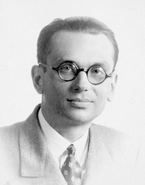
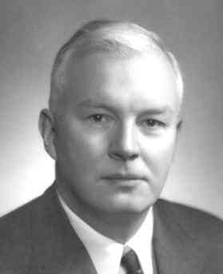

#+title: Lecture Slides for CS 350, URegina Winter 2025
#+subtitle: CS 350
#+AUTHOR: Dr. Joseph Eremondi

#+OPTIONS: toc:1 H:2

#+BEAMER_HEADER: \usepackage[sfdefault]{atkinson} %% Option 'sfdefault' if the base
#+BEAMER_HEADER: \usepackage{FiraMono}
#+BEAMER_HEADER: \usepackage[T1]{fontenc}

#+startup: beamer
#+LaTeX_CLASS:beamer
#+LaTeX_CLASS_OPTIONS: [bigger]
#+LaTeX_CLASS_OPTIONS: [dvipsnames]
#+COLUMNS: %45ITEM %10BEAMER_ENV(Env) %10BEAMER_ACT(Act) %4BEAMER_COL(Col)
#+beamer: \beamerdefaultoverlayspecification{<+->}

#+BEAMER_THEME: moloch [block=fill]

#+BEAMER_HEADER:\definecolor{title}{RGB}{2, 71, 49}
#+BEAMER_HEADER: \setbeamercolor{alerted text}{fg=black}
#+BEAMER_HEADER: \setbeamerfont{alerted text}{series=\bfseries}
#+BEAMER_HEADER: \newcommand{\colored}[2]{{\color{#1} #2}}

#+BEAMER_HEADER: \usepackage[utf8]{inputenc}
#+BEAMER_HEADER: \usepackage[libertine]{newtxmath}
#+BEAMER_HEADER: \DeclareUnicodeCharacter{03BB}{${\lambda}$}
#+BEAMER_HEADER: \usepackage{semantic}
#+BEAMER_HEADER: \usepackage{stmaryrd}
#+BEAMER_HEADER: \mathlig{=>}{\Rightarrow}
#+BEAMER_HEADER: \definecolor{LightGray}{gray}{0.9}
#+BEAMER_HEADER: \usepackage[outputdir=pdf]{minted}
#+BEAMER_HEADER: \usepackage{etoolbox}
#+BEAMER_HEADER: \usepackage{hyphenat}
#+BEAMER_HEADER: \AtBeginEnvironment{minted}{\pause}
#+BEAMER_HEADER: \setminted[racket]{escapeinside=||,bgcolor=LightGray,beameroverlays=true,baselinestretch=1.2,fontsize=\scriptsize}
#+BEAMER_HEADER: \setminted[c++]{escapeinside=||,bgcolor=LightGray,beameroverlays=true,baselinestretch=1.2,fontsize=\scriptsize}
#+BEAMER_HEADER: \setminted[swift]{escapeinside=||,bgcolor=LightGray,beameroverlays=true,baselinestretch=1.2,fontsize=\scriptsize}
#+BEAMER_HEADER: \setminted[rust]{escapeinside=||,bgcolor=LightGray,beameroverlays=true,baselinestretch=1.2,fontsize=\scriptsize}

#+PROPERTY: header-args  :cache yes

#+SETUPFILE: readtheorg_inline.theme

* Introduction
:PROPERTIES:
:EXPORT_FILE_NAME: pdf/slides001-intro.pdf
:CUSTOM_ID: introduction
:END:
#+beamer: \beamerdefaultoverlayspecification{<+->}
#+OPTIONS: todo:nil

** Course Details
:PROPERTIES:
:CUSTOM_ID: course-overview
:END:
*** Course Objectives
To learn:
- Functional programming
  + Recursion
  + Immutable data
  + Programming by cases
  + Higher-order functions
- How to write your own programming language
  + Parsing/Abstract Syntax
  + Desugaring
  + Evaluation

**** _To change how you /think/ about programming_
*** Course Notes / Textbook
- Course Notes: /Functional Languages, Interpreters and Types/
  + Work in progress, so let me know if you discover any errors/issues
  + Covers the first half of the course (Functional Programming)

- Textbook: /Programming Languages: Application and Interpretation/, 3rd edition, by Shriram Krishnamurthi
  + aka PLAI
  + Freely available online, pdf in UR Courses
  + Covers the second half of the course (Implementing Programming Languages)
    - We'll follow loosely

*** Course Communication
- Everything on URCourses
  + Announcements
  + Assignments and Handin
  + Textbook, Slides, Videos
  + Discussion Forum
  + Messages to Instructor

- Do NOT ask programming/conceptual questions by email/private message
  + Use the discussion forum
  + If you're wondering, others are too
  + EXCEPTION: when you can't ask your question without revealing
    your solution to the assignment

*** Office Hours
- Location: RIC 317
  + Take the elevator, go across the bridge and through the door
  + Or take the stairs by the "Church Turing Thesis" wall and vending machines
- Tues at 10:00
- Thurs at 11:30
- Check pinned announcement on URCourses

*** Grading Scheme
  + 35% assignments
  + 15% midterm
    - In-class
    - Wednesday, Feb 12
  + 40% final
  + 10% Participation

*** Participation
- You get marks just for showing up
- Each lecture is 0.5%, to a maximum of 10%
- Each forum post is 0.5%, maximum of 5%
  + e.g. You need to attend half the lectures for full marks
- Assignment 0 is 1% (counts as 2 lectures)

*** Assignment 0
- Due Monday, On URCourses
- Get your Dr. Racket Set up
  + Download from https://download.racket-lang.org/
  + Install the plt file
  + Full instructions on URCourses
- Get your handin account setup
  + Username and password under "Feedback" for "Login Details"
  + Submit the assignment using [[./img/handin.png]]

*** Assignments 1-6
- Six bi-weekly assignments
- Due Fridays at 5pm (17:00)
  + No extensions
  + Lowest two grades dropped
    - Last two are "optional" if you're happy with your marks
*** Assignments (ctd.)
- Mostly programming
  + Some conceptual questions
- Score based on running tests
  + Some public (included in assignment)
  + Some private (only known by me)
  + Code doesn't run $->$ no marks
- Some points for style/documentation/etc.
  +  Sample based marking
*** Submitting Assignments via Handin
- Unlimited submissions before deadline
- After a submission, you get:
  + A score
  + A list of which public tests failed, along with expected results
- *READ THE TEST RESULTS* to know what you need to fix

*** Syntax and Type Errors
- *ALL CODE CONTAINING SYNTAX OR TYPE ERRORS WILL GET A GRADE OF ZERO*
  + The handin tool will give an error message if your file doesn't compile
- If your code has a type or syntax error, you can try submitting again
- It's better to submit code that fails some tests than to submit code with type or syntax errors

*** Resources for This Course
- There are few resources available for you to learn about ~flit~
  + THIS IS BY DESIGN
- You will learn to think about code
  + With your brain
  + Not with copy/paste or AI
- ~flit~ is a small language
  + All the features/functions you need will be described in the course notes
- There are many languages built using Racket
  + Copying code will probably get you a 0

*** Academic Integrity
- You are to complete all assignments *individually*
- Some (easy) questions on assignments are individualized to you, and must be completed for your assignment to be graded.
- All of the following are considered cheating:
  + Using code from a local or online AI tool
  + Copying code from a website like StackOverflow
  + Viewing another student's solution
- ChatGPT DOES NOT UNDERSTAND FLIT
  + Getting AI code to work is harder than just doing the assignment
**** Don't set yourself up for failure on the exams

** Course Content

*** Course Objectives
  Programming language genealogy and design.

  Imperative, functional, and object-oriented language paradigms.

  Context-free grammars and syntax trees.

  Data types, control structures, exception handling, data abstraction, information hiding, and non-determinism.

  Program representation, translation, and execution.

  Functional programming: advantages, constructs, closures, and higher-order operations.

  Parallel programming.

  \phantom{First half of the class}

*** Course Objectives
  Programming language genealogy and design.

  Imperative, *functional*, and object-oriented language paradigms.

  Context-free grammars and syntax trees.

  Data types, control structures, exception handling, data abstraction, information hiding, and non-determinism.

  Program representation, translation, and execution.

  *Functional programming: advantages, constructs, closures, and higher-order operations.*

  Parallel programming.

  - /First half of the class: Programming in Flit/

*** Course Objectives
  *Programming language genealogy and design.*

  *Imperative,* functional, and *object-oriented language paradigms.*

  *Context-free grammars and syntax trees.*

  Data types, control structures, exception handling, data abstraction, information hiding, and non-determinism.

  *Program representation, translation, and execution.*

  Functional programming: advantages, constructs, closures, and higher-order operations.

  Parallel programming.

  - /Second half of class: implementing interpreters/

*** Common Questions
- Am I going to use Racket in Industry?
  + No

*** Common Questions
- Then why are we learning it
  + Don't know what you'll be using in industry
  + Learn a small language that shows core concept
  + Learn the pieces that languages are made of
    - How to see past syntax
    - Understand what programs /mean/
  + Then you'll be able to learn whatever language you need in industry

*** Common Questions
- Do you really expect me to learn a new language in just one term?
  + Yes. *This is a programming languages class*.
  + The language we're learning is small (really just functions and pattern matching)

*** When might this course be useful?
- You might get hired to
  + Write a JavaScript Node server using callbacks to handle requests
  + Maintain a python library full of lambdas and list comprehension
  + Add to Discord's chat system built in Elixr
  # + Add to Wal-Mart's data management system, drowning in Clojure Parentheses
  + Write an Android GUI using Kotlin, Jetpack Compose and function composition
  + Write Rust at Amazon, or write an iPhone app in Swift, and need to use ~Option~ instead of null pointers
- I can't teach you all of Kotlin, JavaScript, Elixr, Rust, Swift, Clojure, Scala, etc. in one term
  + But I can teach you what they're made of

*** The Science of Computer Science
- How to think about programs in a rigorous way
  + Programs as mathematical objects
  + Equations with programs
- Problem solving with types
  + How to make sure you handle all the cases
    - Making invalid states unrepresentable
  + How the shape of a problem can guide to its solution
  + Using types to communicate properties of code
- This is radically different from the kind of coding you have done so far

*  Expressions and Immutable Data
:PROPERTIES:
:EXPORT_FILE_NAME: pdf/slides002-flit.pdf
:header-args:racket: :results code :lang flit
:CUSTOM_ID: expressions-immutable-data
:END:
#+beamer: \beamerdefaultoverlayspecification{<+->}

** Overview
*** Objectives
- To learn how to use Dr. Racket
- To learn how to install and use ~#lang flit~
** Programming in CS 350
*** All coding for this class uses:
- The Racket Programming Language
- The ~flit~ library for Racket
  + Is it a library? Is it a language?
    - Yes
- The Dr. Racket editor
** Racket
*** What is Racket?
- Lisp-style language
  + ~((((((((Parentheses))))))))~
- Language for making languages
  + You will find documentation for many of these languages online
  + They are different from what we are doing. Beware!

*** What is Dr. Racket?
- IDE for Racket
  - Syntax highlighting
  - Parentheses matching
  - Other useful features
    +  Some I've developed custom for this class
- Read-Eval-Print-Loop (REPL)
  + Feedback when writing code
  + Can  evaluate expressions while you're writing your code

** Flit

*** Objectives
- Learn the syntax of core flit features
  + Numbers, booleans, ~if~, functions, ~let*~
- Learn the semantics of these features
  + First view of equations for understanding programs
- Understand how functional ~if~ differs from imperative ~if~

*** What is Flit?
- "Functional Languages, Interpreters and Types"
- Language defined in Racket
  + Functions you can call
  + Adds syntax to Racket
    - Declaring and pattern matching on data types
    - Type annotations for functions
  + Minimal
    - Has what you need to write programming languages
    - Not much else
    - You can do a lot with very little

*** Flit features:
- Purely functional
  + Variables never change values
  + Can't do ~int x = 3; x = 4;~
- Strongly typed
  + Every expression has a type
  + No implicit coercion between types
- Type inference
  + Don't have to write down the types
  + Writing types down is still a good idea
    - Compiler checks if the actual type matches what you wrote
    - Serves as documentation
- Data Types with Variants

*** Syntax in Flit
- Expression: something that we run to compute a value
- Every flit expression is either:
  + A literal (e.g. ~3, "hello", #t, #f~)
  + An identifier (variable/function name), e.g. ~x, y, +, and, or~
  + Parentheses containing some expression ~(a b c d ...)~
- Parentheses mark the start and end of complex expressions
- If the first thing in the parentheses is a keyword, then that keyword determines
  the meaning of the expression
  + e.g. ~if, lambda, type-case~
- Otherwise, interpreted as a function call
  + First thing in the parentheses is the function to be called
    - NOT always a named function!

*** Infix vs. Prefix
- All operations in Flit are written using "prefix notation"
  + Operation, then arguments
  + ~(+ 2 3)~, not ~(2 + 3)~
- Languages like C++ and Python use "infix notation" for math

*** Function calls
- In C++ you write ~f(x,y,z)~
- In Flit, you write ~(f x y z)~
- 99% of what you do in Flit is calling functions

*** Why Parentheses?
- They're different from what you're used to
  + I want to to learn to see /past/ syntax
- You can tell /exactly/ where an expression starts and ends
- You can tell exactly the order of operations
  + No need for BEDMAS/PEMDAS or precedence rules
- Most importantly: *Programs are Trees*
  + Hierarchical structure: expressions contain expressions contain expressions...
  + Parentheses make this very explicit

*** Square vs. Round vs. Curly
- Racket treats all parentheses as the same
#+begin_src racket  :exports both
(+ 1 2)
[+ 1 2]
{+ 1 2}
#+end_src

#+RESULTS:
#+begin_src racket
3
3
3
#+end_src

- We'll use square brackets in some places for clarity
  + Save Curly brackets for the second half of the class

*** Parentheses in the real world
- e.g. Clojure, uses parentheses
- WebAssembly has an S-Expression based syntax for programmers
- JSON is basically just funny-looking parentheses

*** Numbers
- Most operations prefix version of what you've seen in C++/python

#+begin_src racket :exports both
(+ 2 7)
(- 10 0.5)
(* 1/3 2/3)
(/ 1 1000000000000.0)
(max 10 20)
(modulo 10 3)
#+end_src

#+RESULTS:
#+begin_src racket
9
9.5
2/9
1e-12
20
1
#+end_src

*** Booleans
- Literals written #t and #f
- Prefix versions of most boolean operations

#+begin_src racket :exports both
(= (+ 2 3) 5)
(> (/ 0 1) 1)
(zero? (- (+ 1 2) (+ 3 0)))
(and (< 1 2) (> 1 0))
(or (zero? 1) (even? 3))
#+end_src

#+RESULTS:
#+begin_src racket
#t
#f
#t
#t
#f
#+end_src

*** Imperative Languages
- C, C++, and Python are /imperative languages/
  + Each statement tells what to /do/
- Mutable state and side-effects
    + Program state: current variable values
    + Statements can change the state
      - /Mutate/ value of variable

*** Functional Language
- Flit is /purely functional/
- Program is made up of /expressions/
  + These evaluate to a /value/
- Variables are /immutable/
  + Like variables in math
  + Can make new ones, but value never changes
- Use functions and recursion to do all computation

*** Example: Imperative Conditionals
- Conditionals in C++/Python tell what to /do/
#+begin_src C++
if (someCondition)
  doThis
else
 doThat
#+end_src
- The if-statement doesn't have a value, but it can mutate (change) the state

***  Conditional Expressions
#+begin_src racket :exports both
(if (< 2 3) "hello" "goodbye")
;; another example
(+ 3
  (if (= 2 (+ 1 1))
      3
      40))
#+end_src

#+RESULTS:
#+begin_src racket
"hello"
6
#+end_src

- Conditionals in Flit are *expressions*, not statements
- Value is either the "then" branch or the "else" branch
  + Always have 2 branches
- Boolean changes what the expression *is*, not what it does
  + e.g. Above, the 2nd ~if~ evaluates to ~3~ because the condition evaluates to true

*** Equational Reasoning
- When all variables are immutable, we can treat programs as mathematical objects
- Write equations about programs as if they were numbers/booleans/etc.
- /Referential transparency/
  + If you give a functional program the same inputs, you will always get the same outputs
- Example:

  #+transclude: [[file:notes.org::flit-plus-semantics][Semantics of Plus]]
  - Math plus is different than Flit plus, needs numbers, not expressions

*** Imperative Breaks Equational Reasoning
- In C++, the equals sign is a LIE
  #+begin_src C++
  int x;
  x = 3;
  x = 4;
  #+end_src
  - Have ~x = 3~ and ~x = 4~, so surely ~3 = 4~, right?

*** Equations for IF
- We can describe the behaviour of if-expressions with the following two equations:

#+name: flit-if-semantics
#+begin_definition Semantics of If
For any expressions ~EXPR1~ and ~EXPR2~
- ~(if #t EXPR1 EXPR2) = EXPR1~
- ~(if #f EXPR1 EXPR2) = EXPR2~
#+end_definition

- The equals sign is not a lie here
  + The two sides of the equation have the same run-time result
  + No matter what we choose for ~EXPR1~ or ~EXPR2~
***  Functions
- Calling a function replaces variable with concrete argument
#+begin_src racket :exports both
;; Define a function
(define (addOne [x : Number]) : Number
  (+ x 1))

;; Call the function we defined
(addOne 10)
#+end_src

*** Calling Functions
- Syntax for calling a function is
  + Open bracket
  + Function name
  + Arguments, each separated by whitespace
  + Close bracket
#+begin_src racket
(f arg1 arg2 arg3 ... argN)
#+end_src

- Each argument might be a variable or a literl, or a complex expression in brackets

***  Defining Multi-Argument Functions
#+begin_src racket :exports both
(define (isRemainder [x : Number]
                     [y : Number]
                     [remainder : Number])
        : Boolean
  (= remainder (modulo x y)))
(isRemainder 10 3 1)
(isRemainder 10 4 1)
#+end_src

***  General Form Defining Functions
- General form:

#+begin_src racket :exports code
(define (functionName
         [argName : argType]
         ...
         [argNameN : argTypeN]) : returnType
  functionBody)
#+end_src
- Brackets around the function name, followed by arguments
  + Each argument given as ~[name : Type]~
  + We'll use ~:~ to mean "has type" a lot in this class
- After name/arguments closing paren, have ~: returnType~
- Then, the body of the function
  + e.g. the code to run
- Later in the course we'll see another way of defining functions

*** Type Inference
- We can leave types off function arguments and return type
- Compiler is /usually/ smart enough to figure out the types
  #+begin_src racket
  ;; example
  (define (addone x)
    (+ x 1))

  ;; in general
  (define (functionName argName1 argName2 ... argNameN)
    functionBody)
  #+end_src

*** Semantics of Function Calls
- Functions are about /substitution/:
#+name: flit-funcall-semantics
#+begin_definition Semantics of Function Calls
If a function ~f~ is defined as:
- ~(define (f x) body)~
then for any expression ~EXPR~, we have:
- ~(f EXPR) = [x => EXPR]body~
where ~[x => EXPR]body~ is ~body~, with all non-shadowed occurrences of the variable ~x~ replaced by ~EXPR~
#+end_definition
*** Symbols :noexport:
- Special type in Racket
- Written with single quote ~'a~, ~'hello~, ~'foo~
- Like strings, but you don't ever traverse/concatenate/look inside
- Only relevant operation is comparison
  + ~(symbol=? 'a 'b)~
  + Compares pointers, so very fast

*** Intermediate definitions

- Can still define variables
  + Once they're given a value, never changes
  + Allows re-use
    - Only evaluated once, can use multiple times
#+begin_src  racket :noweb strip-export :exports both
(define (squaredSum [x : Number]
                    [y : Number]) : Number
  (let ([xy (+ x y)])
    (* xy xy)))
(squaredSum 1 2)
#+end_src

#+RESULTS:
#+begin_src racket
9
#+end_src

*** Understanding Definitions
**** In C++, you might write
  #+begin_src C++
        while (someCond){
                int x = f(3);
                doSomethingWith(x);
                doSomethingElseWith(x);
        }
  #+end_src

  - ~let~ is similar
    + Scope is clear from the brackets
    + Functional, so the ~doSomething~ never changes the value of ~x~
    + Could have just written ~f(3)~ instead of ~x~ in both places
      - Same, as long as there's no side effects
*** General Syntax
- In general:

#+begin_src racket
(let* ([varName1 EXPR1]
       [varName2 EXPR2]
       ...
       [varNameN EXPRN])
  bodyEXPR)
#+end_src

- Keyword ~let*~, a bracketed list of defined variables, then the body
- Defined vars ~[variableName variableValue]~
  + Round vs. Square not important
  + Defining just one variable has double brackets
    - ~(let* ([x 3]) (+ x 1))~
    - Kind of awkward, but just how it works

*** Semantics of Let
#+name: flit-single-let-semantics
#+begin_definition Semantics of Let for Single Variables
For any expression ~EXPR~, we have:
- ~(let ([x EXPR]) body) = [x => EXPR]body~
where ~[x => EXPR]body~ is ~body~ with all non-shadowed occurrences of ~x~ replaced by ~EXPR~
#+end_definition

  - Multiple variables work similarly, but also do the substitution in the expressions of later variables values
    + We'll see this formally later

*** Alternate versions of Let
- There's also ~let~
  + Like ~let*~, but when multiple variables, can't refer to each other
- Recursive version ~letrec~
  + Can define multiple variables that all refer to each other and themselves
- For now you only need ~let*~
  + Very useful for gradually building up a complex solution from previous smaller bits

* Types in Flit
:PROPERTIES:
:EXPORT_FILE_NAME: pdf/slides003-types.pdf
:header-args:racket: :results code :lang flit
:CUSTOM_ID: types-in-flit
:END:
#+beamer: \beamerdefaultoverlayspecification{<+->}
** Programming with Holes

***  Why write down types?
- With type inference, we don't /need/ to write down types
- Still a good idea to write them down
- Writing a type is like running an infinite number of tests
  + Compiler makes sure that every possible run of your program produces the type written down
- Sanity check
  + Make sure types in your head match the types in the code
- Documentation
  + Types make it very clear what arguments a function expects

*** Checking Types
- Can annotate any expression to confirm its type
#+begin_src racket :exports both
(has-type 3 : Number)
(has-type #t : Boolean)
(has-type "hello" : String)
#+end_src

#+RESULTS[a2fa135bb1c1aa22cf318423c40145565390d619]:
#+begin_src racket
3
#t
"hello"
#+end_src

*** Strong Typing
- Flit is /strongly typed/
  + Won't do automatic conversions for you
  + No ~void*~ type that we can use to cast through
  + Doesn't have JavaScript ~"1"+1="11"~ but ~"1"-1=0~
#+begin_src racket
(+ "1" 1)
#+end_src
- Gives ~typecheck failed: Number vs. String~

*** Thinking About Types
- With any type, there are two things we care about
  + How to /directly/ create a value of that type
  + How to /directly/ use a value of that type
    - Can also create/use any value by giving it to a function expecting/returning that type
    - Eventually, you need some primitive operations

*** Numbers
- To create: literals ~3~, ~22~, ~0.00001~
- To use: built in arithmetic ~+, -,  *, /~  etc. and comparisons like ~zero?~
- Operations have function types
  + ~+ : (Number Number -> Number)~
  + ~zero? : (Number -> Boolean)~

*** Strings
- To create: string literals
  + ~"hello"~ ,  ~""~,  ~"abcdefg"~
- To use: mostly built-in operations
  + e.g. ~string-ref : (String Number -> Char)~
  + ~string-append : (String String -> String)~
  + I'll highlight relevant functions as we see them

*** Booleans
- To create: literals ~#t~, ~#f~
- To use: ~if someBool e1 e2~
- E.g. the purpose of booleans is to be things we give to ~if~ expressions

*** Types for If
- ~if~ is not a function
  + Doesn't evaluate unused branches
- Need a special rule to determine its type
  + Can have ~any~ type, depending on the type you give it
- Just like we have equations, we can make formal rules for typing

*** Typing Rule for If
  #+name: flit-if-typing
  #+begin_definition Typing for If
  For any expressions ~EXPR1~, ~EXPR2~ and ~EXPR3~,
  - if ~EXPR1 : Boolean~, and
  - there is some type ~T~ such that ~EXPR2 : T~ and ~EXPR3 : T~,
  then:
  - ~(if EXPR1 EXPR2 EXPR3) : T~
  #+end_definition

  - Condition must always be boolean
  - Don't care what the type of the branches is, but the *need to be the same*
    + Type-checker will give error if branches have different types
  - Result of the ~if~ has the same type as the branches

*** Function Calls
  #+name: flit-app-typing
  #+begin_definition Typing for Function Calls
  For any expressions ~EXPR_f~ and ~EXPR_arg~
  - if ~EXPR_f : T1 -> T2~
  - and ~EXPR_arg : T1~
  - then ~(EXPR_f EXPR_arg) : T2~
  #+end_definition

- When asking "how can I make a value of this type":
  + Can always try "call a function that returns that type"
- The type-checker makes sure that:
  + The arguments have the type the function expects
- Multi-argument functions are similar

*** Function Definitions

  #+name: flit-fundef-typing
  #+begin_definition Typing for Function Definitions
  For a definition ~(define (f x1 ... xN) body)~
  - if ~body : T_ret~
    +  /under the assumption that/ ~x1 : T_1~ ... ~xN : T_N~
  - then ~f : (T_1 ... T_N -> T_ret)~
  #+end_definition
  - e.g. a function type with arguments matching the ~x~'s types, and return type matching the body

  - Function variable types are /assumptions/, not obligations

    + To /define/ function, don't provide things of the argument types

    + Instead, can pretend you already have things of those types

      - e.g. the parameters

*** Programming Via Holes
- Figure out the type of the thing you're trying to write
  + Often, I give this to you
- Write a dummy function with that type, with ~TODO~ as the body
- Write some tests that capture what you're expecting the function to do
- Repeat until all tests pass and there's no more holes:
  + Fill in a hole with something of the right type
    - Which might contain more holes
    - Could be function call, ~if~, in-scope variable, etc.

*** Functions for Filling Holes
- Can always fill a hole of type ~T~ by applying a function that returns type ~T~
  + Give a hole as each argument for that function
- Now, you've replaced one hole with 0 or more holes
  + Yay?
  + Hopefully these holes are simpler
  + Can try to fill them with literals, variables, or other function calls
- We'll see more of this with recursion and datatypes

*** Example: Max
#+begin_src racket
(define (max [x : Number] [ y : Number]) : Number
  TODO)
#+end_src
#+BEGIN_EXAMPLE
x : Number
y : Number
---------------
TODO : Number
#+END_EXAMPLE
- We /have/ two numbers ~x~ and ~y~
- We /want/ a number

*** Example: Max (ctd.)
- Try putting in an ~if~
#+begin_src racket
(define (max [x : Number] [ y : Number]) : Number
  (if TODO TODO TODO))
#+end_src
#+BEGIN_EXAMPLE
x : Number
y : Number
---------------
TODO1 : Boolean
TODO2 : Number
TODO3 : Number
#+END_EXAMPLE
- Now we need a condition, and something for the true/false cases

*** Finishing Max

- Try putting in an ~if~
#+begin_src racket
(define (max [x : Number] [ y : Number]) : Number
  (if (<= x y) y x))
#+end_src

- The variables ~x~ and ~y~ were available for filling the holes
  + Because we were inside the function body

*** Calling Max
- Can use equations to determine the result
 |-------------------------------+-----------------------|
 | ~(max 3 4)~                     | Starting value        |
 | ~[x=>3][y=>4](if (<= x y) y x)~ | Sem. of function call |
 | ~(if (<= 3 4) 4 3)~             | Do the substitution   |
 | ~(if #t 4 3)~                   | Semantics of ~<=~       |
 | ~4~                             | Semantics of If       |
 |-------------------------------+-----------------------|

* Recursion and Lists
:PROPERTIES:
:EXPORT_FILE_NAME: pdf/slides004-recursion.pdf
:header-args:racket: :results code :lang flit
:CUSTOM_ID: recursion-lists
:END:
#+beamer: \beamerdefaultoverlayspecification{<+->}
** Functional Thinking and Recursion

# [[./img/smbc_recursion.png]]
# *** What Is Functional Programming?
# - Functions in our program correspond to functions in math
#   + Mapping from inputs to outputs
#   + Same inputs always produce the same outputs
# - Talk about what programs *are*, not what programs do
# - Instead of changing variable values
#   + We call functions with different arguments
# - Instead of changing data structures
#   + We decompose them, copy the parts, and reassemble them in new ways
#   + Copying is implemented with pointers
#     - Fast, memory efficient

# *** Advantages of Functional Programming
# - All program state is *explicit*
#   + Easy to tell exactly what a function can change
#   + No shared state between components
#     - Other function can't change value without realizing
#     - No data races for threading
# - Programming is *declarative*
#   + Structure of the problem guides structure of the solution
# - Equational reasoning
#   + In imperative languages, equals sign ~=~ is a LIE
#     - Can write ~x = 3; x = 4;~, but ~3 != 4~
#   + If have ~(define (f x) body)~, then for all ~y~,
#     ~(f y)~ and ~body~ are interchangable
#     - after replace ~x~ with ~y~ in ~body~
#     - Easier to tell if your program is correct
#     - Some optimizations easier
# *** Disadvantages of Functional Programming
# - None?
# - Sometimes slower
#   + Very hard to do without Garbage Collection
#     - e.g. see Closures in Rust
#   + Sometimes faster because you need fewer safety checks in your code
# - Farther from what the CPU is actually doing
# - Some algorithms are more concise with mutation
#   + But lots aren't

*** Trees and Recursion
- A lot of data has tree-like structure
- Recursion is the natural way to process hierarchical data
  + Especially if there's not a bound on the depth
  + E.g. how do we handle input when we don't know how big it is?

*** Example: Natural Numbers
- Any whole, non-negative number is either:
  + Zero
  + One plus another smaller number

*** The Magic of Recursion
- When writing a function, you can pretend:
  + You already have a function
  + With the same type as the function you're trying to write
  + That always produces the correct result
  + As long as you give it /smaller/ inputs
    - For some notion of smaller
- If your data is composed of smaller pieces, you probably want to call the recursive function on those pieces
- *DO NOT* try to "unfold the recursion" in your head
  + Or even think about a function calling itself
  + The "assume we have a solution for smaller inputs" is the correct way to think about recursion
- If you've seen mathematical induction, it's the same idea
  + In my special topics class they're /literally/ the same

*** Writing Recursion Functions Using Holes
- Write the type of the function you're trying to make
- Put ~TODO~ as its body
- Use ~if~  to make a branch for each possible shape the input has
  + Put ~(let* () TODO)~ as the body
- In the ~let*~, define variable:
  + Decompose your input into its parts
  + Call the recursive function on the parts that have the right type
    - You might need to guess/figure out some of the other arguments
- Look at what you have in scope
- Put the pieces together to create a result of the correct type
  + Hopefully that solves the problem

*** Factorial - Types
- $n! = 1 \times 2 \times \ldots n$
- Takes in a (natural) number, outputs a number
  #+begin_src racket
  (define (factorial [n : Number]) : Number
    TODO)
  #+end_src

*** Factorial - Tests
  #+begin_src racket

  (test (factorial 0) 1 )
  (test (factorial 1) 1 )
  (test (factorial 2) 2 )
  (test (factorial 3) 6 )
  (test (factorial 4) 24 )
  (test (factorial 5) 120 )
  #+end_src
- Notice the pattern?

*** Factorial - Template
- A natural number is either
  + Zero
  + One more than some other number
    - We call this the "successor", written "S" or "suc"
    - Probably want to use this in the solution
#+begin_src racket
(define (factorial [n : Number]) : Number
  (if (zero? n)
      ;; zero case
      (let* ()
        TODO)
      ;;n+1 case
      (let* ()
        TODO)
      ))
#+end_src

*** Factorial - Decomposing the Input
- No "parts" of zero
  + This is the base case
  + One more than some other number
    - We call this the "successor", written "S" or "suc"
    - Probably want to use this in the solution
- ~>0~ case: it's one greater than another number
  + This is a recursive case
#+begin_src racket
(define (factorial [n : Number]) : Number
  (if (zero? n)
      ;; zero case
      TODO ;; no parts of zero
      ;;n+1 case
      (let* ([n-1 (- n 1)])
        TODO)
      ))
#+end_src

*** Factorial - Recursion
- Input to ~factorial~ is a number
- Component ~n-1~ is a number
  + So can call ~factorial~ recursively on it!
#+begin_src racket
(define (factorial [n : Number]) : Number
  (if (zero? n)
      TODO
      (let*
          ([n-1 (- n 1)]
           [factn-1 (factorial n-1)])
          TODO)
      ))
#+end_src

*** Factorial - Filling holes
- Base case: factorial of 0 is 1
  + Can't be zero, otherwise everything would be zero
- Notice the pattern
  + The product of the first n numbers is the same as n times the product of first n-1 numbers
  + We get that from our recursive call
#+name: factorial-complete
#+begin_src racket
(define (factorial [n : Number]) : Number
  (if (zero? n)
      1
      (let*
          ([n-1 (- n 1)]
           [factn-1 (factorial n-1)])
          (* n factn-1))
      ))
#+end_src

*** Run Tests
#+begin_src racket :exports both :noweb strip-export
<<factorial-complete>>
(test (factorial 0) 1 )
(test (factorial 5) 120 )
#+end_src

#+RESULTS[34a75a914469fc8950d69bb58fcc1f91aaa35232]:
#+begin_src racket
good (factorial 0) at line 11
  expected: 1
  given: 1

good (factorial 5) at line 12
  expected: 120
  given: 120

#+end_src

*** Preconditions
- Note: types not quite precise enough
  + e.g. ~(factorial -1)~ or ~(factorial 1/2)~ loop forever
- Precondition: argument is a non-negative whole number
  + Can't express this in the code, so write in the comments
  + Aside: I research languages where you /can/ express this with types
- It's the responsibility of the callee to make sure the precondition holds
  + You can check for safety, but you don't have to

*** Postcondition
- Something true about the return of the function
  + That can't be expressed in the types
- Writer of the function must make sure that it holds

*** Another Example: Exponentiation
+ Live coding in Dr. Racket

** Unbounded Data: Lists

*** Lists Abstractly
- Sometimes you want a bunch of things
- e.g. ~'(1 2 3 4 5)~ or ~("To" "be" "or" "not" "to" "be")~
- You might want to track some things you encounter/generate
  + E.g. Add to a list, combine lists, etc.
- Might want to do something for each element of a list
- If you have some number of things:
  + Either that number is 0, and you have nothing
  + Or you have at least one thing, plus the rest of the things

*** Functional Linked Lists
- Every linked list is one of:
  + Empty (sometimes called ~nil~ or ~null~)
    - No relation to ~NULL~ pointer in C++
  + An element appended to the beginning of another list
- We call the operation of appending an element to a list ~cons~
  + Historical name, goes back to LISP days
- Cons does *not* change its input
  + Creates a new list whose tail is the old list
  + Like const reference  in C++

*** Lists in Flit
+ Multiple ways to write lists
+ ~'()~ is the empty list, can also write ~empty~
+ Extending lists:  ~(cons h t)~ creates list with element ~h~ appended to list ~t~
  - ~h~ and ~t~ for ~head~ and ~tail~
+ List literals, can write ~(list 1 2 3 4)~ or ~'(1 2 3 4)~
  - Shorthand for:
  - ~(cons 1 (cons 2 (cons 3 (cons 4 empty))))~
+ We'll favour ~list~, but the REPL might use ~'(...)~
+ Lots more helper functions, we'll see throughout the class
  

*** Types for Lists
- Lists are a /parameterized type/
  + For any type ~T~, you can have ~Listof T~
  + Like C++ Generics
- Common list operations
  + ~empty : (Listof 'a)~
  + ~cons : ('a (Listof 'a) -> (Listof 'a))~
  + ~empty? : ((Listof 'a) -> Boolean)~
  + ~first : ((Listof 'a) -> 'a)~
  + ~rest : ((Listof 'a) -> (Listof 'a))~
- ~'a~ is /type variable/, functions will work for any type in place of ~'a~
  +  We'll learn more about this later

*** Template for Lists
- Two cases: list is empty or cons
- Cons case has
  + Head (first element)
  + Tail (rest of the list)
- Can make a recursive call on tail of cons case
  #+begin_src racket
  (define (list-template
           [xs : (Listof Number)])
    (if (empty? xs)
       TODO
        (let ([h (first xs)]
              [t (rest xs)]
              [recRest (list-template t)])
          TODO)
        ))
  #+end_src

*** Example: Sum Template
#+begin_src racket :exports both
  (define (sum [xs : (Listof Number)])
    : Number
    (if (empty? xs)
        TODO
        (let* ([h (first xs)]
               [t (rest xs)]
               [sumRest (sum t)])
          TODO)))
#+end_src
*** Example: Sum
- Have the first number
- Recursive call gives us the sum of the rest of the list
- Adding them together gives the final result
#+begin_src racket :exports both
  (define (sum [xs : (Listof Number)])
    : Number
    (if (empty? xs)
        0
        (let* ([h (first xs)]
               [t (rest xs)]
               [sumRest (sum t)])
          (+ h sumRest))))
   (sum empty)
   (sum '(1 2 3))
   (sum '(100 2 3))
#+end_src

#+RESULTS[7368d2c35d6fa7c13e931c55a9f9d4723a939ff1]:
#+begin_src racket
0
6
105
#+end_src

*** Pattern Matching: Intuition
+ Recursive case: used "getter" function to get the sub-data in the recursive case
  - ~(- x 1)~ for numbers
  - ~first~ and ~rest~ for lists
+ Always want to have the sub-parts available
+ Don't want to apply getters on the wrong data
  - e.g. ~first empty~ will raise an error

*** Pattern Matching
#+begin_src racket
  (define (sum [xs : (Listof Number)])
    : Number
    (type-case (Listof Number) xs
        [(empty) 0]
        [(cons h t)
        (let* ([sumRest (sum t)])
          (+ h sumRest))
        ]))
#+end_src

*** General Syntax for List Matching
#+begin_src racket
(type-case (Listof SOME_TYPE) listToExamine
        [(empty) emptyResult]
        [(cons h t) consResult
        ])
#+end_src
- We have to specify the type
  + Technical limitation, I'm working on getting rid of this
- ~h~ and ~t~ are variable names
  + You can choose whatever names you want
- The pattern match /defines/ two new variables ~h~ and ~t~
  + In-scope in ~consResult~
  + Not in-scope for ~emptyResult~
    - Can't get the head and tail of an empty list

*** Why pattern matching?
- Never perform an un-safe operation
  + Only extract head and tail of list when we know they exist
- Compiler checks that you've handled all the cases
  + e.g. Will error if you leave out ~empty~ case
  + Never forget an edge-case
- Naturally follows the flow of recursion
  + Matched variables are always for "smaller" values that you can call recursive function on

*** Example: Generating a Modified List
:PROPERTIES:
:BEAMER_env: exampleblock
:END:
+ Can also generate lists
+ e.g. Increment each number in a list
  + Uses pattern matching
  + Shows how to create lists recursively
    #+begin_src racket :exports both
  (define (increment [xs : (Listof Number)])
          : (Listof Number)
    (type-case (Listof Number) xs
      [(empty)
         TODO]
      [(cons h t)
        (let* ([incrTail (increment t)])
         TODO)]))
  (increment '(2 3 4))
    #+end_src

*** Example: Types
- Empty Case
 #+begin_example
 xs : (Listof Number)
 --------------
 TODO : (Listof Number)
 #+end_example

- Cons Case
 #+begin_example
 xs : (Listof Number)
 h : Number
 t : (Listof Number)
 incrTail : (Listof Number)
 --------------
 TODO : (Listof Number)
 #+end_example

*** Example: Generating a Modified List
- If we've got a list that is the tail, but with each number incremented
  + Then we can increment the first
- Use ~cons~ to make a result list containing the new head and new tail

     #+name: list-increment
     #+begin_src racket :exports both
   (define (increment [xs : (Listof Number)])
           : (Listof Number)
     (type-case (Listof Number) xs
       [(empty)
          empty]
       [(cons h t)
          (let* ([incrTail (increment t)]
                 [incrHead (+ 1 h)])
            (cons incrHead incrTail))]))

     (increment (list 1 2 3))
     #+end_src

     #+RESULTS[0cc4d73387fd1dcd26b031e109029226350b7352]: list-increment
     #+begin_src racket
     '(2 3 4)
     #+end_src

*** Generating is not Modifying

- After ~increment~, the old list still exists
  #+begin_src racket :exports both :noweb strip-export
  <<list-increment>>
  (define someList   (list 1 2 3 4))
  (define otherList (increment someList))

  someList
  otherList
  #+end_src

  #+RESULTS[c98f7328d149d54e0491af00bc3a61c2b0338cee]:
  #+begin_src racket
  '(1 2 3 4)
  '(2 3 4 5)
  #+end_src

*** Parametric Polymorphism
+ Lists are a *parameterized type*
  - Only need to define once for the different element types
+ Many list functions are *polymorphic*
  - Work regardless of what type of elements there are
  - Types contain *type variables*, denoted with single quote ~'x~
    + Like symbols
  - Flit type inference figures out solutions for type variables when you call a function
  - E.g. ~first : ((Listof 'a) -> 'a)~
    + Input is list whose elements are some type ~'a~
    + Output has type ~'a~
    + e.g. ~first '(1 2 3)~ is a ~Number~, but ~first '(#t #f #t)~ is a Boolean
+ Later, this will be very useful for writing generic list operations

*** Example: List Concatenation
- We can combine two lists into a single list
- Polymorphic type
  + Works for list with any contents
  + We never do anything with the contents other than copy
  + This function is built into Flit as ~append~
    #+name: plait-concat-def
    #+begin_src racket
  (define (concat [xs : (Listof 'elem)]
                  [ys : (Listof 'elem)])
          : (Listof 'elem)
    (type-case (Listof 'elem) xs
      [(empty)
         ys]
      [(cons h t)
         (cons h (concat t ys))]))
    #+end_src

*** Example: List Concatenation (ctd.)
**** Example
:PROPERTIES:
:BEAMER_COL: 0.48
:BEAMER_ENV: block
:END:
    #+name: plait-concat
    #+begin_src racket :exports both :noweb strip-export
  <<plait-concat-def>>

  (concat '(1 2 3) '(4 5 6))
  (concat '("3" "5") '("0"))
  (concat empty '(#t))
  (concat '(#f) empty)
    #+end_src

**** Results
:PROPERTIES:
:BEAMER_COL: 0.48
:BEAMER_ENV: block
:END:
#+RESULTS: plait-concat

*** More Examples
- Demo: Dr. Racket (as time permits)
  + Duplicating each element of a list
  + Filtering out odd elements of a list

* Defining Data Types
:PROPERTIES:
:EXPORT_FILE_NAME: pdf/slides005-datatypes.pdf
:header-args:racket: :results code :lang flit
:CUSTOM_ID: defining-data-types
:END:
#+beamer: \beamerdefaultoverlayspecification{<+->}

** Warmup: Pairs
:PROPERTIES:
:CUSTOM_ID: warmup-pairs
:END:

*** Pairs: "AND" for types
-  ~(Number * Boolean)~
  + Cartesian product
    - "AND" for types
  + A value of this type contains a ~Number~ AND ~a Boolean~
  + Why is it infix? Who knows
    - Maybe to help distinguish it from multiplication
- Projections
  + Get the data from the pairs
#+begin_src racket :exports both
(define myPair : (Number * Boolean)
   (pair 2 #t))
(fst myPair) ;;Number
(snd myPair) ;;Boolean
#+end_src

#+RESULTS:
#+begin_src racket
2
#t
#+end_src
*** Pairs in General
- For any types ~'a~ and ~'b~ there is a type ~('a * 'b)~
- Build with ~pair : ('a 'b -> ('a * 'b))~
  + Takes one argument of each type, produces the pair
- Projections
  + ~fst : (('a * 'b) -> 'a)~
  + ~snd : (('a * 'b) -> 'b)~
- Used for functions that return multiple values
  + Or to pass two values as one to a function
*** Pairs as Anonymous Records
- Pairs similar to two-field structs in C++
  + Main difference: no need to make a new name for pairs
  + Can write generic code that works for all pairs
#+begin_src racket
(define (flip [pr : ('a * 'b)]) : ('b * 'a)
  (pair (snd pr) (fst pr)))
(flip (pair 3 4))
#+end_src

#+RESULTS[984e46ec415816730d26cc8264c5eb0ad445e150]:
#+begin_src racket
(values 4 3)
#+end_src

- Python has pairs/tuples as a core datatype
  + Tuple: equivalent of pair, but with $n$ elements for some $n$
  + ~('a * b' * 'c * d' ...)~

*** Defining the Pair type

- Pairs are built in, but we could define them like this:

#+begin_src racket
(define-type (Pair 'a 'b)
  [pair [elem1 : 'a] [elem2 : 'b]])
#+end_src

- ~Pair~ is the name of the type
- ~'a~ and ~'b~ are the type parameters
  + e.g. the types of things in the pair
- There is one constructor, called ~pair~
  + type name uppercase, constructor lowercase
- It has two fields
  + ~fst~ and ~snd~ are just names we choose for the fields
- Fields have types ~'a~ and ~'b~
    - e.g. the types of the things in the pair
*** Example: Odds and Evens
#+name: evensodds
#+begin_src racket :exports both
(define (splitOddsEvens [nums : (Listof Number)])
  : ((Listof Number) * (Listof Number))
  (type-case (Listof Number) nums
             ;; Empty list has no odds or evens
             [(empty)
                (pair '() '())]
             [(cons h t)
              ;; Recursion splits tail into odds/evens
              ;; use fst and snd to get these two lists
               (let* ([splitTail (splitOddsEvens t)]
                      [tailOdds (fst splitTail)]
                      [tailEvens (snd splitTail)])
                 ;; Now check if the head is odd or even
                 ;; and add head to correct list
                 (if (= 0 (modulo h 2))
                     ;; If even, add head to the second list
                     (pair tailOdds (cons h tailEvens))
                     ;; If odd, add head to the first list
                     (pair (cons h tailOdds) tailEvens)))]))
#+end_src

*** Example: Odds and Evens (ctd)
#+begin_src racket :noweb strip-export :exports both
<<evensodds>>
(splitOddsEvens (list 1 2 3 4 5 7 11 2 4 7))
#+end_src

#+RESULTS[38106e14b26b141f8044e85d8f1d2fe75821dd1f]:
#+begin_src racket
(values '(1 3 5 7 11 7) '(2 4 2 4))
#+end_src

** Algebraic Data Types
:PROPERTIES:
:CUSTOM_ID: algebraic-data-types
:END:

*** "OR" for types
- Pairs gave us "AND"
- What does "OR" look like for types?
  + ~(OR Number Boolean)~ should be the type of values that are either a number or a boolean
  + Want a tag so we can check which one it is
    - Called a "constructor"
    - not the same as Java/OOP constructor
- Saw some examples like this already
  + A number is zero OR one plus another number
  + A list is empty OR an element cons-ed to another list
- Racket lets us define our own types mixing AND and OR

*** First example

#+begin_src racket
(define-type Shape
  (Rectangle [length : Number]
             [width : Number])
  (Circle [radius : Number]))

#+end_src
- ~Shape~ is a /datatype/
- It has two /constructors/, ~Rectangle~ and ~Circle~
  + i.e. a Shape is a circle OR a rectangle
- ~Rectangle~ has two fields, named ~length~ and ~width~, with type Number
  + ~length~ and ~width~ are just names we choose
- ~Circle~ has one field named ~radius~ with type Number

*** Constructors
#+begin_src racket
(define-type Shape
  (Rectangle [length : Number]
             [width : Number])
  (Circle [radius : Number]))

#+end_src
- A constructor for a datatype doesn't "do" anything
  + Functional language
- Gives the primitve way to create a value of that type
- Can use as functions
  + E.g. A rectangle contains two numbers
  + Calling ~Rectangle~ on two numbers returns a value of type ~Shape~
  + ~Rectangle : (Number Number -> Shape)~
  + ~Circle : (Number -> Shape)~
    - Because it only has 1 field

*** Creating values of a datatype
#+name: shape-defn
#+begin_src racket
(define-type Shape
  (Rectangle [length : Number]
             [width : Number])
  (Circle [radius : Number]))

(define tv (Rectangle 16 9))
(define loonie (Circle 1))
#+end_src
- A Shape either has two numbers OR one number
  + Flit keeps a tag on each value of type ~Shape~
  + Tells us if it's a ~Rectangle~ or ~Circle~

*** Auto-generated Functions
- Flit makes "checkers" and "getters"
  +  We won't use these very much
#+begin_src racket :noweb strip-export
<<shape-defn>>
(Rectangle? tv)
(Circle? tv)
(Rectangle-length tv)
;; (test/exn (Circle-radius tv) "")
  ;;raises an error, no such field present
#+end_src

#+RESULTS[c9b1387816a0e0dbc19637078ecf002c4f27d7c3]:
#+begin_src racket
#t
#f
16
#+end_src

*** Pattern matching
- Don't want to accidentally get a field that doesn't exist
- Almost always want to use the fields in the solution
- Solution: pattern-matching
#+begin_src racket :noweb strip-export :exports both
<<shape-defn>>
(define (area [shp : Shape]) : Number
  (type-case Shape shp
     [(Rectangle l w)
       (* l w)]
     [(Circle r)
       (* 3.14 (* r r))])
)
(area tv)
(area loonie)
#+end_src

#+RESULTS[e3c3a2f9341f728b949d58a1f785648bb843c551]:
#+begin_src racket
144
3.14
#+end_src

*** Pattern Match Syntax
#+begin_src racket :noweb strip-export
(define (area [shp : Shape]) : Number
  (type-case Shape shp
     [(Rectangle l w)
       (* l w)]
     [(Circle r)
       (* 3.14 (* r r))]))
#+end_src
- Each branch starts with:
  + ~(constructorName variableNames ...)~
  + in brackets, even if constructor takes 0 arguments
-  Expression after those brackets is the result to produce for that branch
- ~l~, ~w~, and ~r~ are just the names we choose for the variables
  + If ~shp~ is a rectangle, they're assigned the values of its ~length~ and ~width~ fields
    - Order matters: based on order of fields when type was defined
  + If ~shp~ is a circle, then ~r~ is gets value of ~radius~ field
*** General Syntax for Pattern Matching
#+begin_src racket
(define-type DataType
  (ConstructorName1 [field1a : FieldType1a]
                ... [field1z : FieldType1x])
  (ConstructorName2 [field2a : FieldType2a]
                ... [field2z : FieldType2y])
  ...
  (ConstructorNameN [fieldNa : FieldTypeNa]
                ... [field1z : FieldTypeNz]))
#+end_src
- Can match on a value of that type as follows:
#+begin_src racket
(type-case DataType thingToMatchOn
  [(ConstructorName1 var1a var1b ... var1x)
    returnExprForCase1]
  [(ConstructorName2 var2a var2b ... var2y)
    returnExprForCase2]
  ...
  [(ConstructorNameN varNa varNb ... varNz)
    returnExprForCaseN])
#+end_src
*** Semantics of Pattern Matching
- ~Ctor~ is short for "constructor"
#+begin_definition Semantics of Pattern Matching
A pattern match expression
#+begin_src racket
(type-case TYPE (Ctor arg1 ... argn)
  [(OtherCtor1 x1a ... x1z) otherResult1]
  ...
  [(Ctor y1 ... yn) resultExpr]
  ...
  [(OtherCtorM xMa ... xMz) otherResultM])
#+end_src
is equal to: ~[y1 => arg1]...[yn => argn]resultExpr~
  +  i.e. ~result~ with ~y1~ replaced by ~arg1~ and ... ~yn~ replaced by ~argn~
#+end_definition

*** Semantics ctd.
- Once again, substitution is the key operation
- The value of a type-case is the result of whatever branch matches
  + with the concrete arguments used as values for the pattern variables ~y1~ ... ~yn~ in the matching branch
- We don't usually know which constructor is used
  + e.g. usually we match on a variable or result of function call
  + Way of saying "whatever the value is, this is how we'll handle it"
- But, other equations will let us simplify the matched value

*** Semantics Example
#+begin_example
  (area tv)
= (area (Rectangle 16 9))
= (type-case Shape (Rectangle 16 9)
    [(Rectangle l w) (* l w)]
    [(Circle r) (* 3.14 (* r r))])
= [l => 16][w => 9](* l w)
= (* 16 9)
= 144
#+end_example

*** Total Matching
- Missing a case in pattern matching is a /syntax error/
- Lets us know we are safe
  +  No "null pointer" or "out of bounds" errors
- If you write a pattern match, and each branch is correct, then your program is correct
- Can add an else clause to handle multiple cases
  + See Racket window
*** Most Languages are Unsafe
- E.g. Imagine a C++ struct for a library
  + You might remember this from CS 115
#+begin_src C++
enum ItemType {
  Book,
  DVD
}
struct ItemInfo {
  string title;
  ItemType itemType;
  // Only needed for books
  string author;
  // Only needed for DVDs
  int runningTime;
}
#+end_src
- No way to enforce that we don't have running time for book
*** The Type-Safe Motto

#+BEGIN_CENTER
*Make Illegal States Unrepresentable*
#+end_CENTER

*** Alternative with Datatypes
- Instead, Flit can do:
  #+begin_src racket
  (define-type ItemInfo
    (Book [title : String] [author : String])
    (DVD [title : String] [runningTime : Number]))

  (define (print-info item)
    (type-case ItemInfo item
        [(Book title author)
           (string-append title
                (string-append ", by " author))]
        [(Book title runningTime)
           (string-append title
                (string-append ": runtime "
                               (to-string runningTime)))]))
  #+end_src
- No way to give a DVD an author or Book a running time
- Can't accidentally e.g. print the author of a DVD, because there won't even be an author in scope
*** Application: Representing Failure

+ In flit standard library
#+begin_src racket
(define-type (Optionof 'a)
  (none)
  (some [v : 'a]))
#+end_src
+ Alternative to using ~NULL~ to mark a value as absent
+ Pattern matching guarantees no null pointer errors
  - We'll see a more detailed example
+ Type system expresses whether can be empty or not
  - If it's not ~Optionof~, then value can't be missing
*** Example: Safe Head
#+begin_src racket :exports both
(define (safeHead [l : (Listof 'a)]) : (Optionof 'a)
  (type-case (Listof 'a) l
     [(empty)
        (none)]
     [(cons h t)
        (some h)]))
(safeHead '())
(safeHead (list 1 2 3 4 ))
#+end_src

#+RESULTS[34a9120b1731204f40440df53617187822dd3230]:
#+begin_src racket
(none)
(some 1)
#+end_src
*** Example: Optional Arguments
- Option gives a way to say "use a default value for this argument"
#+begin_src racket

(define (range [start : Number] [end : Number]
               [maybeGap : (Optionof Number)])
  : (Listof Number)
  ;; Default gap of 1 if nothing is given
  (let* ([gap (type-case (Optionof Number) maybeGap
                [(none) 1]
                [(some x) x])])
   (if (<= end start)
       ;; Base case, nothing in range if end is before start
      '()
      ;; Recursive case: include the start
      ;; then add that to the range starting at the next number
      (cons start (range (+ gap start) end maybeGap))
      )))
(range 0 10 (none))
(range 0 100 (some 5))
#+end_src

#+RESULTS[11561d3cba166d43c4b10af1cc24070d4f4acf45]:
#+begin_src racket
'(0 1 2 3 4 5 6 7 8 9)
'(0 5 10 15 20 25 30 35 40 45 50 55 60 65 70 75 80 85 90 95)
#+end_src
*** Example: Association Lists
- Can use lists of pairs as a key-value store
- Want to search for element in the list whose key is present
  + What if it's not in the list?
#+begin_src racket :exports both
(define (lookup [key : Number]
                [pairs : (Listof (Number * 'a))])
  : (Optionof 'a)
  (type-case (Listof (Number * 'a)) pairs
    [empty ;; If list is empty, then the key can't be present
       (none)]
    [(cons h t)
       (if (= key (fst h)) ;; If the key matches, we're done
           (some (snd h))
           (lookup key t))]))
(lookup 2 (list (pair 1 "one") (pair 2 "two") (pair 4 "four")))
(lookup 3 (list (pair 1 "one") (pair 2 "two") (pair 4 "four")))
#+end_src

#+RESULTS[69c0e450ca8c8e2863c8f488dda09d4e7a57d640]:
#+begin_src racket
(some "two")
(none)
#+end_src

*** Options in the Real World
- Swift (e.g. writing iPhone apps)
  #+begin_src swift
enum Optional<Wrapped> {
    case none
    case some(Wrapped)
}
  #+end_src

- Rust (Safer alternative to C/C++)
  #+begin_src rust
pub enum Option<T> {
    None,
    Some(T),
}
  #+end_src

*** Datatype to End All Datatypes
#+begin_src racket
(define-type (Either 'a 'b)
  (Left [inLeft : 'a])
  (Right [inRight : 'b])
)
#+end_src
- Can define all (non-recursive) datatypes  with this and pairs
- e.g. Shape is like ~(Either (Number * Number) Number)~

*** Either Example
#+begin_src racket
;; Like lookup, but also errors if key occurs multiple times
;; Either lets us encode a message in the failure case
(define (lookupUnique [key : Number]
           [pairs : (Listof (Number * 'a))])
  : (Either String 'a)
  (type-case (Listof (Number * 'a)) pairs
    [empty ;; If list is empty, then the key can't be present
       (Left "Key not found!")]
    [(cons h t)
       (let* ([rec (lookupUnique key t)]))
       (if (= key (fst h)) ;; Check for dupes
           (type-case (Either String 'a) rec
             ;; If head has key but tail doesn't, success
             [(Left msg) (Right (snd h))]
             [(Right val) (Left "Duplicate keys in list")])
           ;; If head didn't have key
           ;; Then success/failure is what tail found
           rec)]))
#+end_src

* Trees and Recursive Datatypes
:PROPERTIES:
:EXPORT_FILE_NAME: pdf/slides006-trees.pdf
:header-args:racket: :results code :lang flit
:CUSTOM_ID: recursive-data
:END:
#+beamer: \beamerdefaultoverlayspecification{<+->}
** Recursive Algebraic Data Types

*** Self-reference in types
- Datatypes are made more powerful when we allow self reference
- This allows us to define *trees*
  + of arbitrary depth
- Data can be traversed using recursion

*** Trees vs. Trees™
- In other classes, you might have seen specific kinds of trees
  + Binary search trees
  + 2-3 Trees, BTrees, Red-Black trees
- In this class, we will mean tree very generally
  + Anything that has a hierarchical structure
- Everything in a tree is either a leaf, or has 1 or more children
  + That are also trees
- What is in the tree depends on the kind of tree

*** Example: Lists as a dataype
#+name: num-list
#+begin_src racket
(define-type NumList
  (Nil)
  (Cons [head : Number] [tail : NumList]))
#+end_src
- Note: this is not quite how lists are defined in Racket/Flit
  + But they could be!
- Recursive fields in datatype $\to$ recursive calls in template
#+begin_src racket :noweb strip-export
<<num-list>>
(define (sum [xs : NumList])
  (type-case NumList xs
             [(Nil)
              0]
             [(Cons h t)
              (let ([sumRest (sum t)])
                    (+ h (sum t)))
              ]))
(sum (Cons 100 (Cons 20 (Cons 3 (Nil)))))
#+end_src

#+RESULTS:
#+begin_src racket
123
#+end_src

*** Lists are Trees
- A list is a tree where:
  + Each node has 0 or 1 children (linear)
  + 1-child nodes contain data: head of list
- Similarly, a natural number is a tree where
  + Each child has 0 or 1 nodes
  + No data is stored in any nodes

*** Example: Filesystem
+ Model of a file system
  - Not how is implemented on disk
#+name: fs-defn
#+begin_src racket
(define-type Filesystem
  (File [name : String]
        [data : Number])
  (Folder [name : String]
          [contents : (Listof Filesystem)]))
#+end_src

*** Linear-time Search using Recursion

- Find the first matching file
#+name: fs-search
#+begin_src racket :noweb strip-export

(define (search [target : String]
                [fs : Filesystem]) : (Optionof Number)
  (type-case Filesystem fs
             [(File name data)
              (if (string=? name target)
                  (some data)
                  (none))]
             [(Folder _ contents)
               (searchList target contents)]))
#+end_src

*** Helper Function: Searching the list
- We have mutually recursive types
  + ~Filesystem~ contains ~(Listof Filesystem)~
  + ~(Listof Filesystem)~ contains ~Filesystem~
- So we use mutually-recursive functions

#+name: fs-searchlist
#+begin_src racket

(define (searchList [target : String]
                    [files : (Listof Filesystem)])
        : (Optionof Number)
  (type-case (Listof Filesystem) files
             [empty (none)]
             [(cons h t)
              (let ([result (search target h)])
                (if (none? result)
                    (searchList target t)
                    result))
              ]))
#+end_src
*** Testing the search
#+begin_src racket :noweb strip-export :exports both
<<fs-defn>>
<<fs-search>>
<<fs-searchlist>>
(define InnerSolarSystem
  (Folder "Sun"
          (list (File "Mercury" 1)
                (File "Venus" 2)
                (Folder "EarthSystem"
                        (list (File "Earth" 3)
                              (File "Moon" 3.5)))
                (Folder "MarsSystem"
                        (list (File "Mars" 4)
                              (File "Phobos" 4.3)
                              (File "Diemos" 4.6))))))

(search "Moon" InnerSolarSystem)
(search "Jupiter" InnerSolarSystem)
#+end_src

#+RESULTS:
#+begin_src racket
(some 3.5)
(none)
#+end_src

*** Example: Binary Search Tree
- Recall from CS 210
- A Binary search tree (BST) stores data indexed by some key
- Each node is empty, or has data and 2 (possibly empty) children
- Finding a node in the BST is linear /in the depth of the tree/
  + $O(\log n)$ time if it's balanced

*** BST data definition

#+name: bst-type
#+begin_src racket
;; A BST is either empty (with no data)
;; or has a data, a binary search tree with smaller data
(define-type (BST 'elem)
  (leaf)
  (node [left : (BST 'elem)]
        [right : (BST 'elem)]
        [index : Number]
        [data : 'elem]))
#+end_src

*** BST Range Check
- Make sure that a BST is well-formed, and that all its data is in the given range
- Only use this in testing
#+begin_src racket

(define (BST-inrange [t : (BST 'elem)]
                     [strict-lower-bound : Number]
                     [upper-bound : Number]) : Boolean
  (type-case (BST 'elem) t
    ;; A tree with no data is always in range
    [(leaf) #t]
    ;; non-empty: check if index in range
    ;; and that left/right are all smaller/bigger
    [(node left right index data)
     (and
      (> index strict-lower-bound)
      (<= index upper-bound)
      ;; Left tree should be in range, and <= this node
      (BST-inrange left strict-lower-bound index)
      ;; Right tree should be in range, and > this node
      (BST-inrange right index upper-bound))]))

#+end_src

*** Well Formed BSTs
- Call our range-checker with default values

    #+name: bst-wf
#+begin_src racket

(define (BST-wellformed [t : (BST 'elem)]) : Boolean
  ;; We check if all nodes are in the correct range,
  ;; with a starting range
  ;; of -infinity to +infinity i.e. all numbers
  (BST-inrange t -inf.0 +inf.0))

#+end_src

*** Adding a node
- Make a new tree that contains the data under the given tree
  + Kind of like cons, but for BSTs

    #+name: bst-insert
#+begin_src racket
(define (BST-insert [index : Number]
                    [data : 'elem]
                    [t : (BST 'elem)]) : (BST 'elem)
  (type-case (BST 'elem) t
    ;; Inserting a node into the empty tree
    ;; results in a 1-node tree
    [(leaf) (node (leaf) (leaf) index data)]
    ;; If the tree isn't empty, then either add to left or right,
    ;; depending if new index is smaller/bigger than this node
    [(node left right nodeIndex nodeData)
       (let* ([newLR
               (if (<= index nodeIndex)
                   (pair (BST-insert index data left) right)
                   (pair left (BST-insert index data right)))])
       (node (fst newLR) (snd newLR) nodeIndex nodeData))]))
#+end_src

*** Looking up a node
- Find the all the data for a given tree
  +  Might have none or duplicates, so return a list

    #+name: bst-lookup
#+begin_src racket
(define (BST-lookup [t : (BST 'elem)]
                    [index : Number]) : (Listof 'elem)
  (type-case (BST 'elem) t
    [(leaf) '()]
    [(node left right nodeIndex data)
     ;; Look left or right,
     ;; depending if target is less than this node
     (let*
         ([child-data
            (if (<= index nodeIndex)
                (BST-lookup left index)
                (BST-lookup right index))])
       ;; Finally, we check if this node contains the target,
       ;; and if it does we include it in the results.
       (if (= index nodeIndex)
           (cons data child-data)
           child-data))]))
#+end_src

*** Trying it out
#+begin_src racket :noweb strip-export :exports both
<<bst-type>>
<<bst-insert>>
<<bst-lookup>>
(define t (BST-insert 3 "three"
            (BST-insert 5 "five"
              (BST-insert 99 "ninety-nine"
                (BST-insert 0 "zero"
                  (BST-insert 99 "NineNine" (leaf)))))))
(BST-lookup t 99 )
#+end_src

#+RESULTS[b7bb43476f443737ab4e458f04b7b56daecd1bcf]:
#+begin_src racket
'("NineNine" "ninety-nine")
#+end_src

*** A Sneak Preview
- Math expressions are trees
#+begin_src racket
(define-type Exp
  (NumE [x : Number])
  (PlusE [x : Exp] [y : Exp])
  (TimesE [x : Exp] [y : Exp]))
#+end_src
- We'll learn to evaluate these in the 2nd half of the course

* First-Class Functions
:PROPERTIES:
:EXPORT_FILE_NAME: pdf/slides007-lambda.pdf
:header-args:racket: :results code :lang flit
:CUSTOM_ID: first-class-functions
:END:
#+beamer: \beamerdefaultoverlayspecification{<+->}
** Higher Order Functions
:PROPERTIES:
:CUSTOM_ID: higher-order-functions
:END:
*** Functions on Functions
- Functions let us be abstract over the data they work on
- But why can't we be abstract over what they do to that data?
  + We can!
- A *higher order function* is a function that takes functions as an argument,
  or returns functions as a value.
- Examples:
  + Callbacks
    - Give a GUI element the function to run when clicked
  + Threads
    - Give the function for each thread to compute
*** Function types
- Type ~(T1 T2 ... Tn -> S)~
  + The type of functions that:
    - take $n$ arguments
    - each with type $T_i$ respectively
    - produces a result of type $S$
- Functions can be defined, where their arguments /are function types!/
*** First Class Functions
- We say a language has /first class functions/ if functions are treated like any
  other expression/value in a language
  + We can construct them at any point, not just at the top level
  + We can give them as arguments to functions
  + We can return them as results of functions
*** Example: Repeatedly apply a function
#+name: applyNTimes
#+begin_src racket
(define (applyNTimes [f : (Number -> Number)]
                     [x : Number]
                     [nTimes : Number]) : Number
  (if (<= nTimes 0)
      x
      (applyNTimes f (f x) (- nTimes 1))))
#+end_src

- Takes 3 arguments
  + A function from Number to Number
  + A number
  + A number
- Returns a number
- In the body:
  + Calls the parameter ~f~ as a function on ~x~

*** ctd
#+begin_src racket :noweb strip-export :exports both
<<applyNTimes>>
(define (timesTen x) (* 10 x))

(applyNTimes add1 3 5)
(applyNTimes timesTen 3 5)
#+end_src
- Takes whatever function we pass in, applies it to 3, 5 times
  + ~(f (f (f (f (f 3)))))~
*** Example: apply an operation to each number in a list
#+name: mapNum
#+begin_src racket
(define (mapNum [f : (Number -> Number)]
                [xs : (Listof Number)]) : (Listof Number)
  (type-case (Listof Number) xs
             [empty empty]
             [(cons x rest)
                (cons (f x) (mapNum f rest))]))
#+end_src
- Takes a function from Numbers to Numbers, and a list of numbers
- Applies ~f~ to each element of the list
  + Apply ~f~ to everything in the empty list
    - Produces empty list
  + Apply ~f~ to each in  ~(cons x rest)~
    - Apply ~f~ to ~x~, recursively apply ~f~ to everything in ~rest~
    - Combine the results with ~cons~

*** ctd
#+begin_src racket :exports both :noweb strip-export
<<mapNum>>
(define (timesTen x) (* 10 x))
(mapNum add1 '(1 2 3 4))
(mapNum timesTen '(1 2 3 4))
#+end_src
*** Creating Anonymous Functions
- So far, have only given functions that we defined with ~define~ as arguments to other functions
- What if we want to make a small little function that we use only once?
- What if we want to make a function dynamically?
*** Lambda
#+begin_src racket
(lambda (x) body)
#+end_src
- Creates a function with argument ~x~ that returns ~body~
- ~x~ may occur in body
- Is an expression, not a declaration
  + Can occur anywhere else
*** Lambda variations
#+begin_src racket
;; Type annotation
(lambda ([x : Number]) : Number
  (+ x 1))

;; Multiple arguments
(lambda (x y) (+ x (+ x y)))

;;Multiple type annotations
(lambda ([x : Number]
   [y : Number]) (+ x (+ x y)))

;; Unicode Greek lambda
;; In Dr. Racket: either cmd-\ or ctrl-\ depending on os
(λ (x) (+ x x))
#+end_src
*** Example
#+begin_src racket :exports both :noweb strip-export
<<mapNum>>
(define (timesTen x) (* 10 x))
(mapNum timesTen '(1 2 3 4))
(mapNum (lambda (x) (* x 10)) '(1 2 3 4))
#+end_src

*** Semantics of Lambda Application

#+begin_definition Semantics of Application (Lambda)
For any terms ~EXPR1~ and ~EXPR2~, with x in scope for ~EXPR1~, we have:
- ~((lambda (x) EXPR1) EXPR2)~ ~= [x => EXPR2]EXPR1~
  + i.e. ~EXPR1~ with all non-shadowed occurrences of ~x~ replaced by ~EXPR2~
#+end_definition

*** Function Application
- /Applying/ a function is just functional programming talk for calling a function
- We say we apply the function ~f~ to argument ~x~ when we write ~(f x)~

*** Define as sugar
- ~(define (f x) body)~
- Same as ~(define f (lambda (x) body))~
- Defining functions is /syntactic sugar/ for lambda in Flit
- Semantics of ~define~-ed function applications just a special case of the lambda rule

*** Lambda in a context
- Don't have to use lambda at the top level
- Can refer to other variables in the body of the lambda
#+begin_src racket :noweb strip-export :exports both
<<mapNum>>
(define (addNToEach [numToAdd : Number]
                    [xs : (Listof Number)]) : (Listof Number)
  (mapNum (lambda(x) (+ x numToAdd)) xs))
(addNToEach 3 '(1 2 3 4))
#+end_src

#+RESULTS:
#+begin_src racket
'(4 5 6 7)
#+end_src
- The lambda *captures* the variable ~numToAdd~
- Dynamically creates the function that adds its argument to whatever ~numToAdd~ is

*** Lambda and Types
#+begin_definition
If an expression ~~EXPR : T~, under the assumption that the variable ~x : S~,
then ~(lambda (x) EXPR) : (S -> T)~
#+end_definition
- If we have a hole of type ~(S -> T)~, we can replace it with ~(lambda (x) TODO)~
  + New hole will have type ~T~
  + Can refer to variable ~x~

*** Functions as return values
- We can also make functions that produce other functions as a result
  + Just use ~lambda~ in the body of the function
#+begin_src racket :noweb strip-export :exports both
<<mapNum>>
(define (makeAdderWith n) : (Number -> Number)
  (lambda (x) (+ n x)))
(makeAdderWith 3)
(mapNum (makeAdderWith 3))
#+end_src

*** Combinators
- Functions that take and return functions
- Can "lift" operations to whole functions
- Create a new function by specifying how it should behave on each input
  + Lambda lets us refer to this variable
#+begin_src racket :noweb strip-export :exports both
<<mapNum>>
(define (+fun [f : (Number -> Number)]
              [g : (Number -> Number)]) : (Number -> Number)
  (lambda (x) (+ (f x) (g x))))
;; e.g. Make the function that adds (f x) and (g x) for any x
#+end_src

*** Semantics of Passing and Returning Functions
- There is no special equation for passing a function as a value
- Just use the substitution rule to replace the variable name by the ~lambda~ that the function is equal to
#+begin_example
(define (negate x) (* x -1))

(+fun negate negate)
= (lambda (x) (+ (negate x) (negate x)))
= (lambda (x) (+ (* x -1) (* x -1)))

So:
((+fun negate negate) 3)
= ((lambda (x) (+ (* x -1) (* x -1))) 3)
= (+ (* 3 -1) (* 3 -1))
= (+ -3 -3)
= -6
#+end_example

*** Example: Beyond Numbers
#+begin_src racket :exports both
(define (liftOption [f : (Number -> Number)])
  : ((Optionof Number) -> (Optionof Number))
  (lambda ([optionN : (Optionof Number)])
    (type-case (Optionof Number) optionN
      [(none) (none)]
      [(some x) (some (f x))]
      )))
(define optionPlusOne (liftOption add1))
(optionPlusOne (some 3))
(optionPlusOne (none))
#+end_src

#+RESULTS:
#+begin_src racket
(some 4)
(none)
#+end_src

*** Lambda IRL
- Almost every language has added a form of lambda/higher-order function
- Often called /callbacks/ or /closures/
  + Used heavily in JavaScript
  + e.g. "run this function when button is pressed"

**** C++
#+begin_src c++
 {
            return (std::abs(a) < std::abs(b));
#+end_src

**** Python
#+begin_src python
f = lambda a, b : abs(a) < abs(b)
f(3,-4)
#+end_src

**** JavaScript
#+begin_src javascript
var f = (a,b) => Math.abs(a) < Math.abs(b);
console.log(f(3,-4));
#+end_src

*** Lambda IRL continued
**** Swift
#+begin_src swift
let f = {a, b in return abs(a) < abs(b)}
f(3,-4)
#+end_src
**** Rust
#+begin_src rust
    let f = |a : i32, b : i32| a.abs() < b.abs();
    println!("{}", f(3,-4)); ;
#+end_src
**** Java
#+begin_src java
(a,b) -> Math.abs(a) < Math.abs(b)
#+end_src

* Polymorphic Higher-Order Functions
:PROPERTIES:
:EXPORT_FILE_NAME: pdf/slides008-mapfilter.pdf
:header-args:racket: :results code :lang flit
:CUSTOM_ID: polymorphic-higher-order-functions
:END:
#+beamer: \beamerdefaultoverlayspecification{<+->}
** Highly Generic Programming
:PROPERTIES:
:CUSTOM_ID: highly-generic-programming
:END:
*** Polymorphic Functions
- Higher-order functions are even more powerful when combined with type variables
- Allows us to say "This works on any type, as long as that type supports this kind of operation"
- Express ideas like "do this to every element in a list"
*** Example: Sorting
#+begin_src racket
(define (sortNumbers [xs : (Listof Number)]) : (Listof Number)
  ....)

;; These implementations are probably doing 99% the same thing
;; except they're using different comparison operators
(define (sortById [xs : (Listof (Number * String))])
        : (Listof (Number * String))
  ....)

;; What we really want is this:
(define (sortBy [xs : (Listof 'a)]
                [compare : ('a 'a -> Boolean)])
  : (Listof 'a)
  ....)
#+end_src
- Sort function that works on any type ~'a~
  + So long as we have a comparison function ~compare~ that can find if one ~'a~ value is <= another
*** Map
- One of the most essential functions on list
- For each element in the list, apply this function to each element
  + Returns the resulting list, original list is unchanged
- If your function takes in type ~'a~ and produces type ~'b~, then ~map~ can turn a ~(Listof 'a)~ into ~(Listof 'b)~
#+begin_src racket
(define (map [f : ('a -> 'b)]
           [xs : (Listof 'a)]) : (Listof 'b)
  (type-case (Listof 'a) xs
             [empty
               empty]
             [(cons x rest)
               (cons (f x)
                     (map f rest))]))
#+end_src
*** Examples
#+begin_src racket :exports both
(map (lambda (x) (* x 1001)) '(1 2 3 4))
(map not '(#t #f #f #t))
(map some '("Hello" "Goodbye"))

#+end_src

#+RESULTS:
#+begin_src racket
'(1001 2002 3003 4004)
'(#f #t #t #f)
(list (some "Hello") (some "Goodbye"))
#+end_src

*** Map does recursion so you don't have to
- Lots of times, we were writing code that looked exactly the same
- Higher-order functions and polymorphism let you turn those patterns into an actual *function*

*** Filter
- Another common function on lists
- Takes a *predicate* for some type:
  + Look at a value and return either true or false
  + Defines a property on that type
- Returns a new list containing only the elements satisfying the predicate
#+begin_src racket
(define (filter [p : ('a  -> Boolean)]
                [xs : (Listof 'a)]) : (Listof 'a)
  (type-case (Listof 'a) xs
             [empty
               empty]
             [(cons x rest)
              ;; Check if the first element satisfies p
              ;; If it does, include it in the results,
              ;; otherwise omit
               (if (p x)
                   (cons x (filter p rest))
                   (filter p rest))]))
#+end_src

*** Filter examples
#+begin_src racket :exports both
(filter (lambda (x) (zero? (modulo x 2)))
        '(1 2 3 4 5 6))
(filter some?
        (list (none) (some "Hello") (none) (some "Goodbye")
              (none) (none) (some "Cheers") (none)))
(filter (lambda (x) (> x 1000000))
        (list 1 2 3 4 (* 100000 100000)) )
(filter (lambda (x) #f) '(1 2 3 4))
#+end_src

*** Using Filter: The Functional Quicksort
#+name: quicksort
#+begin_src racket
(define (sortBy [compare : ('a 'a -> Boolean)]
                [xs : (Listof 'a)]) : (Listof 'a)
  (type-case (Listof 'a) xs
             [empty
               empty]
             [(cons first rest)
               (let*
                 ([smallers
                    (filter (lambda (x) (compare x first))
                            rest)]
                  [biggers
                    (filter (lambda (x) (not (compare x first)))
                            rest)])
                 (append (sortBy compare smallers)
                         (cons first
                               (sortBy compare biggers))))]))

#+end_src

*** How Quicksort works
- An empty list is already sorted
- If a list has at least one element, we can partition that list into everything smaller than that element, and greater than that element
- We recursively sort those lists
- This gives us 3 lists:
  + A sorted list of things smaller than (or equal to) the head
  + The head
  + A sorted list of things greater than (or equal to) the head
- If we append these together in that order, the result will still be sorted
  + And contains everything from the original list

*** Quicksort Examples
#+begin_src racket :noweb strip-export :exports both
<<quicksort>>
(sortBy <= '(5 4 1 5 3 9 7))

(sortBy (lambda (x y) (<= (fst x) (fst y)))
      (list (pair 5 "a") (pair 4 "b") (pair 1 "c") (pair 9 "d")))

(sortBy (lambda (s1 s2) (<= (string-length s1) (string-length s2)))
        (list "goodbye" "hey" "hello" "a" "arithmetic" ))
#+end_src

#+RESULTS:
#+begin_src racket
'(1 3 4 5 5 7 9)
(list (values 1 "c") (values 4 "b") (values 5 "a") (values 9 "d"))
'("a" "hey" "hello" "goodbye" "arithmetic")
#+end_src

*** More Examples: All/Any
- Check if some boolean property is true for
  + All elements in a list
  + At least one element in a list
#+begin_src racket
(define (all? [pred : ('a -> Boolean)]
              [elems : (Listof 'a)]) : Boolean
  (empty? (filter (lambda (x) (not (pred x))) elems)))

(define (any? [pred : ('a -> Boolean)]
              [elems : (Listof 'a)]) : Boolean
  (not (empty? (filter pred elems))))
#+end_src

*** Polymorphic Combinators
- Combinators that are polymorphic are highly general
  + Ways to build new functions out of old functions
- Often used to build up arguments to map or filter

*** Function Composition
- For any two functions, we can chain them together
  + If their types agree
#+name: comp
#+begin_src racket
;; Written that way to match the symbol in math
(define (o [g : ('b -> 'c)]
           [f : ('a -> 'b)]) : ('a -> 'c)
  (lambda (x)
    (g (f x))))
;; (g (f x)) = ((o g f) x) for all x
;; Arguments in that order so that this equation looks nice
#+end_src

*** Example
#+begin_src racket :noweb strip-export :exports both
<<comp>>
(map (o (lambda (x) (* x 10)) add1)
   '(1 2 3 4))

(filter (o not empty?)
        (list empty '(1 2) '(3 2 1) empty '(1)))
#+end_src

#+RESULTS:
#+begin_src racket
'(20 30 40 50)
'((1 2) (3 2 1) (1))
#+end_src
- See type example on the board

*** Partial Application
- For functions that take multiple arguments, we can get a new function by providing only one argument
  #+name: curry
  #+begin_src racket
  (define (curry [f : ('a 'b -> 'c)]
                 [x : 'a])
          : ('b -> 'c)
    (lambda (y) (f x y)))
  #+end_src

- Can reverse order of arguments

  #+name: flip
  #+begin_src racket
  (define (flip [f : ('a 'b -> 'c)])
    : ('b 'a -> 'c)
    (lambda (bVal aVal) (f aVal bVal)))

  #+end_src

*** Example

#+begin_src racket :noweb strip-export :exports both
<<curry>>
<<flip>>
;; Gets (modulo x 2) for each x in the list
(map (curry (flip modulo) 2)
     '(1 2 3 4 5 6 7 8))
#+end_src

#+RESULTS:
#+begin_src racket
'(1 0 1 0 1 0 1 0)
#+end_src

*** Optional Lifting
- Take any operation, and make it work on ~Optionof~

  #+begin_src racket :exports both
  (define (liftOption [f : ('a -> 'b)])
                      : ((Optionof 'a) -> (Optionof 'b))
        (lambda (maybeX)
          (type-case (Optionof 'a) maybeX
            [(none)
               (none)]
            [(some x)
               (some (f x))])))
  ((liftOption add1) (some 3))
  ((liftOption add1) (none))
  #+end_src

  #+RESULTS[5dbbffe8e76e32d700aa52893b2592959be522b3]:
  #+begin_src racket
  (some 4)
  (none)
  #+end_src

*** Optionals With a Default

- Take any operation, and make it work on Optionof
  + Result is not an option, so we have to give a default to use when argument is ~none~
  #+begin_src racket :exports both
  (define (defaultOption [f : ('a -> 'b)]
                         [default : 'b])
                      : ((Optionof 'a) -> 'b)
        (lambda (maybeX)
          (type-case (Optionof 'a) maybeX
            [(none)
               default]
            [(some x)
               (f x)])))
  ((defaultOption add1 0) (some 3))
  ((defaultOption add1 0) (none))
  #+end_src

  #+RESULTS[06430ef3b53954f70bd4fba0181e92136839f363]:
  #+begin_src racket
  4
  0
  #+end_src

*** Point Free Programming
- When you build functions using combinators instead of lambda, it's called
  /point free programming/
- Building programs becomes kind of like putting Lego together
- Generally, don't want to always use point-free programming
  + Sometimes the lambda is just clearer
- But can be easier to read in many cases

* Generative Recursion and Tail Recursion
:PROPERTIES:
:EXPORT_FILE_NAME: pdf/slides009-tailrec.pdf
:header-args:racket: :results code :lang flit
:CUSTOM_ID: tail-recursion
:END:
#+beamer: \beamerdefaultoverlayspecification{<+->}
** Broad Goals
:PROPERTIES:
:CUSTOM_ID: broad-goals-0
:END:
*** Overview
- Objectives
  + Iteratively building solutions to problems in functional languages
  + Implementing recursive procedures efficiently
  + Capturing this pattern of recursion as a higher-order function
- Key Concepts
  + Generative recursion
  + Tail-calls
  + Tail-call elimination
  + Folds
** Generative Recursion
:PROPERTIES:
:CUSTOM_ID: generative-recursion
:END:
*** The Problem
- Some problems don't obviously map to the style of recursion we've seen so far
  + Or do, but not efficiently
- Especially problems that are about incrementally updating a value
  + No good way to talk about "the result so far"
- e.g. What's the recursive version of:
  #+begin_src c++
  int x = startVal;
  for (int i = 0; i < n; i++)
  {
    x = f(x);
  }
  #+end_src
*** Example: Reversing a List The Naive Way
#+name: reverse-slow
#+begin_src racket :exports both
(define (reverse [xs : (Listof 'a)]) : (Listof 'a)
  (type-case (Listof 'a) xs
    [empty empty]
    [(cons h t)
       (append (reverse t) (list h))]))
(reverse '(1 2 3))
(reverse '("hello" "goodbye"))
#+end_src

#+RESULTS: reverse-slow
#+begin_src racket
'(3 2 1)
'("goodbye" "hello")
#+end_src

- Reversing the empty list produces the empty list
- Reversing a list with one element means
  + Reversing the tail of the list
  + Putting the first element at the end of the new list
- $\mathcal{O}(n^2)$: Each ~append~ has to walk through the whole list
*** Reverse: What we want (conceptually)
- Start with an empty list
- Pop an element off the first list, then add it to our result list so far
- When reach the end, have a reversed list
*** An efficient reverse
#+begin_src racket
(define (reverseHelper [xs : (Listof 'a)]
                       [listSoFar : (Listof 'a)]) : (Listof 'a)
  (type-case (Listof 'a) xs
    [empty
       listSoFar]
    [(cons h t)
       (reverseHelper t (cons h listSoFar))]))
(define (reverse xs) (reverseHelper xs empty))
#+end_src

- Helper function
  + Base case: finished, produce the list we've built so far
  + Recursive case: keep building, but on the tail of the list
    - Call with head appended to ~listSoFar~
- Main function calls the helper with the start value
  + Empty list ~empty~
*** General Template
**** To write ~f : (Ty1 Ty2 ... TyN -> ReturnTy)~
+ Write a helper function with one extra argument
  - Extra argument called the /accumulator/
    + Often named ~accum~
  - Has same type as return type
    + ~fHelper : (Ty1 Ty2 ... TyN ReturnTy -> ReturnTy)~
+ Helper function is recursive
  - Base case: return the accumulator
  - Recursive case: call the helper recursively on the sub-value
    + Compute an updated value for the result so far
    + Pass it as the accumulator for the recursive call
+ Last step: ~f~ calls helper with initial accumulator value
*** The Call Stack
- In Racket (or any language), when we make a function call, we need to know what to do with the result
  + In C/C++: where to execute after return is computed
  + Keep track of the expression we'll plug the result into
    - Note: We don't have a stack in Curly (yet) because our interpreter is written such that the Racket stack keeps track of where to return.
- Each function call pushes onto the call stack, pops when it returns
  + You've probably seen this when you get an error message in e.g. Python
- Stack contents
  + Body of function being currently computed
  + Environment for that body
  + Position in expression that's waiting for the result of this function
    -  Called the /continuation/
*** Stack Overflow
- If the call stack gets too large, a /stack overflow/ can be triggered
  + When the memory allocated for the stack is exceeded
- Typically the stack has much less space than the heap (dynamically allocated memory)
  + Specifics depend on the implementation of your language
*** Example
#+begin_src racket
(define (g y z) (+ y z))
(define (f x)
  (cons (g x 1) empty))
(f 3)
#+end_src
- Start:  stack top empty
- Call ~f~:
  + Push body ~(cons (g x 1) empty)~, env ~x := 3~, continuation is ~END_OF_PROGRAM~
- Call ~g~
  + Push body ~(+ y z)~, env ~y := 3, z := 1~, continuation is ~(cons [] empty)~
    - ~[]~ shows where the result of the body is used
- Return (pop) : plug ~4~ in place of ~[]~ to get ~cons 4 empty~
- Return (pop), see ~END_OF_PROGRAM~ marker, produce ~'(4)~ as result
*** Returning a Function Call
- Slightly different example
#+begin_src racket
(define (g y z) (+ y z))
(define (f x)
  (g x 1))
(f 3)
#+end_src
- Start:  stack top empty
- Call ~f~:
  + Push body ~(g x 1)~, env ~x := 3~, continuation is ~END_OF_PROGRAM~
- Call ~g~
  + Push body ~(+ y z)~, env ~y := 3, z := 1~, continuation is ~[]~
    - Result of ~g~ is value of ~f~'s body
- Return (pop) : plug ~4~ in place of ~[]~ to get 4
- Return (pop), see ~END_OF_PROGRAM~ marker, produce ~4~ as result
*** What's The Difference?
- In the first example, we had to take the result of the call to ~g~ and incorporate it into the result of ~f~
  + By adding it as the first field of ~cons~
- In the second example, the result of ~g~ /was/ the result of ~f~
  + We never needed ~x~ in the environment after making the call to ~g~
  + We never need the body of ~f~ after making the call to ~g~
    - All the body of ~f~ tells us is to compute the body of ~g~
- The Racket/Flit interpreter can just change the body and env on the stack, /without pushing to it/
  + Mutation $\to$ fast
*** Tail Calls
- An expression is in *tail position* if it is
  + The body of a function
  + The branch of a conditional (if, type-case, etc.) that was in tail position
- A function call in tail position is a *tail call*
- A function is NOT a tail call if it is
  + An argument to another function or constructor
- Tail calls can be implemented as /jumps/ and /mutation/
  + Don't need to add to the stack
*** Tail Recursion
- Tail recursion: when *all recursive calls in a function definition are tail calls*
- Generative recursion (as described above) /is/ tail recursion
- Tail recursive functions can be optimized into a loop
  + No need to change the stack
  + Recursive call $\to$ update parameters then jump
  + Constant memory usage
  + Less overhead
*** Example: List Length in Constant Space
#+begin_src racket
(define (fast-length-helper [xs : (Listof 'a)]
                            [accum : Number])
  (type-case (Listof 'a) xs
    [empty accum]
    [(cons h t)
       (fast-length-helper t (+ 1 accum))]))
(define (fast-length xs) (fast-length-helper xs 0))
#+end_src
- Instead of computing the result directly, we incorporate the "result so far" into the new information from the non-recursive arguments
- We keep computing by calling ~fast-length-helper~ recursively
  + Parameter gets smaller
  + Accumulator gets more information
- Recursive call is tail call
- Won't stack overflow, even on large arguments
*** Live Example: Slow and Fast Factorial
- See Racket in lecture
*** A Note On Terminology
- *Generative recursion* is when recursion works by building up (generating) a solution as an extra parameter, and returning that parameter in the base case
- *Tail recursion* is when all recursive calls in a function are tail calls
- Many examples we'll see in this course of tail recursion are also generative recursion, and vice versa
  + Some counter-examples, e.g. ~foldr~ that we'll see soon
*** Tail Recursion and While Loops
- We can relate tail recursion to while loops in imperative languages
#+begin_src c++
x = initialValue;
while (test(x)){
 x = f(x);
}
return g(x);
#+end_src
- Is equivalent to
#+begin_src  racket
(define (helper x)
  (if (test x)
      (helper (f x))
      (g x)))
#+end_src
- Updating multiple variables $\to$ multiple arguments to ~helper~
*** Implicit vs. Explicit State
- Once again, we see that functional languages can express the same patterns as imperative language
- We can still express stateful computations in functional languages, but it's /explicit state/
  + You can tell what state there is by looking at the type of a function
  + Nothing is hidden from the
- Bugs in code are often due to subtle interactions between mutable states
  + Especially with parallelism/concurrency
- The functional style means that no state is hidden
  + Easier to debug state problems
    - By hand, or with tools/linters
* Folds: Recursion as a Function
:PROPERTIES:
:EXPORT_FILE_NAME: pdf/slides010-fold.pdf
:header-args:racket: :results code :lang flit
:CUSTOM_ID: folds
:END:
#+beamer: \beamerdefaultoverlayspecification{<+->}
** Abstracting Generative Recursion
:PROPERTIES:
:CUSTOM_ID: abstracting-generative-recursion
:END:
*** Objective
- Goals
  + To see how the patterns of normal and  generative recursion on lists can be represented concretely as a higher order function
- Key Concepts
  + ~foldl~ and ~foldr~
*** Higher-Order Genrative Recursion: Folds
- Recall: higher-order polymorphic functions let us turn design patterns into functions
  + e.g. ~map~ for "do this to each element of a list"
  + ~filter~ for "Get rid of elements that fail some check"
- We had a recipe/template for tail recursion
  +  We can turn this into a function
*** Recall: Tail-Recursion Template
- Make a helper with an extra argument
  + Extra arg called the /accumulator/
- Pattern match on the input you're processing
- Base case: return the accumulator
- Cons case: just call ourselves tail-recursively
  + With one less element in the input list
  + With the updated accumulator
*** Foldl: The Idea
- We can make "update the accumulator" concrete as a function
- Compute a new value for the accumulator based on:
  + Old value of the accumulator
  + Current element of the list
- Take that function as an argument, then just use our template
  +  All that's left is to give an initial value for the accumulator
*** Foldl (Fold Left)

#+name: foldl
#+begin_src racket
(define (foldl [f : ('a 'b -> 'b)]
               [accum : 'b]
               [xs : (Listof 'a)]) : 'b
  (type-case (Listof 'a) xs
    [empty
      accum ]
    [(cons h t)
       (foldl f (f h accum) t)]))
#+end_src
- Polymorphic over:
  + List element type ~a~
  + Result type ~b~
- If list empty, gives whatever the current ~accum~ is
- If not empty, uses ~f~ to update the ~accum~ based on the first element of the list
  + Then processes the rest of the list with a recursive call
- Tail recursive, so fast and takes constant space
*** Example: Reverse using folds
#+begin_src racket :noweb strip-export :exports both
<<foldl>>
(define (fold-reverse [xs : (Listof 'elType)]) : (Listof 'elType)
  (foldl (lambda (elem accum) (cons elem accum))
         empty
         xs))
(fold-reverse '(1 2 3))
#+end_src

#+RESULTS:
#+begin_src racket
'(3 2 1)
#+end_src
- ~'a~ is ~'elType~, ~'b~ is ~(Listof 'elType)~
- Update function type:
  + ~('elType (Listof 'elType) -> (Listof 'elType))~
- Initial accumulator is empty list, since we start with nothing
- Update function adds the current element to the front of the list we've built so far
*** Reasoning with foldl
 - ~(foldl f init (list a b c d))~ gives:
   +  ~(f d (f c (f b (f a init))))~
 - Similar to normal recursion:
   + Assume that ~accum~ has the correct result so far
   + Find the ~f~ that incorporates the next element of the list into the new ~accum~
 - For ~fold-reverse~
   + Assume that ~accum~ has the correct reversal of the list we've seen so far. How do we incorporate the next element?
     - We add it to the front, since it's the last of all elements we've seen so far, so the first in the reversed list
     - Recursive call says "keep processing for the rest of the list"
*** Foldl is a for-loop
#+begin_src C++
int A[N];
int x;
// and some other variables
for (int i = 0; i < N; i++){
  int current = A[i]
  // Do something with x
 }
#+end_src
- C++ for-loop over array
  + Get the array element for each ~i~ in 0 ... N
  + Do some stuff
    - e.g. Set the values of the other variables
- Flit fold is this but with /explicit state/
  + Accumulator captures all the variables that the loop can modify
  + New variable value come from function
  + Multiple variables? Use pair types
*** Example: Fibonacci with Foldl
- See Dr. Racket

*** Non-tail Folds
- Recall our pattern for normal (non-tail) recursion
- Pattern match on the input:
  + Base case: return simplest result
  + Recursive case: call self on tail, then put together with head
- Can make a higher-order function to generalize this
  + Function parameter for the "put together" part
*** Constructing Foldr (Fold Right)
#+begin_src racket
(define (foldr [f : ('a 'b -> 'b)]
               [init : 'b]
               [xs : (Listof 'a)]) : 'b
  (type-case (Listof 'a) xs
    [empty
      init ]
    [(cons h t)
       (f h (foldr f init t))]))
#+end_src
- Like foldr, but processes the list right-to-left
- ~(foldr f init '(a b c d))~ gives ~(f a (f b (f c (f d init))))~
- Reasoning the exact same, except we assume the argument to ~f~
  has the accumulator for all elements /after/ the current element
- Generally ~foldl~ is faster
*** Example: Map as a fold
#+begin_src racket :exports both
(define (map-via-fold [f : ('a -> 'b)]
                      [xs : (Listof 'a)])
  : (Listof 'b)
  (foldr (lambda (elem mappedTail)
           (cons (f elem) mappedTail))
         '()
         xs))
(map-via-fold add1 (list 2 3 4 5))
#+end_src

#+RESULTS[bc9b7b228d64189ad0e715a62c53e3d36e1b02de]:
#+begin_src racket
'(3 4 5 6)
#+end_src

- We give a function that says how to combine head of a list with the result of recursively calling on the tail
  + ~foldr~ does the recursive call for us
- Mapping on empty list should produce empty list
  + So we give ~'()~ as the base-case value
*** Example: Filter as a fold
#+begin_src racket
(define (filter-via-fold [p : ('a -> Boolean)]
                         [xs : (Listof 'a)])
  : (Listof 'a)
  (foldr (lambda (elem filteredTail)
           (if (p elem)
               (cons elem filteredTail)
               filteredTail))
         '()
         xs))
(filter-via-fold even? (list 1 2 3 4 5))
#+end_src

#+RESULTS[db01b16647fd56f6993326dd8151c5b271619517]:
#+begin_src racket
'(2 4)
#+end_src
- Use ~lambda~ to build a function that tells us what to do with the head of the list and the result of recursively processing the tail
*** Example: ConcatAll as a fold
#+begin_src racket
(define (concatAll-via-fold [lists : (Listof (Listof 'a)) ])
  : (Listof 'a)
  (foldr (lambda (currentList mergedTail)
           (append currentList mergedTail))
         '()
         lists))
(concatAll-via-fold (list (list 1 2) (list 3 4 5) (list 99) (list )))
#+end_src

#+RESULTS[713ad5bf5f83f28c59cfb224e47689e1fe70b9d9]:
#+begin_src racket
'(1 2 3 4 5 99)
#+end_src

*** List Recursion, Once And For All
- ~foldr~ is the higher-order function version of pattern matching on lists
  + Give an empty case (initial value)
  + Give a function that incorporates head of the list with the recursive result on the rest of the list
- ~foldl~ is the higher-order function version of generative recursion on lists
  + Give an initial accumulator
  + Give a way to update the accumulator for each element of the list
- These two functions can replace (nearly) all pattern matching/recursion on lists
- Examples (see lecture Racket file)
*** Folds for other types
- ~foldl~ only works with lists or list-like types
  + If there's multiple recursive values (e.g. tree), then can't do only tail calls
- Conversely, every datatype has a version of ~foldr~
  + Take a function that tells how to put recursive results into a final result
  + Could derive it automatically, but Flit doesn't do this.
  + Pattern matching is usually easier for non-lists
* Abstract Syntax and Parsing
:PROPERTIES:
:EXPORT_FILE_NAME: pdf/slides011-syntax.pdf
:header-args:racket: :results code :lang flit
:CUSTOM_ID: abstract-syntax-and-parsing
:END:
#+beamer: \beamerdefaultoverlayspecification{<+->}

** The Big Picture
:PROPERTIES:
:CUSTOM_ID: the-big-picture
:END:

*** Life of a program

- The Language Pipeline:

#+latex: {\tiny
#+ATTR_LATEX: :align p{0.11\textwidth}p{0.11\textwidth}p{0.11\textwidth}p{0.11\textwidth}p{0.11\textwidth}p{0.11\textwidth}p{0.11\textwidth}
\raggedright
| Source code | $\xrightarrow{\text{parsing}}$ | Abstract syntax tree | $\xrightarrow{\text{translation}}$ | Core Syntax  | $\xrightarrow{\text{evaluation}}$ | Result       |
|             |                                |                      |                                    |              |                            |              |
| text file   | lexing                         | data structure       | desugaring                         | simpler AST  | interpreter                | value        |
|             |  tokenizing                    |                      | compilation                        | machine code | execute on CPU             | side effects |
|             |                                |                      |                                    |              |                            |              |
#+latex: }

*** Syntax vs Semantics
- Can have many syntaxes that parse to the same abstract syntax
  + Different keywords
  + Different operator names
  + Different order of expressions
- E.g. flit/plait vs shplait

** Describing Syntax
:PROPERTIES:
:CUSTOM_ID: describing-syntax
:END:

*** EBNF
- Extended Backus-Naur form
  + Named after scientists who worked on Algol

- Notation for Context Free Grammars
  + See CS 411

- Describes which strings are valid expressions/statements/etc. in a language

- Generative

  + Gives a process for generating valid strings in the language

  + String is valid if and only if it's generated by the grammar

*** Example
#+begin_src
<expr> ::=
    "{" "+" <expr> <expr> "}"
  | "{" "*" <expr> <expr> "}"
  | <number>
#+end_src
- ~<expr>~ is a /nonterminal/
  + A symbolic variable that doesn't show up in the final string, but is replaced using a rule
- ~::=~ means /can be one of/
- ~|~ separates the possibilities
  + Think "or" like in C++
- Literal strings are in quotation marks
  + Usually for keywords, operators or parentheses
  + We'll sometimes leave these off
- ~<number>~ is a literal number e.g. some sequence of digits

*** Generating a string
- Start with a single non-terminal
  + e.g. ~<expr>~ for an expression
- Until you have a string with no non-terminals, repeatedly:
  + Replace a non-terminal with one of its variants
    - i.e. one of the things on the right of ~::=~
- Examples:
  + ~<expr> -> 3~
  + ~<expr> -> {+ <expr> <expr>} -> {+ 2 <expr>} -> {+ 2 5}~
  + ~<expr>~
    - ~-> {* <expr> <expr>}~
    - ~-> {* {+ <expr> <expr>} <expr>}~
    - ~-> {* {+ 5 <expr>} <expr>}~
    - ~->{ * {+ 5 100000} <expr>}~
    - ~-> { * {+ 5 100000} -3}~

*** The Language Described by a BNF
- All possible ways of generating strings
  + Gives us a /set/ of possible strings
- The language of the Grammar/BNF is the set of all possible strings that are generated by its rules
- E.g. ~{+ 2 {* 3 5}}~ is generated
- Not in language: ~{+ 3 4 5}~
  + No sequence of choices/replacements can make this string from the rules

** Parsing and Abstract Syntax
:PROPERTIES:
:CUSTOM_ID: parsing-and-abstract-syntax
:END:

*** This Looks Familiar
- An expression was:
  + A number
  + OR, "+" with (an expression AND and expression)
  + OR, "*" with (an expression AND an expression)
- What tools do we have to model something like this?

*** Parse Trees
- Notice that the different replacements didn't affect each other
  + Can effectively replace them in parallel
  + This is what "context free" means
- Tree structure
  + Non-terminal is a node
  + Terminal is a leaf
  + Edge is application of rule from grammar
- Can make a datatype representing these trees

*** Abstract Syntax
#+begin_src racket
(define-type Exp
  (num [n : Number])
  (plus [left : Exp]
        [right : Exp])
  (times [left : Exp]
         [right : Exp]))
#+end_src
- This is called the /abstract syntax/ for the programming language
- A value of this type is called an /abstract syntax tree/
  + AST for short

*** Parsing
- The process of turning source code (linear string) into abstract syntax (tree)
  + Turns the program into a thing we process recursively
  + Tree structure mirrors structure of the program
- Can fail
  + What if the string isn't generated by the grammar?
  + This is what a syntax error is

*** Parsing in this class
- Parsing is an interesting problem
- But it's not an interesting /programming languages/ problem
- We will use Racket/Flit features to do most of the parsing for us
  + Use  quoting to write s-expressions directly
    - Does the hard work of figuring out nested brackets

*** The S-Expression Type
- Symbolic expressions
  + Goes back to John McCarthy, LISP, early days of AI at MIT
  + s-exp for short
- In Flit, ~`(foo bar ...)~ always has type ~S-Exp~
- We can imagine it as being something like:

 #+begin_src racket
(define-type S-Expr
  (Identifier [x : Symbol])
  (numE [n : Number]
  (BoolLit [b : Boolean]))
  ...
  (List [s-exps : (Listof S-Expr)]))
 #+end_src

*** The Symbol Type
- A useful built-in Flit type for names of things
  + e.g. variables in a programming language we're interpreting
- Symbol literals:
  #+begin_src racket
  'x
  'hello
  'foobar
  'cheese
  #+end_src
- Only relevant operation is:
  #+begin_src racket
  symbol=? : (Symbol Symbol -> Boolean)
  #+end_src
  + Checks if two symbols are equal
- Kind of like strings, but there's no concept of "substring"
  + Just a tag that we can create and check if two are the same

*** S-Expression in Flit
- The backtick ~`~ in Racket says "interpret the next thing as an s-exp"

  #+begin_src racket
    `a
    `(+ 2 3)
    `(a b c d (+ 2 3) #t (#f #f))
  #+end_src

- We'll use backtick as the first half of our parser
  + Easier to deal with s-expressions than strings
  + It processes the brackets for us

*** S-Expression Operations
- Many useful built-in functions
  #+begin_src racket :exports both
  (s-exp->list `(a b (+ 1 2) #f))
  (s-exp-number? `x )
  (s-exp-number? `3 )
  (s-exp-symbol? `x )
  (s-exp-symbol?  `(+ 2 3))
  (symbol=? '+
            (s-exp->symbol (first (s-exp->list `(+ 2 3)))))
  #+end_src

  #+RESULTS[65f762564779a8dc682c30b63f565bdf65cc843f]:
  #+begin_src racket
  (list `a `b `(+ 1 2) `#f)
  #f
  #t
  #t
  #f
  #t
  #+end_src

*** From S-exp to AST
- S-expression is a tree
  + Might not be a tree representing anything in our language
- If s-exp is literal
  + e.g. a number
  + Generate the literal in our AST
  + Error if it's unsupported
- If it's a list
  + Check the first thing in the list
  + If it's a keyword, check that we have the right number of arguments
  + If we do, (try to) parse each argument
- Otherwise, fail
- Uses the ~s-exp-match?~ function
  + Don't need to memorize how it works, we'll give you the parsers in this class
*** Example Parser
#+name: arith-parse
#+begin_src racket
(define (parse [s : S-Exp]) : Exp
  (cond
    [(s-exp-match? `NUMBER s) (num (s-exp->number s))]
    [(s-exp-match? `{+ ANY ANY} s)
       (plus (parse (second (s-exp->list s)))
            (parse (third (s-exp->list s))))]
    [(s-exp-match? `{* ANY ANY} s)
       (times (parse (second (s-exp->list s)))
            (parse (third (s-exp->list s))))]
    [else (error 'parse "invalid input")]))
#+end_src

#+RESULTS[563e8dad43c0e9a51bca411e53e88ea99b830f91]: arith-parse
#+begin_src racket
#+end_src
*** What you need to know about parsers
- Should know:
  + BNF gives a way to recursively define what programs in a language look like
  + Parsers turn concrete syntax (text) into abstract syntax (tree datatype)
  + The languages we're implementing are S-expression based
    - Parentheses make parsing easier
- Don't need to know:
  + How to write a parser
  + Flit S-Expression functions
* Arithmetic: Our First Interpreter
:PROPERTIES:
:EXPORT_FILE_NAME: pdf/slides012-arith.pdf
:header-args:racket: :results code :lang flit
:CUSTOM_ID: arithmetic-our-first-interpreter
:END:
#+beamer: \beamerdefaultoverlayspecification{<+->}

** Interpreters: Overview
:PROPERTIES:
:CUSTOM_ID: interpreters-overview
:END:

*** What is an interpreter?
- A program
  + Written in some language ~A~
  + Takes as input a program written in language ~B~
  + Executes that program
- Different from compiler
  + Compiler is only a translator
    - Usually to machine language
  + Leaves the running of the code to CPU or another interpreter
    -  E.g. Typescript compiler emits Javascript, leaves running of code to JavaScript run-time

*** The Church Turing Thesis

#+ATTR_LATEX: :align p{0.2\textwidth}p{0.2\textwidth}p{0.2\textwidth}p{0.2\textwidth}
|   | [[./img/Alonzo_church.jpg]]         |                             |                 |
|   | Alonzo Church                   | Kurt Gödel                                  | Alan Turing                     |
|   |                                 |                                             |                                 |
|   | /\nohyphens{(lambda calculus)}/ | /\nohyphens{(general recursive functions)}/ | /\nohyphens{(Turing machines)}/ |
|   |                                 |                                             |                                 |

*** The Church Turing Thesis
**** Turing Completeness
- The following can all simulate each other:
  + Turing Machines
  + General-recursive functions
  + Lambda calculus (we'll see later)
- We call a programming language that can simulate a Turing machine
  /Turing Complete/
  + Any language with ~while~ loops or recursion is Turing Complete
**** All Turing Complete Languages can simulate each other

*** Turing Completeness and Interpreters
- You can write an interpreter for any language in any Turing-complete language
- The features of a language you're interpreting are /completely unrelated/ to the features of the language the interpreter is written in
  +  Sometimes you can piggyback on the implementation language features, but that's a matter what's /convenient/, not what's /possible/

*** Keeping it all straight
- The implementation language is NOT the language you're interpreting
- In this class, the implementation language is Racket/Flit
- We'll write interpreters for a bunch of small languages
  + We'll call them "Curly" because we write them with curly brackets
  + Textbook calls them SMoL (Standard Model of Languages)
  + Write Curly programs in Racket files using quotation
    - Backtick turns them into S-Expressions for easy parsing

*** General Form of an Interpreter
#+begin_src racket
(define (interp [e : Exp]
                [x : SomeContext]
                ...
                [y : OtherContext])
        : Value
  ....)
#+end_src
- ~Exp~ is the is the AST datatype for whatever language we're interpreting
- What the context arguments and ~Value~ datatype are depend on the language
  + Initially we have no context arguments, and ~Value~ is very simple
  + Will get more complicated as we go through the course

*** Our First AST Type
- ~Exp~ is:
  + Output of parsing
  + Input to ~interp~
  + Tree representation of the term to evaluate
- ~Value~ is the result of running a program
  + Output of ~interp~
  + For now, just numbers
#+name: arith-ast
#+begin_src racket
(define-type-alias Value Number)
(define-type Exp
  (num [n : Number])
  (plus [left : Exp]
        [right : Exp])
  (times [left : Exp]
         [right : Exp]))
#+end_src

*** Structure of Interpreter
- Idea: if we know what the values of sub-expressions are, we can then look at what kind of AST node we have to determine what to do with those values
  + How to get values from sub-expressions?
  + Recursion!
- ~interp~ is a recursive function on structure of syntax
  + Base cases are literals, translate directly into values
  + Recursive cases are operations
    - Interpret sub-expressions recursively
    - Combine according to value version of the operation

*** Our First Interpreter
- Interpreting arithmetic, so values are just Flit ~Number~
  +  See Curly-Arith on URCourses

#+name: arith-interp
#+begin_src racket :noweb strip-export :exports both
<<arith-ast>>
<<arith-parse>>
(define (interp [e : Exp] )
        : Value
  (type-case Exp e
             [(num n) n]
             [(plus l r)
                (+ (interp l) (interp r))]
             [(times l r)
                (* (interp l) (interp r))]))
(define (run s-exp) (interp (parse s-exp)))
(run `3)
(run `{+ 2 5})
(run `{+ {* 1 {+ 2 1}} {+ {* 3 4} {* 0 1000000}}})
#+end_src

** Extending Curly-Arith to Curly-Cond

*** Adding features
- Need to update
  + AST definition
  + Parser
  + Interpreter
- Example: ~{if0 cond x y}~
  + Evaluates to ~x~ if ~cond~ evaluates to ~0~
  + Evaluates to ~y~ if ~cond~ evaluates to anything else

*** Updating the dataype
#+name: cond-ast
#+begin_src racket
(define-type Expr
  (num [n : Number])
  (plus [left : Exp]
        [right : Exp])
  (times [left : Exp]
         [right : Exp]))
  ;;NEW
  ;; conditional expressions
  (cnd [test : Exp]
       [thenBranch : Exp]
       [elseBranch : Exp])
#+end_src

*** Updating the parser
#+begin_src racket
    [(s-exp-match? `{if0 ANY ANY ANY} s)
     (cnd (parse (second (s-exp->list s)))
            (parse (third (s-exp->list s))
            (parse (fourth (s-exp->list s))]
#+end_src

*** Updating the interpreter
#+begin_src racket :noweb strip-export :exports both
(define (interp [e : Exp] ) : Number
  (type-case Exp e
             [(num n) n]
             [(plus l r)
                (+ (interp l) (interp r))]
             [(times l r)
                (* (interp l) (interp r))])
  
             [(cnd test thenBranch elseBranch)
               (if (= 0 (interp test))
                 (interp thenBranch)
                 (interp elseBranch)
               )])
#+end_src
- If the test expression evaluates to 0, then evaluate the then-expression
  + Otherwise, evaluate the else-expression

*** Syntax vs. Values
- Why couldn't we just compare ~test~ to ~zero?~
#+begin_src racket
;; Interp case for If0
;; bad version
[(cnd test thenBranch elseBranch)
  (if (equal? test (num 0))
      (interp thenBranch)
      (interp elseBranch))]
#+end_src
- What would ~{if0 {+ 0 0} 3 4}~ evaluate to?
  + Check would fail because it's not the /literal number 0/
  + Computer programs need to do computation

*** Keeping it all Straight
- We want equivalent expressions to produce equivalent results
  + ~if0~ should work the same for ~0~, ~{+ 1 -1}~, ~{* 0 5}~ etc.
- Always recursively interpret expression to a value before we try doing semantic operations
- When in doubt, follow the types
  + ~Exp~ is abstract syntax, uninterpreted expressions
  + ~Value~ is the result of interpreting
    - What we want to do addition/multiplication/zero-checking on
* Values, Dynamic Typing and Desugaring
:PROPERTIES:
:EXPORT_FILE_NAME: pdf/slides013-dyntype.pdf
:header-args:racket: :results code :lang flit
:CUSTOM_ID: values-dyntype
:END:
#+beamer: \beamerdefaultoverlayspecification{<+->}

** Introducing Boolean

*** Booleans
- ~if0~ was an awkward feature
  + Can't really do ~and~, ~or~
  + e.g. What should ~{and 1 1}~ be?
    - Any non-zero value has the right properties
- We want our interpreter to have multiple /types/
  +  Numbers and Booleans
*** Dynamic vs. Static Typing
- Static typing: types are checked /before/ a program runs
  + E.g. Flit, C++, Go, Java, Swift, Rust, Haskell, TypeScript, etc.
- Dynamic typing: types are checked at run-time
  + Don't check if an operation is valid until we're actually doing that operation
  + E.g. Python, Ruby, JavaScript, PHP, Racket, Lua
- Recall: implementation language features are /separate/ from features of language being implemented
- We can implement a dynamically-typed language (Curly-Bool) in a statically typed language (Flit)
*** New Syntax
#+begin_src
<expr> ::=
|  <number>
|  <boolean>
| {+ <expr> <expr>}
| {* <expr> <expr>}
| {if <expr> <expr> <expr>}
| {zero? <expr> }
#+end_src
- Allow boolean literals
- ~if~ instead of ~if0~
- One operation producing a boolean
*** Example Programs
#+begin_src racket
{if {zero? {+ {* 40 50}}
    {* -1 2000}}
    1
    -1}
#+end_src
*** Representing Booleans
#+begin_src  racket
(define-type Value
  (numV [n : Number])
  (boolV [b : Boolean]))
#+end_src
- Datatype
  + Value can be number OR a boolean
  + Use pattern-matching to check what a value
- The constructor records run-time type information
*** Abstract Syntax
- Rename Expression constructors for consistency
  + Add ~E~ to names for Expression
  + ~V~ was for Value
#+begin_src racket
(define-type Exp
  (numE [n : Number])
  (boolE [b : Boolean])
  (plusE [left : Exp]
        [right : Exp])
  (timesE [left : Exp]
         [right : Exp])
  (cndE [test : Exp]
       [thenCase : Exp]
       [elseCase : Exp]))
#+end_src
*** Following the Types
- Interpreter now gives an error
#+begin_src racket
(define (interp [e : Exp] ) : Value
  (type-case Exp e
    ...
    [(plusE l r)
     (+ (interp l) (interp r))] ;; TYPE ERROR
#+end_src
- ~(interp l)~ and ~(interp r)~ produce ~Value~
- ~+~ expects ~Number~
*** Dynamic Type Checks
- Can define /lifting/ function which turns a number-operation into value-operation
- Main idea:
  + Pattern-match on values
  + If they're both numbers, then do the operation
    - and wrap the result in ~numV~ to get a Value
  + Otherwise, raise an error
#+begin_src racket
(define (lift-binop [op : (Number Number -> Number)]
                    [v1 : Value]
                    [v2 : Value])
  : Value
  (type-case Value v1
    [(numV n1)
     (type-case Value v2
       [(numV n2)
        (numV (op n1 n2))]
       [else (error 'lift-binop "expects RHS to be a number")])]
    [else (error 'lift-binop "expects LHS to be a number")]))
#+end_src
*** Using the Lifting
#+begin_src racket
(define (interp [e : Exp] ) : Value
  (type-case Exp e
    ...
    [(plusE l r)
     (lift-binop + (interp l) (interp r))]
    [(timesE l r)
     (lift-binop * (interp l) (interp r))]
#+end_src
- Using a higher-order function means we can use for ~plus~ and ~times~
- Textbook just defines ~add~ operation that works on values
*** Interpreting Booleans
- Boolean literals: no work to do
  +  Why return ~boolV~ and not ~boolE~ ?
#+begin_src racket
(define (interp [e : Exp] ) : Value
  (type-case Exp e
    [(boolE b)
     (boolV b)]
#+end_src
*** Dynamic Typing of Conditionals
- Want the thing we're testing to be boolean
  + Don't care about the types of the other things
- Otherwise, same as ~if0~
#+begin_src racket
;; Evaluate Expressions
(define (interp [e : Exp] ) : Value
  (type-case Exp e
             ...
  [(cndE test thn els)
    (type-case Value (interp test)
        [(boolV b)
          (if b
            (interp thn)
            (interp els))]
        [else (error 'interp "Non-boolean given to if")])]
#+end_src
*** Boolean-Producing Expression
- Booleans not much good unless we can use them
- Comparison ~{zero? x}~
#+begin_src racket
(define (interp [e : Exp] ) : Value
  (type-case Exp e
             ...
   [(zero?E e)
     (type-case Value (interp e)
       [(numV n)
        (boolV (= n 0))]
       [else
        (error 'interp "Expected number")])]
#+end_src
*** Design Decision
- We have ~{zero? #t}~ as a type error
- This is not the only choice
  + ~#t~ and ~#f~ are not zero, so we could produce false
- Likewise, we could make ~if~ work on numbers
  +  e.g. in Untyped Racket, ~#f~ is false and everything else is true
*** Dynamic Typing of Expressions
- With dynamic types, values have types, but expressions do not
#+begin_src racket
{if {zero? 5} #t 10}
#+end_src
- Valid Curly-Bool program
  + Runs without error
- Type isn't checked until we run the branch
  + Doesn't care that ~#t~ and ~10~ have different types
- The same is not true of Flit
  + e.g. try it out
** Desugaring
:PROPERTIES:
:CUSTOM_ID: syntactic-sugar
:END:
*** What is syntactic sugar
- Some language features strictly increase the power of a language
  + Let you do things that can't be done any other way
- Some language features aren't strictly necessary, but are nice to have
  + Otherwise we'd just code in machine code/assembly all the time
- These "nice to haves" are called /syntactic sugar/
  + They "sweeten" the experience of programming
*** Example of Sugar
#+begin_src c++
for (int i = 0; i < 10; i++){
  f();
 }
// same as
int i = 0;
while (i < 10){
  f();
  i++;
 }
#+end_src
- The C++ compiler doesn't need to know about for-loops
- Can do an AST->AST transformation
  + One less case to handle in the compiler
  + Simplifies the core language
*** Desugaring
- When one feature can be expressed in terms of another, sometimes we implement it by /desugaring/
  + Translating the AST for a feature into other language features
- Desugared features: no case in the interpreter
  + Instead, translate to a smaller "core" AST type
  + Keeps the interpreter small, easier to maintain
- Have two types for AST
  + Surface AST
  + Core AST
*** Example: Subtraction
- ~{- <expr> <expr>}~
- We'll add subtraction to our language
  + /without changing the interpreter at all/
- Separate AST into surface and core AST
- Add translation from surface to core AST
*** Different Syntax Tree Types
- We will define two separate Abstract Syntax Tree types
  + ~ExpS~ for "Surface expressions"
    - S for "surface", or "sugar"
    - Corresponds directly to the source code
    - Program before desugaring
  + ~Exp~ for core expressions
    - The result of desugaring
    - The type of tree we give to ~interp~ to actually run
*** Subtraction: Datatype
- First need the surface AST
#+begin_src racket
(define-type ExpS
  (numS [n : Number])
  (plusS [left : ExpS]
        [right : ExpS])
  (timesS [left : ExpS]
         [right : ExpS])
  (cndS [test : ExpS]
       [thenBranch : ExpS]
       [elseBranch : ExpS])
  (subS [left : ExpS]
       [right : ExpS]))
#+end_src
- Exact same as core AST, but with subtraction
*** Subtraction: Parser Case
- Parser now produces a surface expression
  + We'll add another pass to make a core expression
#+begin_src racket
(define (parse [s : S-Exp]) : ExpS
  ...
    [(s-exp-match? `{- ANY ANY} s)
     (subS (parse (second (s-exp->list s)))
            (parse (third (s-exp->list s))))])
#+end_src
*** Desugaring: Core Cases
- Define function that translates from ~ExpS~ to ~Exp~
#+begin_src racket
(define (desugar [es : ExpS]) : Exp
  (type-case ExpS es
    [(numS n)
       (numE n)]
    [(boolS b)
       (boolE b)]
    [(plusS l r)
       (plusE (desugar l) (desugar r))]
    [(timesS l r)
       (timesE (desugar l) (desugar r))]
    ...
#+end_src
- For features that are in the core
  + Pattern match
  + Recursively ~desugar~ the parts
  + Re-assemble with the corresponding ~Exp~ constructor
*** Desugaring: Subtraction Helper Function
- Desugaring is about /source-to-source transformations/
- Given some syntax trees, how can we:
  + make a new syntax tree
  + that evaluates to the result of the desired operation
  + without
    - running the code
    - inspecting the trees
- Example:
*** Desugaring: Subtraction Helper Function
- There is no ~subE~ in the ~Exp~ definition
  + Could add it, but don't need to
  + Instead, translate it into /existing/ features of ~Exp~
    - e.g. Our /core syntax/
      #+begin_src racket
    (define (subE [l : Exp]
                  [r : Exp])
      : Exp
      (plusE l
             (timesE (numE -1) r)))
      #+end_src
- e.g. ~{- x y}~ becomes ~{+ x {* -1 y}}~
- Note: ~subE~ is a function, /not/ a constructor
*** Desugaring: Subtraction
- Can use our helper function in desugar now
#+begin_src racket
(define (desugar [es : ExpS]) : Exp
  (type-case ExpS es
   ...
   [(subS l r)
      (subE (desugar l) (desugar r))]
#+end_src
- Why did we desugar ~l~ and ~r~?
  + Can't give to ~plusE~ until they're expressions
  + e.g. what if ~-~ occurs deep in an expression
*** More Examples: Equality
- ~{= x y}~
  + produces a boolean for if they're equal
- Can we implement a boolean-returning equality check
  + Using just what we have now?
- ~x = y~ if and only if ~x - y = 0~

#+begin_src racket
(define-type ExpS
  ...
  (eqS [l : ExpS] [ r : ExpS]))

(define (eqE [l : Exp]
              [r : Exp])
  : Exp
  (zero?E (subE l r)))

(define (desugar [es : ExpS]) : Exp
  ...
    [(eqS l r)
       (eqE (desugar l) (desugar r))]
#+end_src
*** More Examples: Boolean Operations
- Can we add ~and~, ~or~, and ~not~?
- E.g. ~and~
  + Want ~and #t #t~ to be ~#t~, false otherwise
  + Notice: if first arg is ~#t~, then second arg is the result of the whole ~and~
#+begin_src racket
(define (andE [l : Exp]
              [r : Exp])
  : Exp
  (cndE l
        r
        (boolE #f)))

(define (orE [l : Exp]
             [r : Exp])
  (cndE l (boolE #t) r))

(define (notE [e : Exp])
  (cndE e (boolE #f) boolE #t))

#+end_src
- See Curly-Desugar in URCourses for full implementation
*** Advantages of Desugaring
- We added subtraction to Curly
  + /without/ changing ~Exp~ or ~interp~
- Avoids repetition of code
  + Any ~+~ bug-fixes/optimizations now also affect ~-~
- Simplifies the interpreter
  + ~interp~ is usually the most complicated part
*** Compilation vs. Desugaring
- Technically we just wrote our first compiler
  + Translated a small language into an even smaller one
- Compilation is just a bunch of desugaring passes
  + Simpler and simpler languages until we have something simple enough for assembly code
*** Example
- ~{if {= {+ 3 3} 3} 4 5}~
- First we desugar
  + ~{if   {zero? {- {+ 3 3} 3}}  4 5}~
  + ~{if  {zero? {+ {+ 3 3} {* -1 3}}}   4 5}~
  + Actual desugaring happens on trees, not on concrete syntax
  + But this is more readable
- Then we interpret
*** Example ctd
- Then we interpret
  + Dynamic type checks left off for readability
  + ~(interp {if  {zero? {+ {+ 3 3} {* -1 3}}}   4 5})~
  + ~(interp {if  {zero? {+ 6 {* -1 3}}}   4 5})~
  + ~(interp {if  {zero? {+ 6 -3}}   4 5})~
  + ~(interp {if  {zero? 3}  4 5})~
  + ~(interp {if  #f  4 5})~
  + ~(interp 5)~
  + ~5~
* Local Variables and Bindings
:PROPERTIES:
:EXPORT_FILE_NAME: pdf/slides014-subst.pdf
:header-args:racket: :results code :lang flit
:CUSTOM_ID: local-vars-bindings
:END:
#+beamer: \beamerdefaultoverlayspecification{<+->}
** Overview: Variables
:PROPERTIES:
:CUSTOM_ID: overview-functions
:END:
*** Syntax for Variables
- Want a way to:
  + Define variables as having certain values
  + Use those values later in a Curly program
- New syntax:
  + Variables are expressions
    - Anywhere you can use a number, you can use a variable representing a number
  + ~let1~ for defining variables
    - Called ~let1~ because we can only define 1 variable at a time
#+begin_src
<expr> ::=
|  <number>
|  <boolean>
|  <var> ;; new
  ...
| | {let1 {<var> <expr>} <expr>}
#+end_src
*** Variable Binding
- ~{let1 {x val} body}~
  + Can refer to ~x~ in ~boxy~
  + Should give the value of ~body~
    - But with ~x~ replaced by value of ~val~
- We say that the ~let1~ expression *binds* the variable ~x~
  + ~x~ is *bound* in ~body~
  + e.g. it's defined in ~body~ and can be referred to there
  + Will shadow any previous definitions of ~x~ inside ~body~
***  New Abstract Syntax
- Variable can be used as an expression
- ~let1~ has the name of the variable, its value, and where it's used
#+begin_src racket
(define-type ExpS
  ...
  (varS [x : Symbol])
  (let1S [var : Symbol]
         [val : ExpS]
         [body : ExpS]))

(define-type Exp
  ...
  (varE [x : Symbol])
  (let1E [var : Symbol]
         [val : Exp]
         [body : Exp]))
#+end_src
*** Desugaring
- Nothing different, just recursively desugar the parts

#+begin_src racket
;; Desugar Expressions into Core Syntax
(define (desugar [es : ExpS]) : Exp
  (type-case ExpS es
     ...
    [(varS x)
     (varE x)]
    [(let1S var val body)
     (let1E var (desugar val) (desugar body))]
    ))

#+end_src
*** What We Need to Interpret
#+begin_src racket
(define (interp [e : Exp] ) : Value
  (type-case Exp e
    ...
    [(let1E var val body)
     (let* ([valV (interp val)]
            [subbedBody TODO])
       (interp subbedBody))]
#+end_src
- Evaluate the value for the variable ~var~
- Replace ~var~ with that value in ~body~
  + Need a new helper function to do this!
-  Then, evaluate the body /after the substitution/
*** Substitution
**** How can we replace a variable in an expression?
- More recursion!
- "Replace all occurrences of the variable ~x~ with the expression ~s~ inside of the expression ~t~"
- Do this by traversing the expression recursively
- Critical operation in programming languages
*** Cases for Substitution
  + Variable ~y~: check if ~y~ = ~x~ i.e. it's the variable the one we're replacing
    - If it is, produce ~s~
    - Otherwise, produce ~y~ again
  + Literal: just return the literal unchanged
    - since it doesn't contain the variable
  + ~let1~ expressions: replace in the body and the value
    - *unless* the bound variable is the variable we're replacing
    - Then, only substitute in the ~value~
      + since the variable in the body is a "new" shadowing variable
  + Everything else: recursively substitute in the sub-expressions
*** Code for Substitution: Base Cases
- Literals: don't do anything
- Variables: replace if it's what we're trying to replace
  + Otherwise, don't do anything
#+begin_src racket
(define (subst [toReplace : Symbol]
               [replacedBy : Exp]
               [e : Exp] ) : Exp
  (type-case Exp e
    [(varE x)
     (if (symbol=? x toReplace)
         replacedBy
         (varE x))]
    [(numE n)
     (numE n)]
    [(boolE b)
     (boolE b)]
#+end_src

*** Code for Substitution: Bound Variable
#+name: subst-start
- Replace varible in value and body /unless/ that variable is bound in body
#+begin_src racket
(define (subst [toReplace : Symbol]
               [replacedBy : Exp]
               [e : Exp])
  : Exp
  (type-case Exp e
             ...
   [(let1E var val body)
      (let1E var
        (subst toReplace replacedBy val)
        (if (symbol=? var toReplace)
                body
                (subst toReplace replacedBy body)))]
#+end_src

*** Code for Substitution: Recursive Cases
- Just recursively substitute in the parts
#+begin_src racket
(define (subst [toReplace : Symbol]
               [replacedBy : Exp]
               [e : Exp])
  : Exp
  (type-case Exp e
             ...
    [(plusE l r)
     (plusE (subst toReplace replacedBy l)
            (subst toReplace replacedBy r))]
    [(timesE l r)
     (timesE (subst toReplace replacedBy l)
             (subst toReplace replacedBy r))]
    [(cndE test thn els)
     (cndE (subst toReplace replacedBy test)
           (subst toReplace replacedBy thn)
           (subst toReplace replacedBy els))]
    [(zero?E e)
     (zero?E (subst toReplace replacedBy e))]
#+end_src
*** Lifting Values back into Expressions
- Substitution works on expressions, not values
  + But want to plug values in for variables
#+begin_src racket
(define (Value->Exp [v : Value])
  : Exp
  (type-case Value v
    [(boolV b)
     (boolE b)]
    [(numV n)
     (numE n)]))
#+end_src
*** Putting It All Together
- This gives us everything we need to interpret ~let1~
  #+begin_src racket
(define (interp [e : Exp] ) : Value
  (type-case Exp e
    ...
    [(let1E var val body)
     (let* ([valV (interp val)]
            [subbedBody (subst var (Value->Exp valV) body)])
       (interp subbedBody))]
  #+end_src
*** Interpreting Variables
- When interpreting ~let~, we replace the bound ~x~ /before/ we interpret the body
- What if we hit a variable when interpreting?
  + Then it wasn't replaced by interpreting ~let1~
  + So it wasn't defined by ~let1~
- It is an *undefined variable*
  + Raise an error!
- Can detect this statically, but we won't because we're lazy
  #+begin_src racket
(define (interp [e : Exp] ) : Value
  (type-case Exp e
    ...
    [(varE x)
     (error 'interp
        (string-append "Undefined variable: "
                       (symbol->string x)))]
  #+end_src

* Implementing Lambdas with Substitution
:PROPERTIES:
:EXPORT_FILE_NAME: pdf/slides012-lambda-subst.pdf
:header-args:racket: :results code :lang flit
:CUSTOM_ID: implementing-lambdas-with-substitution-and-dynamic-typing
:END:
#+beamer: \beamerdefaultoverlayspecification{<+->}
** Broad Strategy
:PROPERTIES:
:CUSTOM_ID: broad-strategy
:END:
*** Implementation Strategy
- Have the the machinery we need to represent functions
  + Treat functions as values
    - Dynamic type checks
  + Substitution for replacing function arguments
    - Already have from Let
- Need to decide:
  + How to substitute within functions/calls
  + How to interpret functions/calls
*** Syntax and Parsing
- ~{lam SYMBOL <expr>}~
  + ~{lam x body}~ is anonymous function with argument ~x~ and body ~body~
  + ~lam~ instead of lambda to distinguish Curly vs Flit
#+begin_src racket
(define (parse s-expr)
  (cond
    ....
    [(s-exp-match? `{lam SYMBOL ANY} s)
     (lamS (s-exp->symbol
              (first (s-exp->list
                        (second (s-exp->list s)))))
           (parse (third (s-exp->list s))))]))
#+end_src
*** Parsing Calls
- Function application
  + Another name for function calls
- Same as before, but now we need to allow any expression in function position, not just symbols
  + Has to be the last case in the parser
  + Parse as function call if first thing in ~{...}~ is not a keyword
#+begin_src racket
[(s-exp-match? `{ANY ANY} s)
     (appS (parse (first (s-exp->list s))
               (parse (second (s-exp->list s))))]
#+end_src
*** Lambdas in our ASTs
#+begin_src racket
(define-type Exp
  ....
  (lamE [arg : Symbol]
       [body : Exp]))
  (appE [fun : Exp]
        [arg : Exp])
#+end_src
- Similar for ~ExpS~
*** Functions as Values
- Add a function constructor
#+begin_src racket
(define-type Value
  (numV [num : Number])
  (boolV [b : Boolean])
  (lamV [arg : Symbol]
        [body : Exp]))
#+end_src
- The result of interpretation is called a /value/
  + Number, or a function
  + Function stores the info we need to call it
*** Functions as Internalized Expressions
- Notice that ~lamE~ and ~lamV~ have the /exact/ same fields
  + First-class functions functions in Curly let us treat /expressions/ as values
    - A computation to be performed later
    - In some other context
- The value of a function is the code to be run later
*** Substitution for Calls and Lambda
- ~appE~ works just like plus, times, etc.
  + Doesn't bind anything, so we just substitute in the parts
- ~lamE~ binds its variable
  + Similar to ~let1~
- Don't substitute in a Lambda body if the variable we're replacing matches the function variable
  + Ensures that the function variable shadows any previous declarations
#+begin_src racket
(define (subst [toReplace : Symbol]
               [replacedBy : Exp]
               [replaceIn : Exp]) : Exp
  (type-case Exp replaceIn
  ....
    [(lamE var body)
       (lamE var
         (if (symbol=? var toReplace)
             body
             (subst toReplace replacedBy body)))]
  ))
#+end_src
*** Evaluating Functions
#+begin_src racket
(define (interp expr)
  (type-case Exp interp
     ....
     [(lamE x body)
       (lamV x body)] ))
#+end_src
- Nothing to do to turn function into a value
  + Just package up the data in the Value type
  + Store the expression to be evaluated later
*** Calls
#+begin_src racket
(define (interp expr)
  (type-case Exp interp
    [(appE fun arg)
       (type-case Value (interp fun)
         [(lamV var body)
            (let* ([argExp (Value->Exp (interp arg))]
                   [subbedBody (subst var argExp body)])
              (interp subbedBody))]
         [else
            (error 'interp "Tried to call non-function")])]
#+end_src
- The thing we're calling might not be a Lambda /yet/
  + So we evaluate it recursively
  + Dynamic check that result is a function
- Then, we have a ~lamV~ and an argument expression
  + Evaluate the argument
  + Replace the function variable with the argument
  + Finally, evaluate the substituted body
*** Example
#+begin_src racket
{let1 {double {lam x {* 2 x}}}
      {+ 3 {double 5}}}
#+end_src
- We'll write in syntax, but ~interp~ works with AST
- ~{{+ 3 {{lam x {* 2 x}} 5}}}~
  + Substitution from interpreting ~let1~
  + 3 evaluates to itself (e.g. ~(numV 3)~)
-  ~{+ 3 {{lam x {* 2 x}} 5}}~
  + Lambda evaluates to ~(lamV 'x (timesE ...))~
  + 5 evaluates to ~numV 5~
  + Substitution: replace ~x~ with ~5~ in ~{* 2 x}~
- ~{+ 3 {* 2 5}}~
  + There was computation left to do in the function body
    - Why ~interp~ the body when interpreting a call
  + Get ~{+ 3 10}~, finally ~(numV 30)~

*** Capturing the environment
- Functions might contain /free variables/
  + Variables that are not bound/defined by the function itself
- Subst /will/ replace those variables when concrete values are given
  #+begin_src racket
  {let1
     f {lam x {lam y {+ x y}}}
     {f 3}}
  #+end_src
  - For any ~x~, ~f~ produces another function that adds its argument to ~x~
  - ~x~ is /free/ in ~{lam y {+ x y}}~
  - Interp replaces ~f~ with the fun
  - Calling ~f~ with ~3~ replaces ~x~ with ~3~
    + Result: ~{lam y {+ 3 y}}~
    + e.g. The function that adds 3 to its argument
  - Substitution lets us build new functions at run time based on values to other functions

*** Our Language Is Now Turing Complete!
- Curly-Lambda can simulate every computer program ever written
  + Not counting syscalls, IO, networking, effects, etc.
- Just because we /can/ write an equivalent Curly-Lambda program, doesn't mean it's easy/succinct
- We can now write Curly-Lambda programs that run forever
#+begin_src racket
{let1 {f {lam x {x x}}}
  {f f}}
#+end_src
- Replaces ~f~ with ~{{lam x {x x}} {lam x {x x}}}~ calling itself
- Function call: takes body ~{x x}~, replaces ~x~ with argument ~{lam x {x x}}~
- Result is ~{{lam x {x x}} {lam x {x x}}}~, exactly what we started with!
- ~interp~ runs forever
*** A First Taste of Laziness
- How we implement ~if~ really matters now
  + Code might run forever
  + Don't want to run code in the branch we don't take
- What if we did this?
  #+begin_src racket
  ;; BAD! Don't do this
  (define (interp expr
    (type-case Exp expr
        [(cndE test thn els)
        (let ([thenVal (interp thn)]
              [elseVal (interl els)])
          (if (= 0 (checkAndGetNum (interp test)))
                 thenVal
                 elseVal))])))
  (run `{if {zero? 0}
             {+ 1 1}
             {let1 {f {lam x {x x}}} {f f}}})
  #+end_src
- Loops because it evaluates the untaken branch

* Lazy Evaluation
:PROPERTIES:
:EXPORT_FILE_NAME: pdf/slides013-lazy.pdf
:header-args:racket: :results code :lang flit
:CUSTOM_ID: lazy-evaluation
:END:
#+beamer: \beamerdefaultoverlayspecification{<+->}
** Lazy Evaluation
:PROPERTIES:
:CUSTOM_ID: lazy-evaluation-0
:END:
*** Overview
- Objectives
  + To understand the design space of evaluation order
- Key Concepts
  + Lazy evaluation
  + Strict evaluation
  + Strictness points
  + Thunks
*** The Type of Substitution
- We could replace a variable with /any expression/ in substitution
  + Doesn't have to be a value
#+begin_src racket
(define (subst [toReplace : Symbol]
               [replacedBy : Exp]
               [replaceIn : Exp]) : Exp ....)
#+end_src
*** Substituting Expressions vs. Values
#+begin_src racket
(define (interp expr)
  (type-case Exp interp
  ....
    [(appE fun arg)
       (type-case Value (interp fun)
         [(lamV var body)
            (let* ([argExp (Value->Exp (interp arg))]
                   [subbedBody (subst var argExp body)])
              (interp subbedBody))]
         [else
            (error 'interp "Tried to call non-function")])]
#+end_src
- We evaluate the argument before substituting it into the function body
  + Why do we have to do this?
  + We don't
*** Substitution-Based Lazy Evaluation
#+begin_src racket
(define (interp expr)
  (type-case Exp interp
  ....
    [(appE fun arg)
       (type-case Value (interp fun)
         [(lamV var body)
            (let* ([subbedBody (subst var arg body)])
              (interp subbedBody))]
         [else
            (error 'interp "Tried to call non-function")])]
#+end_src
- Don't interpret argument to a value before substituting it
- Works just as well, /but we get different behaviour/
*** Classifying Languages
- Many ways to classify programming languages
- Sometimes presence/absence of features
  + e.g. has lambda, mutable variables, objects, etc.
- Others, there are /design choices/ which every language must make
  + Lazy vs. Strict is one
  + We'll see more
*** Strict vs. Lazy Semantics
- *Strict evaluation order* is when we evaluate function arguments to a value before substituting them into the function body
  + Also called *eager* semantics
- *Lazy evaluation order* is when we don't evaluate function parameters before substituting them into function bodies
*** Differences between Lazy and Strict

- In a language with no side effects:
  + Lazy and strict produce /the exact same results/ with strict and lazy semantics
- Difference is with side-effects
  + Lazy: some code might run later
    - Or not run at all
- If strict succeeds, lazy succeeds
- Sometimes, strict fails but lazy succeeds
*** Example: Error
#+begin_src racket
{let1 {f {lam x {lam y {if {zero? x} y x}}}}
        {{f 1} {+ 3 #t}}}
#+end_src
- Strict evaluation:
  + Evaluates ~{+ 3 #t}~ before substituting it in the function body
  + Raises an error because it's undefined
- Lazy: no error
  + Replaces ~y~ with ~{+ 3 #t}~ /without evaluating/
  + When we substitute, it only ends up in the branch of the ~if~ that we don't take
*** Example: Loop
#+begin_src racket
{let1 {f {lam x {lam y {if {zero? x} y {* x 2}}}}}
        {{f 3}
           {{lam x {x x}} {lam x {x x}}}
           }}
#+end_src
- ~{{lam x {x x}} {lam x {x x}}}~ runs forever
- Strict evaluation:
  + Evaluates the argument that runs forever
  + never gets to substituting
- Terminates with lazy evaluation
  + Never evaluate the function calling itself
  + When substitute, it only ends up in the branch of the ~if~ that we don't take
*** The General Rule
- For function calls
  + Lazy: substitute the argument /expression/ into the body, then evaluate the body
  + Strict: evaluate the argument to a value, then substitute into the body, then evaluate the body
*** Non-Function Recursion
- Recall: with recursion, we needed to have all recursive references in the body of a lambda
- With lazy evaluation, we don't need this, because we won't try to evaluate the variable
- Lets us define *infinite data structures* using recursion
  + As long as we only ever access a finite part of the structure, program will terminate
  + e.g. "the list of all natural numbers"
- See Racket examples in ~lazy.rkt~
*** Strictness Points
- Some features /had/ to evaluate their arguments before using them
  + e.g. the number we're testing in ~if~
    - Can't progress until it's a value
  + These are /strictness points/
    - Places an un-evaluated argument will be evaluated
- Include
  + Boolean tested in ~if~
  + Arguments to plus or times
  + The /function/ in a function call
    - not the argument
*** Laziness in real languages
- Python and JavaScript have /generators/
  + A structure we can iterate from, that doesn't generate the entire list we're going through
  + This is basically just a lazy list, implemented similar way
- Can probably do something similar with iterators in C++
*** Laziness via lambda
- We can simulate laziness in an eager language using just functions
- A function that ignores its argument acts like a lazy value
  + To force it back to a value, you call it with any value
*** Laziness via lambda example
#+begin_src racket
{let1 {f {lam x {lam y {if {zero? z} {y 0} {* x 2}}}}}
        {{f 3} {lam x {+ x #t}}}}
#+end_src
- Plus of boolean behind a lambda, so no error
  + Function body stored as /expression/
  + Never run unless function called
  + Only called in un-taken ~if~ branch
- In strict language, has the same behaviour as the lazy version

* Currying and the Lambda Calculus
:PROPERTIES:
:EXPORT_FILE_NAME: pdf/slides014-currying.pdf
:header-args:racket: :results code :lang flit
:CUSTOM_ID: currying-and-the-lambda-calculus
:END:
#+beamer: \beamerdefaultoverlayspecification{<+->}
** Overview
:PROPERTIES:
:CUSTOM_ID: overview-3
:END:
*** Objectives
- Learning Goals
 - To learn how multi-argument functions can be
   desugared into single-argument functions
   + Curly-Curry
 - To see that /everything/ can be desugared into single-argument functions
   + by learning about the Lambda Calculus
- Core Concepts
  + Currying
  + Lambda Calculus
** Currying
:PROPERTIES:
:CUSTOM_ID: currying
:END:
*** Executing a multiple-argument function
- Say we allow ~{lam {x y z} {+ x {* y z}}}~ in Curly
- How can we interpret a call to this function?
  + ~x,y,z~ replaced by concrete argument values (substitution)
*** Achieving this: Currying
- We can achieve this with nested lambda expressions
#+begin_src racket
{let f {lam x {lam y {lam z {+ x {* y z}}}}}
  ....}
#+end_src
- To call, we do nested calls
#+begin_src racket
{{{f 1} 2} 3}
#+end_src
- Step by step:
  + ~f 1~ produces ~{lam y {lam z {+ 1 {* y z}}}}~
  + Calling that on 2 produces ~{lam z {+ 1 {* 2 z}}}~
  + Calling that on 3 produces ~{+ 1 {* 2 3}}}~
    - Exactly what we want for ~{f 1 2 3}~
*** Definition
#+attr_html: :width 100px
#+attr_latex: :width 100px

- The approach of simulating multiple-argument functions with nested single-argument functions is called *Currying*
  + Named after Haskell Curry, and American logician
    - Also the namesake of the Haskell programming language
- A function written in this style is /curried/
*** Desugaring with Currying
- We can add multiple-argument functions to our Surface Language /without/ changing
  the core language
  + Handle in ~desugar~
*** AST for Multi-Argument Functions
#+begin_src racket
(define-type ExpS
....
 (lamS [xs : (Listof Symbol)]
          [body : ExpS]))
 (appS [fun : ExpS]
           [args : (Listof ExpS)])
#+end_src
- Functions now take a list of variables
- Calls now take a list of arguments
*** Elaborating Multi-Argument Functions
- ~lamE~ has type ~(Symbol Exp -> Exp)~
  + Can use as argument to fold!
  #+begin_src racket
  (define (desugar [se : ExpS])
    (type-case ExpS se
               ....
     [(lamS xs body)
        (foldr lamE (desugar body) xs)
       ]))

  #+end_src
- No arguments: just produce the body
- At least one argument: curry the rest of the arguments, and wrap the result in a lambda
  +  ~(lamS '(x y z) body)~ becomes ~(lamE 'x (lamE 'y (lamE 'z body)))~
*** Multi-Argument Calls
- Function calls associate in the opposite direction
  + So need to fold left
#+begin_src racket
  (define (desugar [surfExpr : ExpS])
    (type-case ExpS surfExpr
               ....
     [(appS funExpr args)
        (foldl appE (elab funExpr) args)]))

  #+end_src
- Given a list of argument to apply, build up one giant expression with nested calls
- ~{f a b c}~ becomes ~{{{f a} b} c}~

***  Putting Them Together
- To run ~{{lam {x y z} body} a b c}~:
  + Desugared into ~{{{{lam x {lam y {lam z body}}} a} b} c}~
  + Interp makes ~(subst x a {lam y {lam z body}})~
  + then  ~(subst x a (subst y b {lam z body}))~
  + then  ~(subst x a (subst y b (subst z c body)))~

*** A Word of Warning
- Flit/Racket do /not/ use currying by default
  + Multiple argument functions are /not/ desugared into single-argument ones
- We can convert between curried and uncurried functions with combinators
  + See lecture on Higher Order Functions
- A 0-argument ~(lambda () e)~ is /NOT/ the same as ~e~ in Flit
  + But it is in Curly, if we use this desugaring
*** Another Desugaring: Let
- Recall that ~let1~ let us define a local variable to have the value of some expression, that we could then use to build another expression
- We can make ~let1~ syntactic sugar using lambda
#+begin_src  racket
  (define (desugar [surfExpr : ExpS])
    (type-case ExpS surfExpr
               ....
     [(let1S x xExpr body)
        (appE (lamE x (elab body))
              (desugar xExpr))]))
#+end_src
- Define a function whose body is the body of the ~let1~
- Immediately call it with the value we're giving to the defined variable
- Does the exact same thing as Let1
** Lambda The Ultimate
:PROPERTIES:
:CUSTOM_ID: lambda-the-ultimate
:END:

*** Functions As Sugar
- So far we've seen that single argument functions can simulate
  + Multi-argument functions
  + Local variable definitions
- What else can se simulate?
- *NOTE* I won't ask about the following desugarings on an exam
  + But they're an important introduction to the "science" of computer science
    and the "mathematics" of informatics
*** The Smallest Language We Can Imagine
#+begin_src racket
(define-type UTLC
  ;; A variable
  (varE [x : Symbol])
  ;; Function application (call)
  (appE [fun : UTLC]
       [arg : UTLC])
  ;; Anonymous function (lambda)
  (lamE [param : Symbol]
       [body : UTCL]))
#+end_src
- Stands for "Un-Typed Lambda Calculus"
- All you can do is define an anonymous function (lambda) or call a function (application)
- *The Untyped Lambda Calculus is Turing Complete*
  + Any program you can write, you can write an equivalent UTLC Program
*** Interpreting the UTLC
- Works just like we've seen so far
  + ~Lam~ is like ~Fun~
  + ~App~ is like ~Call~
- Substitution version
#+begin_src racket
(define (interpUTLC [e : UTLC] : UTLC)
  (type-case UTLC e
    [(appE fun arg)
       (type-case (interpUTLC fun)
          [(lamE x body)
             (interpUTLC (subst x arg body))]
          [else (error 'x "Undefined variable")])]
    ;; Function and variables don't do any computation,
    ;; they just return themselves
    ;; Could have variables return an error,
    [else e]))
#+end_src
- Can also do with environments, like Curly-Lambda-Env
*** Booleans
- Note: I'll write the desugarings as functions, rather than with ~elab~, just to keep things self contained
- You can imagine these functions as constructors we'd use for the surface syntax, that produce ~UTLC~ directly
#+begin_src racket
;; {lam {x y} x}
(define True
  (lamE 'x (lamE 'y (varE 'x))))
;;{lam {x y} y}
(define False
  (lamE 'x (lamE 'y (varE 'y))))
;; curried (test thenCase elseCase)
(define (If test thenCase elseCase)
  (appE (appE test thenCase) elseCase))
#+end_src
- If we give ~If~ the boolean ~True~ it produces the then-case
- If we give ~If~ the boolean ~False~ it produces the else-case
*** Numbers
- Define $n$ to be the function that takes in another function and an argument, and applies it $n$ times
  +  $\lambda f \lambda x \ldotp f (f (f ... (f x)))$
#+begin_src racket
;; {lam {f x} x}
(define Zero
  (lamE 'f (lamE 'x (varE 'x)))) ;; Function that returns its argument
;; {lam {f x} {f {n f x}}}
;; Add one to a number
(define (Add1 n)
  (lamE 'f (lamE 'x) (appE (varE 'f) (appE (appE n f) x))))
;; {lam {f x} {m f {n f x}}}
(define (plusE m n)
  (lamE 'f (lamE 'x) ((appE m (varE 'f)) (appE (appE n f) x))))
#+end_src
*** Pairs
- You can view a pair as a function that takes in a boolean and returns either the first or second value depending on that boolean
#+begin_src racket
;; {lam z {if z x y}} for the pair (x,y)
(define (Pair x y)
  (lamE 'z (If (varE 'z) x y)))
;; {pr true} gives the first element of pr
(define (Fst pr)
  (appE pr True))
;; {pr false} gives the second element of pr
(define (Snd pr)
  (appE pr False))
#+end_src
*** Recursion: The Y Combinator
- Not the startup funder
- $\lambda f \ldotp (\lambda x \ldotp f\ (x\ x)) (\lambda x \ldotp f\ (x\ x)))$
#+begin_src racket
;;{lam f {{lam x {f {x x}}} {lam x {f {x x}}}}}
(define Y
  (lamE 'f (appE (lamE 'x (appE f (appE x x)))
               (lamE 'x (appE f (appE x x))))))
#+end_src
- Fixed-point function
  + For any ~g~, have ~{Y g}~ = ~{g {Y g}}~ = ~{g {g {Y g}}}~...
    - e.g. replace ~g~'s first argument with ~g~, infinitely
- Takes a function ~f~ with an extra parameter ~self~
- Makes a new function where each call to ~self~ is replaced by a call to ~f~
- You don't need to know the details of how this work, just that it's possible to
  do recursion in the UTLC
- Once we have recursion, we have loops

* Implementing Lambdas with Environments: Closures :noexport:
:PROPERTIES:
:EXPORT_FILE_NAME: pdf/slides015-closures.pdf
:header-args:racket: :results code :lang flit
:CUSTOM_ID: implementing-lambdas-with-environments-closures
:END:
#+beamer: \beamerdefaultoverlayspecification{<+->}
** Broad Goals
:PROPERTIES:
:CUSTOM_ID: broad-goals
:END:
*** Overview
**** Goals
- Implement an interpreter for a Curly variant with functions
  + Add a Lambda feature
  + Allow functions to be taken or returned by functions
  + Allow function calls on arbitrary expressions, not just symbols
- Use Environments to make the implementation efficient
- Replicate the behaviour of the substitution-based interpreter
**** Key Concepts
- Definition of a closure
- Static and Dynamic Scope for first-class functions
** The Details
:PROPERTIES:
:CUSTOM_ID: the-details
:END:
*** The Problem: Practical
- Each substitution is $\mathcal{O}(n)$ where $n$ is the number of nodes in the function body AST
- This is /in addition/ to the cost of actually evaluating the function
  + Very slow!
- Want a way to have $\mathcal{O}(1)$ function calls
  + Not including the time to evaluate the function body
- Substitution is forgetful
  - Just replaces function variable with expression
  - Not very useful for debugging
*** The Problem: Theoretical
- Interpreter serves as a /definition/ for a language
- Want to use interpreters to say what a program /means/
- What does ~{+ x y}~ mean?
  + Substitution-interpreter: error
  + But this program isn't meaningless!
    - Meaning depends on /context/
*** The Solution: Environments
- Data structure for /deferred substitution/
  + List of variable/value pairs
- Intuition:
  - Instead of replacing all ~x~ with value ~v~, keep a list of replacements you need to do
  - When you interpret ~x~, check the environment before raising an error
  - If there's an entry for ~x~ in the environment, return that
    + Error otherwise
    + Means reference to undefined variable

*** The Environment Data Structure

- Data structure associating variable keys with Values
#+begin_src racket :noweb strip-export :exports both
(define-type-alias Binding (Symbol * Value)
(define-type-alias Env (Listof Binding))

;; Environment is either empty or extended env
(define mt-env : Env
  empty)
(define (extend [bnd : Binding]
                [env : Env])
        : Env
  (cons bnd env))

#+end_src
- Textbook uses hashtables
  + The important thing is the interface

*** Looking up variables
- Find value for a given variable
- Find the *first* binding in the environment
  + This is important for shadowing
- Idea: get all pairs whose variable is what we're looking for
  + Then take the first
#+begin_src  racket
(define (lookup [var : Symbol]
                [env : Env])
        : Value
  (let* ([matching (filter
                    (lambda (bnd) (equal? (fst bnd) var))
                    env)])
    (type-case Env matching
        [(empty)
           (error 'lookup
                  (string-append "Undefined variable: "
                                 (to-string var)))]
        [(cons h t)
           (pairSnd h)]))
#+end_src
*** Intepreting Curly-Lambda with Environments
- We can change the implementation
  + /without changing the surface language/
  + or the expression datatype
- Programs should run the exact same in both interpreters
- Strategy: add an extra context argument for Environment
  + Pass along with every recursive call
  + Extend environment for recursive calls with newly defined variable

#+begin_src racket
(define (interp [env : Env]
                [e : Exp] ) : Value
  (type-case Exp e
             ....))
#+end_src
*** Case: Plus etc.
- Exactly like before, except we have to pass the environment in the recursive call
- Other operations are similar
#+begin_src racket
;; {+ e1 e2} evaluates e1 and e2, then adds the results together
    [(plusE l r)
     (+ (interp env l) (interp env r))]
#+end_src
*** Case: Variable
- Can't return an error, because we might have added a deferred substitution to the environment
- So we look in the environment and see if there's a value /bound/ to x
- If there is return it
  +  Otherwise, variable not found error
#+begin_src racket
[(varE x)
      (lookup x env)]
#+end_src
*** A (Wrong) First Attempt: Values
- Define ~Value~ just like in substitution version
  +  Functions consist of their argument and the body to execute
#+begin_src racket
(define-type Value
  (numV [num : Number])
  (boolV [b : Boolean])
  (lamV [arg : Symbol]
        [body : Exp]))
#+end_src
*** A Wrong First Attempt: Functions Interp
- As a first attempt, try building functions just like in substitution version
#+begin_src racket
(define (interp env expr)
  (type-case Exp interp
     ....
     [(lamE x body)
       (lamV x body)] ))
#+end_src
*** A Wrong First Attempt: Calls Interp
- Just like before
  + Evaluate argument to value
  + Evaluate function, make sure it's actually a function, and get its parameter and body
- Interpret function body in the environment with the parameter bound to the argument's value
  +  Whenever we see the variable in the function body, we'll use its value
#+begin_src racket
(define (interp env expr)
  (type-case Exp interp
  ....
  [(appE fun arg)
     ;; Interpret the function and arg
     (let* ([argVal (interp env arg)]
            [funVal (interp env fun)])
       (type-case Value funVal
         [(lamV var body) ;; Extend current env with argument value
          (interp (extend var argVal env) body)]
         [else
          (error 'interp "Tried to call non-function")]))]
#+end_src
*** The problem
- With a lambda, there could have been many substitutions that were applied to its free variables
  + With substitutions, the variables get replaced in the lambda
  + With environments, the variables aren't replaced /until we interpret the body/
- When we actually go to interpret the body, we don't have the environment that the function was created in
  + Just the environment from the time of the call
- We've implemented *dynamic scoping* by accident!
*** Terminology
- /Static scope/ means a function never changes once it has been *defined*
  + We can still create functions dynamically
  + But once created they're static
    - e.g. any undefined variables get their values from the environment /where the function was defined/
- /Dynamic scope/ means that any free (undefined) variables in a function get their values from the environment when the function was /called/ (not defined)
*** Implementing Static Scope: Closures
- A function should be /closed/ over its environment at the point it's created (interpreted)
- So we add an extra piece of data to the ~Value~ variant for functions: the environment at the time of creation
  + The combination of a function variable+body and an environment is called a *closure*
- Closures give environment interpreters the same behavior as substitution interpreters
*** The New Value Type
- Value version of functions contains an environment in addition to its variable and body
#+begin_src racket
(define-type Value
  (numV [num : Number])
  (boolV [b : Boolean])
  ;; Like lamV but with an environment
  (closureV [arg : Symbol]
            [body : Exp]
            [env : Env]))
#+end_src
*** Properly Interpreting Functions
- When we interpret a lambda, /package the current environment up with it/
  + This is what lets us dynamically create new functions
  + For top-level functions, this is the empty environment
#+begin_src racket
(define (interp env expr)
  (type-case Exp interp
     ....
     [(lamE x body)
       (closureV x body env) ;;<------
       ] ))
#+end_src
*** Properly Interpreting Calls
- When we call a function, extend /the environment that was packaged up with it/
  + Any free variables in the body get values from the place the closure was constructed

#+begin_src racket
(define (interp env expr)
  (type-case Exp interp
  ....
  [(appE fun arg)
     ;; Argument and function are interpreted in the same environment as the whole expression
     ;; e.g. NOT the environment from the closure
     (let* ([argVal (interp env arg)]
            [funVal (interp env fun)])
       (type-case Value funVal
         [(closureV var body funEnv)
          (let* ([envForCall (extend var argVal funEnv)])
          (interp envForCall body))]
         [else
          (error 'interp "Tried to call non-function")]))]
#+end_src
*** Summary: Dynamic vs. Static Scope
- Free variables in a function body are variables that are
  not defined/bound in that function body
- Static scope gives free variables values from the environment when the function was /constructed/
- Dynamic scope gives variables values from the environment when the function was /called/
*** Example: Static Scope
#+begin_src racket
{let1 {double {lam x {* x 2}}}
  {let1 {quadruple {lam y {double {double y}}}}
    {let1 {double 2}
      {quadruple 3}}}}
#+end_src
- ~{lam y {double {double x}}}~ has one free variable, ~double~
  + Functions and variables are in /the same namespace/ in Curly-Lambda
- ~{lam y {double {double x}}}~ evaluates to closure
  + Body is ~{double {double x}}~
  + Env is ~double := {lam x {* x 2}}~
- Env at call:
  + ~double := 2~
  + ~quadruple := {lam y {double {double x}}}~
  + ~double := {lam x {* x 2}}~
*** Example: Static Scope ctd
#+begin_src racket
{let1 {double {lam x {* x 2}}}
  {let1 {quadruple {lam y {double {double x}}}}
    {let1 {double 2}
      {quadruple 3}}}}
#+end_src
- Call evaluates ~quadruple~ to closure
- Finally evaluates ~{double {double x}}~
  + In extended closure environment:
    - ~x := 3~
    - ~double := {lam x {* x 2}}~
- Result is 12
*** Example: Dynamic Scope
#+begin_src racket
{let1 {double {lam x {* x 2}}}
  {let1 {quadruple {lam y {double {double x}}}
}    {let1 {double 2}
      {quadruple 3}}}}
#+end_src

#+RESULTS[6db66fa0326a196ff9a4e39dc18bfda60ec52c91]:
#+begin_src racket
#+end_src

- ~{lam y {double {double x}}}~ evaluates to closure
  + Doesn't save environment
- Call evaluates ~{double {double x}}~
  + In extended /call site/ environment:
    - ~x := 3~
    - ~double := 2~
    - ~quadruple := {lam y {double {double x}}}~
    - ~double := {lam x {* x 2}}~
- Dynamic type error
  + Can't call 2 as a function
** But Professor, When Will I Ever Use This?
:PROPERTIES:
:CUSTOM_ID: but-professor-when-will-i-ever-use-this
:END:
*** Static Scoping in the Wild
**** Python:
  #+begin_src python :exports both
  timesTwo = lambda x : 2 * x
  quadruple = lambda y : timesTwo(timesTwo(y))
  def mainFun(x):
      timesTwo = 2.0
      return quadruple(x)
  return mainFun(3)
  #+end_src

**** Result:
  #+RESULTS:
  : 12

*** Static Scoping in the Wild
**** JavaScript:
  #+begin_src js :exports both
  var timesTwo = function (x) { return x * 2 };
  var quadruple =
      function (x) {return timesTwo(timesTwo(x)) };
  function mainFun(x){
      var timesTwo = 2.0;
      return quadruple(x)}
  return mainFun(3)
  #+end_src

  #+RESULTS:
  : 12

**** Result:
  #+RESULTS:
  : 12

*** Async in JavaScript
- The entire JS approach depends on static scope
- From the w3schools async tutorial
#+begin_src js
async function myFunction() {
  return "Hello";
}
myFunction().then(
  function(value) {myDisplayer(value);}
);
#+end_src
- ~myFunction.then~ is a higher order function
  + Takes in another function as an argument
- They call the function argument the /callback/
- ~function(value)~ is just the Javascript syntax for lambda
  + Dynamically creates the function that is run when ~myFunction~ actually runs
- Concurrency in JS is mostly just syntactic sugar for lambda/higher-order functions

* Store Passing and Boxes
:PROPERTIES:
:EXPORT_FILE_NAME: pdf/slides016-box.pdf
:header-args:racket: :results code :lang flit
:CUSTOM_ID: store-passing-and-boxes
:END:
#+beamer: \beamerdefaultoverlayspecification{<+->}
** Overview
:PROPERTIES:
:CUSTOM_ID: overview-4
:END:
*** Store Passing Interpreters
- Objectives
  + Understand boxes as an abstraction for mutable state
  + Implement an interpreter for a language with mutable state
    - Where the implementation language does /not/ have mutable state
  + See how Racket can extend its own syntax
- Key Concepts
  + Mutable state
  + Store data structure
  + Store passing
  + Boxes
  + Macros
** Curly-Box: A Language with Mutation
:PROPERTIES:
:CUSTOM_ID: curly-box-a-language-with-mutation
:END:
*** Expressions vs. Statements
- *Expression:* a program or program fragment that is meant to be evaluated
  + Produces a value
  + e.g. Function arguments in C++/Python are expressions
  + Might have side-effects
- *Statement*: a program fragment that is meant to be executed
  + ~if~, loop-bodies, function bodies are all statements in Python/C++
  + e.g. Had to explicitly ~return~ or use assignment to produce a value from a statement
- All of our Curly languages (and Racket) are /expression oriented languages/
  + No notion of statement
  + Syntax consists of nested expressions
    - If branches: expressions
    - Function bodies: expressions
*** Sequencing
- Expression-oriented version of a statement
- ~{seq <expr> <expr>}~
- Evaluates the first expression /then discards the result/
  + Only useful if the first expression has side effects
- Then evaluates the second expression
- The value of the second expression is the value of the whole ~seq~ expression
*** Boxes: Mutation in Functional Languages
- Kind of like C++ References
- Pointers, but with no notion of pointer arithmetic
- A box denotes *a location in the store*
  + Store: the current state of mutable values
  + e.g. a model of memory/RAM
- Copies of a box refer to the same part of memory
  + So changes to that part are seen by /all/ copies of that box
*** Boxes in Curly-Box
- ~{box <expr>}~
  + Allocates a new box in the store with the
  + Like C++ ~void* x = new int; *x = expr;~
- ~{unbox <expr>}~
  + Evaluates the expression to a box
    - dynamic type error if not a box
  + Produces the value for that box's location in memory
  + Like C++ ~*x~;
- ~{set-box! <expr> <expr>}~
  + The ~!~ indicates that the form has a side effect
    - Just a convention, ~!~ is a normal character in Racket/Curly
  + Evaluates the first expression to a box
  + Evaluates the second expression
  + Stores that value in the box's location in memory
  + Produces that value as the result
    - Other design choices are possible for the result
  + Like C++ ~*x = expr;~
*** Example
#+begin_src racket
{let1 {x {box 3}}
  {let1 {y x}
  {seq {set-box! y 10}
    {unbox x}}}}
#+end_src
- Allocates a new box, with the value 3
- The variable ~x~ is given the value of that box
- The variable ~y~ is given the value of ~x~
  + e.g. the value of the box
- We write 10 to /the location that ~y~ points to/
  + This is the same location that x points to
- We produce the value from wherever ~x~ points
  + 10, since we updated its value
*** Boxes are First-Class Values
- Boxes are a new type of value
  + Just like pointers are values in C++
- Functions can create, take, return boxes
  + e.g. pass a box to a function
  + do ~set-box!~ on it
  + After function, new value will be seen
*** Example
#+begin_src racket
{let1 {double! {lam x
                    {set-box! x
                             {* 2 {unbox x}}}}}
      {let1 {b {box 3}}
        {seq {double! b}
             {unbox b}}}}
#+end_src
- Result is ~6~
  + Calling ~double!~ gave the /location/ containing 3, not a copy of the value 3
  + So the call changed what was at ~b~'s location
  + So unboxing ~b~ after had the new value
** Interpreting Boxes
:PROPERTIES:
:CUSTOM_ID: interpreting-boxes
:END:
*** Semantics
- We /could/ just use Racket mutation to implement boxes
  + But we're not going to
- Recall: when we define a functional language, we get equations about the functions we define
  + e.g. ~(interp (plusE x y))~ is /mathematically equal/ to ~(+ (interp x) (interp y))~
- Our interpreters aren't just implementations
  + They're /specifications/ for the language
    - Semantics
  + Equations we can use to reason about program behaviour
- By using a purely functional approach, we define a semantics for Curly, even if it has mutation
- The semantics is informal, but still a useful tool for /understanding/ stateful programs and languages
*** New Abstract Syntax
#+begin_src racket
(define-type Exp
  ...
  ;; Create a new box with the given value
  (boxE [e : Exp])
  ;; Write the given value to the given box
  (set-box!E [theBox : Exp]
             [valToWrite : Exp])
  (unboxE [theBox : Exp])
  (seqE [eFirst : Exp]
        [eSecond : Exp])
  )
#+end_src
*** The Store
- Data structure modelling memory
#+begin_src racket
(define-type-alias Location Number)

(define-type-alias Store (AssocList Location Value))

(define mt-store empty)

#+end_src
- Store has the same interface as Environment
  + But keys are locations, not symbols
  + We store locations as numbers, but that's an implementation detail
*** Store Operations: override-store
#+begin_src racket
(define override-store
  : (Location Value Store -> Store)
  extend)
#+end_src
- Creates /a new store/ that has the given value at the given location
  + If something was in that location, the new value overwrites it
  + In our implementation, this happens by adding the new value to the start of the list, so a search will always find it first
- Original store is unchanged
  + Purely functional /implementation language/
*** Store Operations: lookup
- ~lookup : (Location Store -> Value)~
- Get the value at the given location
  + Finds the first one in the list e.g. from the most recent ~override-store~
*** Store Operations: new-loc
#+begin_src racket
(define (new-loc [sto : Store])
  : Location
  (+ 1 (max-loc sto)))

(define (max-loc [sto : Store])
  : Location
  (foldr max 0 (map pairFst sto)))
#+end_src
 + Get a new ~Location~ that does not yet have a value in the store
   - ~max-loc~ is a helper that enables this
   - Gets the list of all locations in the store
   - Iterates (folds) to find the largest
 + Used with ~override-store~ to extend a store to a new one with an additional location
*** A Store Passing Interpreter
- Generative recursion: added an extra parameter to our function to simulate something being updated
- To interpret a language with mutable state, we'll do something similar
  + Add a ~Store~ parameter to ~interp~
  + Make ~interp~ produce both a ~Value~ and an updated ~Store~
    -  And take ~Store~ as argument
#+begin_src racket
(define-type-alias Result
  (Value * Store))

(define (v*s [v : Value]
             [s : Store]) : Result
  (pair v s))

(define (interp [env : Env]
                [e : Exp]
                [sto : Store]) : Result ....)
#+end_src
*** Updating The Interpreter: Plus
#+begin_src racket
(define (interp [env : Env]
                [e : Exp]
                [sto : Store]) : Result
  (type-case Exp e
   [(plusE l r)
     (let* ([lresult (interp env l sto)]
            [v-l (pairFst lresult)];; Value
            [sto-l (pairSnd lresult)]
            [rresult (interp env l sto-l)] ;; sto-l, NOT sto
            [v-r (pairRst rresult)]
            [sto-r (pairSnd rresult)]);; sto-l, NOT sto
       (v*s (lift-binop + v-l v-r)
            sto-r))] ;; Ending store is the state after evaluating r
#+end_src
- Interp the left, getting its value and store
- Interp the right /using the new store from the left/
  +  Note the sequencing: the store gets threaded through
- Do the addition, /then return the resulting store from the right/
  + Design choice: which operand we eval first makes a difference
*** Aside: Racket Macros
- Racket lets you define your own syntactic sugar
  + Add or rewrite Racket syntax
- These are called macros
- C++ has /textual macros/
  + Just inserts a string into the text of your source file
- Racket has /syntactic macros/
  + Actually lets you write functions that run at compile-time and inspect the syntax given
- ~define-type~ and  ~type-case~ are both Racket macros
- The entire ~Flit~ type system is implemented with Racket macros
*** A Macro for Interpreting with Stores
#+begin_src racket
(define-syntax with
  (syntax-rules ()
    [(with body) body]
    [(with [(v-id sto-id) call] [(v-ids sto-ids) calls]... body)
     (let* ([vs call]
            [v-id (pairFst vs)]
            [sto-id (pairSnd vs)])
       (with [(v-ids sto-ids) calls]... body))]))
#+end_src
- I won't ask you to write a macro on an exam
- I might check whether you know that
  + Macros extend the syntax of a language using the language itself
  + Macros are code that is run at compile-time
*** Why Bother With a Macro
- Makes code shorter
- Makes intent clearer
  + "Interpret this code, then give a name to the value and store that result"
*** Using Our Macro
#+begin_src racket
(define (interp [env : Env]
                [e : Exp]
                [sto : Store]) : Result
  (type-case Exp e
    [(plusE l r)
     (with [(v-l sto-l) (interp env l sto)]
           [(v-r sto-r) (interp env r sto-l)]
           (v*s (lift-binop + v-l v-r)
                sto-r))]
#+end_src
- Much more succinct: call interp, and immediately give a name to the store and value we get as a result
- Updating all the other cases is similar
  + See in-class Racket if time permits
*** Order Matters
- We chose to evaluate the left side before the right
  + This is arbitrary
  + Could have instead
- The stores we pass reflects the order
  + ~interp~ of the left argument produces a value
    - /and/ a new store
  + ~interp~ of the right happens /after/ the left
    - So it should see the effects of interpreting the left
    - So it /starts/ with the store that left /returned/
*** Order Example
#+begin_src racket
{let1 {b {box 3}}
      {+ {seq {set-box! b {* 3 {unbox b}}}
              5}
         {unbox b}}}
#+end_src
- The first ~+~ argument is a ~seq~ expression
  + Sets the value of ~b~
  + Side-effect!
- Start with empty store
- Then store ~3~ at ~b's~ location
- Then interp ~{seq {set-box! b {* 3 {unbox b}}} 5}~
  + Store starts with ~b := 3~
  + Unboxing ~b~ gives ~3~, so ~9~ written as new value for ~b~
  + ~seq~ throws away the /value/ from ~set-box!~ and produces ~5~
- Then interp ~{unbox b}~
  + /starts with new store/ which has ~b := 9~
  + Unboxing ~b~ gives 9
- Final result ~14~
*** Boxes as Values
- We represent boxes using locations in the store
  + What value is in the box depends on the current store
#+begin_src racket
(define-type Value
  (numV [num : Number])
  (boolV [bool : Boolean])
  (closureV [arg : Symbol]
            [body : Exp]
            [env : Env])
  (boxV [loc : Location]))
#+end_src
*** Interpreting Box
#+begin_src racket
(define (interp [env : Env]
                [e : Exp]
                [sto : Store]) : Result
(type-case Exp e
  ...
  [(boxE a)
   (with [(v sto-v) (interp env a sto)]
     (let ([loc (new-loc sto-v)])
       (v*s (boxV loc)
            (override-store loc v
                              sto-v))))]
#+end_src

#+RESULTS[db368bd57437b08e77b90e58f290ce7f837bf14d]:
#+begin_src racket
#+end_src

- Interpret the value we're putting in the box
  + And get the store from this interpretation
- Create a new store that has the value at a new address
- Return the box with the new location
  + Return store is the store with the new location and value

*** Interpreting Unbox
#+begin_src racket
[(unboxE a)
     (with [(v sto-v) (interp env a sto)]
       (type-case Value v
         [(boxV l) (v*s (lookup l sto-v)
                        sto-v)]
         [else (error 'interp "not a box")]))]
#+end_src
- Interpret the expression to a value
  + Get the value and the store from this, since it might have had side effects
- Check if the value is a Box
  + Type error otherwise
- Get its location, and produce whatever value was at that location
  + With the store from evaluating the box
*** Interpreting Set-box!
#+begin_src racket
[(set-box!E bx val)
     (with [(v-b sto-b) (interp env bx sto)]
       (with [(v-v sto-v) (interp env val sto-b)]
         (type-case Value v-b
           [(boxV loc)
            (v*s v-v
                 (override-store loc v-v
                                 sto-v))]
           [else (error 'interp "not a box")])))]
#+end_src
- Interpret the box to a value
  + Get the store from this execution
- Interpret the expression to be stored to a value
  + In the store we previously computed, getting a new store
- Check that the box value is actually a box
- Return the other value, /in the new store with the box location overwritten/
  + Could have also returned dummy value ~0~, ~#t~, etc.
  + Purpose is the side effect
*** Interpreting Seq
#+begin_src racket
[(seqE l r)
     (with [(v-l sto-l) (interp env l sto)]
       (interp env r sto-l))]
#+end_src
- Evaluate the first expression /but do nothing with the value/
  + Just get the store that's the result of evaluating it
- Evaluate the second expression /in the store the first returned/

*** Stores vs Environment
- Environments enable /static scope/
  + Follow the stack like structure of function calls
  + When we return from a function call, we keep evaluating in the old environment
- Stores are inherently dynamic
  + We /want/ them to always take the value from the point ~unbox~ is executed
  + Linearly threaded through the program
  + Once we've updated a store (by generating a new one), /we never use the old store again/
    - ... unless we implement more advanced features e.g. undo, backtracking
* Mutable Variables
:PROPERTIES:
:EXPORT_FILE_NAME: pdf/slides017-mutvar.pdf
:header-args:racket: :results code :lang flit
:CUSTOM_ID: mutable-variables
:END:
#+beamer: \beamerdefaultoverlayspecification{<+->}
** Curly-Mutvar
:PROPERTIES:
:CUSTOM_ID: curly-mutvar
:END:
*** Overview
- Learning goals
  + To interpret a language where variables can change values (mutate)
  + To understand the design choices around functions in such a language
- Key concepts
  + Pass-by-reference vs. Pass-by-value
*** Identifiers vs Variables
- Until now, a variable denoted a /value/
  + In a given environment
- They didn't really ever vary
  + Except between different function calls
- To allow variables values to change, we can make one simple change:
  + *Keep locations instead of values in the environment*
  + Then each variable refers to a single store location, whose value can change
*** Bindings with mutable variables
- Each binding associates a symbol with a /location/
  #+begin_src racket
(define-type Binding (Symbol * Location))
  #+end_src
- All other environment operations are the same
- Lookup for environments now has type:
#+begin_src racket
(define (env-lookup [n : Symbol] [env : Env]) : Location ....)
#+end_src
*** Variables as a Two-Step Process
- Getting or setting a variable now involves two lookups:
  + Convert the variable name (symbol) into a ~Location~
    - By looking up in the environment
  + Convert the resulting location into a ~Value~
    - By looking up in the store
- Static vs. Dynamic
  + What variables are in scope is a /static/ property
    - Will always be the same for each call to a given function
  + What values are in memory is a /dynamic/ property
    -  Depends on every bit of code that has run before
*** Interpreting Variables
#+begin_src racket
(define (interp [env : Env]
                [e : Exp]
                [sto : Store]) : Result
  (type-case Exp e
    [(varE x)
     (v*s (lookup (lookup x env) sto) sto)]
....))
#+end_src
- Previously, we just looked up a value with ~lookup~
- Now we lookup a /location/
  + Have to use ~lookup~ again to get its value from the store
    - Recall, ~lookup~ is polymorphic
    - ~lookup : ('key (AssocList 'key 'value) -> 'value)~
    - So ~lookup~ on env gives ~Location~, lookup on store gives ~Value~
- Produce that value, along with the unchanged store
*** Syntax for Mutable Variables
- ~{setvar! SYMBOL <expr>}~
  + Sets the value of an in-scope variable
  + Just like ~set-box!~ except we get the location from the environment, instead of by evaluating a box
- Can only set the value for a specific variable
  + Unlike boxes, which can be created/computed at run-time
- New AST constructor:
#+begin_src racket
(define-type Exp
  ...
  (setVar!E [var : Symbol]
            [e : Exp]))
#+end_src
*** Interpreting Mutation
  #+begin_src racket
  (define (interp [env : Env]
                [e : Exp]
                [sto : Store]) : Result
  (type-case Exp e
    [(setVarE! x e)
      (with ([e-val e-sto] (interp env e sto))
        (v*s e-val
          ;; Get the location from the environment
          (override-store (lookup x env)
                        e-value
                        e-sto)))]
  ....))
  #+end_src
  - Interpret the new value for the variable
    + This gives a value and a new store
  - Lookup up the location for the variable
  - Return a store with the new value at that location
*** Function Calls
- To call a function, we evaluate the body in the environment extended with the argument value
  + Environment now takes /locations/
  + Need a location to associate with the new variable
  + Need to make sure the argument value ends up at that location
- If the argument is e.g. a number, then we have to make a new location for it
- /What if the argument is already a variable?/
  + Have a design decision
*** Pass-by-value
- Default in C/C++
- If we implement function calls using pass-by-value, then:
  + *Each function call generates a new location where its argument values are stored*
  + If the arguments are variables, their values are looked up and copied to the new location
    - e.g. the normal way to interpret a variable
- Each function call has:
  + A new symbol in the environment (the parameter)
  + Pointing to a new location
*** Pass-by-value interp
#+begin_src racket
[(appE funExpr argExpr)
     (with ([fun-v fun-sto] (interp env funExpr sto))
           ([arg-v arg-sto] (interp env argExpr fun-sto))
           (type-case Value fun-v
             [(closureV argVar funBody funEnv)
                (let* ([argLoc (new-loc arg-sto)]
                       [body-sto (override-store argLoc arg-v arg-sto)])
                (interp (extend argVar argLoc funEnv)
                        funBody
                        body-sto))]
             [else error 'interp "Tried to call non-function")]))]
#+end_src
- Evaluate function and arg
  + Gives value and stores, threaded linearly
- New location ~argLoc~ generated for function parameter
  + New store ~body-sto~ with Parameter value added to this location
- Evaluate function body
  + In env from the closure
  + Extended with new location for ~var~
  + With the store containing ~arg-v~ at location ~argLoc~
*** Pass-by-reference
- Pass-by-reference means:
  + when function argument is a variable
  + function's body is evaluated in an environment /where the argument variable is bound to the input variable's location/
- Changes to one will be seen in the other
*** Interpreting
#+begin_src racket
;; Everything the same as pass-by-value
;; except we check if the argument is a variable
;; and use its location instead of the new one if it us
(type-case Exp argExpr
  [(varE x)
     (interp (extend argVar (lookup x env) funEnv)
                  funBody
                  arg-sto)]
  ;; Otherwise do the same as call-by-value
  [else ....])
#+end_src
- In the variable case, we don't allocate a new location
  + Evaluate function body in closure environment
  + Extended to have parameter symbol mapped to *the variable's exiting location*
*** The Difference
- Any changes made to the parameter variable are lost in pass-by-value, but kept in pass-by-reference
- Pass by value means that a function can only mutate locations that it is /explicitly given/
  + i.e. as box parameters
- Pass by reference allows you to abstract over patterns of mutation
  + e.g. Write a function that says "change these variables in this way" that can be used over and over again
  + e.g. swap two variable's values
*** Example
#+begin_src racket
{let1 {y 2}
  {let1 {f {lam x {begin
                       {set-var! x {* x 3}}
                       x}}}
            {+ {f y} y}}}
#+end_src
- In both pass-by-value and pass-by-reference, the call to ~{f y}~ produces 6
- In pass-by-value, ~x~ has a different location than ~y~, that started off with ~2~ (the value of ~y~)
  + The final addition adds the value of ~{f y}~ to the value of ~y~, which did not change
  + ~{+ 6 2}~, result of 8
- In pass-by-reference, ~x~ refers to the same store location as ~y~
  + Setting the value of ~x~ changes ~y~ because they both refer to the same location
  + Result is 12, since both the call and ~y~ have the value of ~6~
*** Which to Choose?
- We will use pass-by-value, since it's simpler
  + C++ is pass by value, but sometimes that value is a pointer/reference
- However, we can replicate pass-by-reference using Boxes
  + This is what e.g. Python does
    - Most objects are implicitly boxed, so it seems like pass by reference
    - Actually passing a value, but the value is (something like) a box
    - Immutable types (like tuples) are passed by value
*** Aliasing
- To enable passing by reference, we add an /aliasing expression/ to Curly-Mutvar
  +  Like "address-of" operator ~&~ in C++
- ~{getloc SYMBOL}~ produces a box whose location is the same location as whatever in-scope symbol it is given
  + e.g. ~{getloc x}~ would produce ~{boxV l}~ where ~l~ is the location in the environment for ~x~
- Interpreting:
  + Like new-box, except we look up the location in the environment instead of getting a new one
#+begin_src racket
    [(getLocE x)
      (v*s (boxV (lookup x env))
        ;; No changes to the store
        sto)]
#+end_src
- Now the box and the variable point to the /same location/
- Changes to one are seen in the other
*** Example
#+begin_src racket
{let1 {doublebox! {lam x {set-box! x {* 2 {unbox x}}}}}
  {let1 {y 3}
            {begin {doublebox! {get-loc y}}
                   y}}}
#+end_src
- Function takes in a box, gets its value, doubles it, and writes it to the same location
- The ~getloc~ makes a new box whose location is the same as ~y~
- When ~doublebox!~ runs it alters the value at the location of its box, which was the location of ~y~
- The final result is 6, since the value of ~y~ was changed
*** Static Scope and Mutable Variables
- Mutable variables are still statically scoped
  + Function is executed in the environment from when it was defined
  + BUT that environment maps symbols to locations
    - The location's value might change after the function is defined
    - But the symbols still map to the same locations
#+begin_src racket
{let1 {x 10}
  {let1 {f {lam y {* x y}}}}
    {seq {setvar! x 20}
         {let1 {x 100}
               {f 5}}
  }}
#+end_src
- In the function body, ~x~ has location from point of definition
  + This location starts with ~10~
  + ~setvar~ updates its value to ~20~
- A new variable ~x~ is defined for the scope that ~f~ is called
  + Its location contains ~100~
  + NOT used in the function call, because not in scope for function definition
*** Evaluation styles
- 3 different properties of an interpreter
  + Strict vs lazy
    - Are function arguments evaluated before substituting or putting in environment
  + Static scope vs. dynamic scope
    - In a function call, are free variables looked-up in the environment the function definition environment, or the function call environment?
  + Call-by-value vs. Call-by-reference
    - Do function calls on variables create new memory locations, or new symbols pointing to the same location as the argument variables?
- These properties are *completely separate from each other*
  + You can mix them in any combination
  + But lazy + mutable state is generally a bad idea
* Implementing Recursion via State
:PROPERTIES:
:EXPORT_FILE_NAME: pdf/slides018-recursion.pdf
:header-args:racket: :results code :lang flit
:CUSTOM_ID: implementing-recursion-via-state
:END:
#+beamer: \beamerdefaultoverlayspecification{<+->}
** Recursion via State
:PROPERTIES:
:CUSTOM_ID: recursion-via-state
:END:
*** Overview
- Goals
  + To see how to implement an interpreter for a language with recursion
  + To see how recursion interacts with environments and stores
- Key Concepts
  + Landin's Knot
*** Recursion in Curly-Rec
- When we are allowed to refer to ~x~ while defining the value that is assigned to ~x~
- We'll do this with a special ~let~ form
  + ~{letrec x <expr> <expr>}~
    - Gives ~{letrec x e1 e2}~ gives ~x~ the value ~e1~ then evaluates ~e2~ with ~x~ in scope
    - Exactly like ~let1~, except *~x~ is also in scope in e1*
*** Bad Recursion
- We can't give ~x~ a value if we need to evaluate ~x~ to get that value
- E.g.
  + ~{letrec x {+ x 1} ....}~
  + Should raise an error or loop forever
  + In a later lecture we'll see a way to give this semantics
*** Good Recursion
- What can we define with recursion?
  + Definitions that refer to ~x~ but don't try to evaluate it
  + *Recursive occurrences of the variable must be in the body of a lambda*
    - Lambda bodies aren't evaluated until call time
*** Interpreting Recursion: The Problem
- To interpret ~{letrec x e1 e2}~ recursively
  + Need ~x~ in scope when interpreting ~e1~
  + Can't put ~e1~'s value because we haven't computed it yet
  + Can't compute ~e1~'s value because we need something for
*** Interpreting Recursion: Idea
- With Mutable Variables, the environment stores /locations/, not values
- For ~{letrec x e1 e2}~
  + Generate a new location for the recursive ~x~ being defined
    - Put a dummy value at it
  + Interpret ~e1~ in the environment extended with ~x~'s location
    - If ever lookup from that location, get the dummy value and raise an error
    - Shouldn't ever lookup if self-references are in the bodies of functions
  + Then, *update the store to contain the value of ~e1~ at the location of ~x~*
  + Then, interpret the body ~e2~ with this updated store
*** Interpreting Recursion: Value
#+begin_src racket
(define-type Value
  (closureV [arg : Symbol]
            [body : Exp]
            [env : Env])
  (numV [num : Number])
  (boolV [b : Boolean])
  (boxV [loc : Location])
  ;; NEW
  ;; Placeholder for implementing recursion
  ;; If we ever produce this, we should get an error
  (DummyV))
#+end_src
*** Interpreting Recursion: Code
#+begin_src racket
(define (interp [env : Env]
                [e : Exp]
                [sto : Store]) : Result
  (type-case Exp e
   [(letRec! x xexpr body)
     (let* ([x-loc (new-loc sto)] ;; Location for x
            [dummy-sto ;; Put a dummy value at x's location
               (override-store x-loc
                                     (DummyV) sto)])
        (with ([x-val x-sto]
               ;; Interpret xexpr in env with x's location
                 (interp (extend x x-loc env)
                          xexpr
                          dummy-sto))
         ;; Interpret body in env with x's location
         ;; and store with x's newly computed value
         ;; plus any side-effects from xexpr
         (interp (extend x x-loc env) body
                 (override-store x-loc x-val x-sto))))]
#+end_src
*** Example
#+begin_src racket
{letrec fact {lam x
                  {if0 x
                       1
                       {* x {fact {- x 1}}}}}
        {fact 3}}
#+end_src
- To evaluate ~letrec~ we:
  + Make a new location ~0~ for ~fact~
  + Evaluate the value for ~fact~
    - Env: ~fact := 0~
    - Store: ~0 => (DummyV)~
      ~~
*** Example (ctd)
- Evaluating function produces closure:
#+begin_src racket
(closureV 'x
   (cndE (varE 'x)
                (numE 1)
                (timesE (varE 'x)
                       (appE (varE 'fact)
                             (plusE (varE 'x)
                                   (timesE (numE 1) (numE -1))))))
   (fact := 0))
#+end_src
- Never lookup from location 0
  + Interp of function doesn't interp body of function
- Closure captures environment with ~fact := 0~
  + Only captures environment, *not store*
*** Example (ctd)
- Then tie the knot
  + Env: ~fact := 0~
  + Store: ~0 ==> (closureV (lamE 'x ....) (fact := 0))~
    - Updated with value for ~fact~
- Cyclic data structure:
  + Store contains closure at location 0
  + Closure stores environment ~(fact := 0)~
  + That environment points to 0 in store
  + Store contains closure at location 0 ....
*** Example (ct)
#+begin_src racket
{letrec fact {lam x
                  {if0 x
                       1
                       {* x {fact {- x 1}}}}}
        {fact 3}}
#+end_src
- Finally evaluate body in updated store
  + Env: ~fact := 0~
- ~3~ evaluates to ~(numE 3)~, ~fact~ evaluates to closure from location 0
- Call evaluates closure body
  + Environment ~x := 1, fact := 0~
  + Store ~0 ==> (closureV ....), 1 ==> (numV 3)~
- ~If0~ in closure body goes to branch with call
- ~fact~ in call evaluates to /the same closure/ at location 0
  + Evaluation repeats, but with ~x~ bound to location with ~numV 2~
  + Etc. until we reach 0 and don't have a recursive call
*** Landin's Knot
- This trick is generally applicable
  + Known as /Landin's Knot/
  + British Computer Scientist Peter Landin
  + Pioneer of functional programming
    - Inventor of /offside rule/ for whitespace-sensitive languages
    - Invented the term /syntactic sugar/
    - Saw the connection between lambda calculus and programming
    - Early version of algebraic datatypes
- You can simulate recursion in any language with
  + First-class functions/closures
  + Mutable references/variables
- Useful in typed languages that can't give the Y-combinator a type
* Objects and OOP
:PROPERTIES:
:EXPORT_FILE_NAME: pdf/slides019-oop.pdf
:header-args:racket: :results code :lang flit
:CUSTOM_ID: objects-and-oop
:END:
#+beamer: \beamerdefaultoverlayspecification{<+->}
** Concepts of Objects
:PROPERTIES:
:CUSTOM_ID: concepts-of-objects
:END:
*** Overview
- Objectives
  + To see how OOP and datatype-oriented programming are dual/inverses
  + To see how objects can be implemented using concepts we've already seen
    - Closures
    - Environments
    - Locations and Stores
- Key Concepts
  + Members/Fields
  + Methods
  + Encapsulation
*** The Object/Datatype Duality
- Recall that a datatype is defined by specifying a list of /variants/ e.g. different ways of constructing the datatype
- The definition of the type carried with it a finite list of possibilities
- To define a new operation taking some datatype ~T~ as input we:
  + Pattern matched on the value of type ~T~
  + Produced a result for each value
- This is a /local change/: we can add a new operation without needing to change any other code in the codebase
- To add a new variant, we needed to refactor /every single/ definition that uses ~type-case~ to have a new case for the new variant
*** The Opposite: OOP
- An object consists of some data, bundled with a *fixed set* of operations on that data
- The operations available (and their types, when relevant) define an /interface/
  + For us, just an informal description
  + Some languages let you specify interfaces as types
- Every time we define a new object with its members and methods, we define a new variant satisfying that interface
  + Local change: define the object in one place and you have a new variant
- Adding a new operation to an interface requires refactoring /every object implementing that interface/
  + Since you have to add the new method
*** OOP vs Algebraic Datatypes

|-------------+--------------------------+--------------------------|
|             | *Add new variant*        | *Add new operation*      |
|-------------+--------------------------+--------------------------|
| *Datatypes* | Needs global refactoring | Local additions only     |
|-------------+--------------------------+--------------------------|
| *Objects*   | Local additions only     | Needs global refactoring |
|-------------+--------------------------+--------------------------|

** Curly-Obj-Immut
:PROPERTIES:
:CUSTOM_ID: curly-obj-immut
:END:
*** Immutable Objects
- We'll add *immutable objects* to Curly
  + No way to mutate field values
  + Copying the object makes a new copy
- Like Tuples in Python
*** Object Operations
- Object creation
  #+begin_src racket
   {object {{SYMBOL <expr>}*} {SYMBOL {SYMBOL} <expr>}* }
  #+end_src
  + Create an object with 0 or more /fields/, whose names are given by the given symbols, and 0 or more /methods/, with the given name, parameter name, and body
  + Simplest version of an (OOP-style) constructor, just takes values for all the fiels and methods
    - Not to be confused with constructor for a datatype
- Field getting ~{get <expr> SYMBOL}~
  + Gets the value of the field with the given name from the given object
  + ~{get o field}~ is like ~o.field~
- Method calling ~{send <expr> SYMBOL <expr> }~
  + Call the given object's method (with the given name), with the given argument
  + ~{send e method arg}~ is like ~e.method(arg)~

  + Name comes from Smalltalk, history of OOP
*** Object operations ctd
- Self-reference: ~this~
  + Inside an object's methods, there is a special variable called ~this~
  + Refers to the object that the method is being called on, so we can get e.g. field values from methods
*** Example
#+begin_src racket
{let1 {mkCircle
        {lam r
             {object {{radius r}}}
                     ;; All methods take one parameter,
                     ;; so we just ignore the parameter
                     {getArea {x} {* {get this radius}
                                     {* {get this radius} 3.14}}}}}
        {let1 {unitCircle {mkCircle 1}}
                {send unitCircle getArea 0}}}
#+end_src
- Produces ~3.14~
*** Example
#+begin_src racket
{let1 {mkSquare
        {lam {w
             {object {{width w}}
                     ;; All methods take one parameter,
                     ;; so we just ignore the parameter
                     {getArea {x} {* {get this width}
                                     {get this width} }}}}}}
        {let1 {unitSquare {mkSquare 2}}
                {send unitSquare getArea 0}}}
#+end_src
- Produces ~4~
- Same interface as circle, can use interchangably if only call methods
** Implementing Objects
:PROPERTIES:
:CUSTOM_ID: implementing-objects
:END:
*** General Strategy
- For the most part, nothing complicated
  + Just make new ~Expr~ and ~Value~ variants with data for object-fields and methods
  + Store fields as values
  + Store methods as closures
- Tricky bit: making sure there's a value for ~this~ in scope for method calls
  + Making sure it's the /right/ value
*** New Expression Variants
#+begin_src racket
(define-type Expr
  ...
  (objectE [fields : (AssocList Symbol Exp)]
           [methods : (AssocList Symbol (Symbol * Exp))])
  (getE [obj-expr : Exp]
        [field-name : Symbol])
  (sendE [obj-expr : Exp]
         [method-name : Symbol]
         [arg-expr : Exp]))
#+end_src
- Nothing fancy, just the literal tree representation of the previous syntax
  + Object is list of field-name field-expression pairs, and list of method-name, method-param, method-body triples
  + Get has expression for the object whose field we're getting, and a symbol for the field name
  + Send has expression for the object whose method we're calling, the name of the method, and an expression for the argument
*** New Value Variants
#+begin_src racket
(define-type Value
  ....
  (objV [fields : (Listof (Symbol * Value))]
        [methods : (Listof (Symbol * Value))]))
#+end_src
- Value version of object
  + Fields: just like in ~Exp~, except each name has a value, not an expression
  + Methods: list of name-value pairs, where each value is assumed to be a closure
*** Starting Language
- We'll add objects onto Curly-Lambda
  + No stores, just environments
- Assignment 6 will be integrating Objects and Stores
  +  Building a small language like Python or JavaScript
*** Interpreting Object Creation
#+begin_src racket
(define (interp [env : Env]
                [e : Exp] : Value
  (type-case Exp e
    [(objectE fields methods)
       ;; Each named field expression gets turned into a name-value pair
       (objV (map (lambda ([pr : (Symbol * Exp)])
                    (pair (fst pr) (interp env (snd pr))))
                fields)
                ;; Each method gets turned into a closure
              (map (lambda ([pr : (Symbol * (Symbol * Exp))])
                    (pair (fst pr) (closureV (fst (snd pr))
                                           (snd (snd pr))
                                           env)))
                   methods))])
#+end_src
*** Interpreting Field Lookup
#+begin_src racket
[(getE obj-expr field-name)
 ;; Dynamic type check
  (type-case Value (interp env obj-expr)
      [(objV fields methods)
        (lookup fields field-name)]
        [else (error 'interp "not an object")])]
#+end_src
*** Interpreting Method Calls
#+begin_src racket
(sendE obj-expr method-name arg-expr)
       (let [(obj-val (interp env obj-expr))
              (arg-val (interp env arg-expr))]
         ;; dynamic type check
         (type-case Value obj-val
           [(objV fields methods)
            (let ([param-closure (lookup methods method-name)])
              (interp (extend 'this obj-val
                         (extend (closureV-arg param-closure)
                                          arg-val
                                    closureV-env))
                      (closureV-body param-closure)))]
#+end_src
- Interpret the object and argument to values
- Lookup the method by name in the object
  + Gives a symbol-expr pair for parameter and body
- Interpret the body in an environment extended with
  + The argument bound to the parameter
  + The entire object's value bound to ~'this~
*** Passing the self reference
- Object can refer to itself in the method
  + Access its fields
  + Call other methods
  + Pass itself as an argument
- Like ~self~ in Python, ~this~ in Java/C++/JS
*** Example: OOP Lists
#+begin_src racket
{let1 {empty {object {{length 0}}
                      {{head {x} errorNoEmptyListHead}
                      {tail {x} this}}}} ;; Note the self reference
{let1 {cons {lam {h t}
                  {object {length {+ 1 {get t length}}}
                          {{head {x} h}
                          {tail {x} t}}}}}
}}
#+end_src
- Instead of having a type with two variants, each list carries its own information
  + Its length (e.g. whether empty or not)
  + Its head (errors if empty)
  + Its tail (empty if empty)
- Can do ~{get someList length}~ or ~{send someList tail 0}~ on empty or cons, and will work in either case
  + Return of methods carried around with the list
*** Example: Functions as Objects
#+begin_src racket
{object {} {call {x} body}}
#+end_src
- Object with a single "call" method
  + Equivalent to a first-class function
#+begin_src racket
{lam x body}
#+end_src
- Can even do recursion
#+begin_src racket
;; factorial with objects
{let1 {fact
  {object {}
        {call {x}
          {if0 x
               1
               {* x {send this call {- x 1}}}}}}}}
#+end_src
* Emacs Variables (please ignore) :noexport:
Local Variables:
org-latex-packages-alist: nil
org-modern-indent-guide: " "
indent-bars-mode: 0
End:

